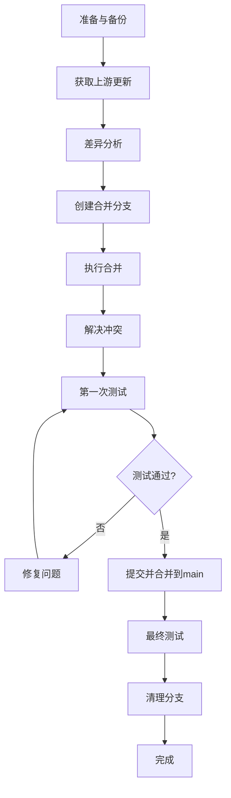

# 仓库合并

> **技能描述**: Git上游仓库同步、差异分析、逐步合并、测试验证、分支清理的完整流程
> **适用场景**: Fork仓库需要同步上游更新，同时保留自己的自定义修改
> **前置条件**:
> - 已配置Git远程仓库（origin + upstream）
> - 工作区干净（无未提交更改）
> - 有基础Git操作知识

---

## 🚀 快速开始（一键启动）

### 方式1：交互式初始化（推荐）

```bash
# 在仓库根目录运行
python C:/Users/superma/.claude/skills/init_repo_sync.py
```

脚本会自动：
- ✅ 检查Git仓库状态
- ✅ 检测/配置上游仓库
- ✅ 获取上游更新
- ✅ 创建备份分支和工作分支
- ✅ 生成配置文件 `.repo-sync-config.json`

### 方式2：在 Claude Code 中一句话调用

**示例1：自动检测上游**
```
启动仓库合并流程，我的代码是基于 FMZ 仓库修改的
```

**示例2：指定上游仓库**
```
启动仓库合并流程，上游仓库是 fmz-source，fork起点是 commit abc123
```

**示例3：最简化调用**
```
启动仓库合并
```

我会自动：
1. 检查当前仓库状态
2. 识别上游仓库（upstream/fmz-source等）
3. 分析上游更新
4. 创建备份和工作分支
5. 生成合并计划

### 方式3：手动指定配置（适合复杂场景）

创建配置文件 `.repo-sync-config.json`：

```json
{
  "upstream": "fmz-source",
  "upstream_branch": "main",
  "fork_point": "abc123def456",
  "user_only_features": [
    "pm_robot",
    "PM-COPY-TRADING",
    "brand"
  ]
}
```

然后说：
```
根据配置文件启动仓库合并
```

---

## 📋 执行流程概览



---

## 阶段1: 准备与备份

### 1.1 检查当前状态

```bash
# 查看Git状态
git status

# 查看当前分支
git branch

# 查看远程仓库配置
git remote -v

# 查看最近提交
git log --oneline -5
```

**检查清单**:
- [ ] 工作区干净（无未提交文件）
- [ ] 当前在main分支
- [ ] 远程仓库已配置（origin + upstream）

### 1.2 创建备份分支

```bash
# 创建备份分支（带时间戳）
git branch backup-before-sync-$(date +%Y%m%d)

# 推送备份到远程
git push origin backup-before-sync-$(date +%Y%m%d)

# 验证备份成功
git branch -a | grep backup
```

**备份策略**:
- 命名格式: `backup-before-sync-YYYYMMDD`
- 推送到远程保留
- 合并成功后可删除

---

## 阶段2: 获取上游更新

### 2.1 获取上游代码

```bash
# 获取上游仓库更新
git fetch upstream

# 查看上游分支
git branch -r | grep upstream

# 查看上游最新提交
git log upstream/main --oneline -10
```

### 2.2 查看上游变更统计

```bash
# 查看commit数量
git log HEAD..upstream/main --oneline | wc -l

# 查看文件变更统计
git diff --stat HEAD..upstream/main

# 查看详细变更文件
git diff --name-status HEAD..upstream/main
```

---

## 阶段3: 差异分析

### 3.1 生成差异报告

创建Python脚本分析差异：

```python
# analyze_upstream_diff.py
import subprocess
import json
from datetime import datetime

def run_command(cmd):
    """执行shell命令"""
    result = subprocess.run(cmd, shell=True, capture_output=True, text=True)
    return result.stdout.strip()

def analyze_diff():
    """分析上游差异"""
    print("=" * 60)
    print("上游差异分析报告")
    print("=" * 60)
    print(f"分析时间: {datetime.now().strftime('%Y-%m-%d %H:%M:%S')}")
    print()

    # 1. 获取变更文件列表
    files = run_command("git diff --name-status HEAD..upstream/main")
    changed_files = [line for line in files.split('\n') if line]

    print(f"📊 变更统计")
    print(f"总变更文件数: {len(changed_files)}")
    print()

    # 2. 分类变更
    added = []
    modified = []
    deleted = []
    renamed = []

    for file in changed_files:
        status, path = file.split('\t')
        if status == 'A':
            added.append(path)
        elif status == 'M':
            modified.append(path)
        elif status == 'D':
            deleted.append(path)
        elif status == 'R':
            renamed.append(path)

    print(f"✅ 新增文件: {len(added)}")
    print(f"📝 修改文件: {len(modified)}")
    print(f"❌ 删除文件: {len(deleted)}")
    print(f"🔄 重命名文件: {len(renamed)}")
    print()

    # 3. 查看用户独有文件
    user_files = run_command("git diff --name-only upstream/main..HEAD")
    user_only_files = [f for f in user_files.split('\n') if f]

    print(f"🔒 用户独有文件: {len(user_only_files)}")
    if user_only_files:
        print("关键文件:")
        for f in user_only_files[:10]:
            print(f"  - {f}")
        if len(user_only_files) > 10:
            print(f"  ... 还有 {len(user_only_files) - 10} 个文件")
    print()

    # 4. 查看上游独有文件
    upstream_files = run_command("git diff --name-only HEAD..upstream/main")
    upstream_only_files = [f for f in upstream_files.split('\n') if f]

    print(f"🆕 上游独有文件: {len(upstream_only_files)}")
    if upstream_only_files:
        print("新功能文件:")
        for f in upstream_only_files[:10]:
            print(f"  - {f}")
        if len(upstream_only_files) > 10:
            print(f"  ... 还有 {len(upstream_only_files) - 10} 个文件")
    print()

    # 5. 潜在冲突文件
    print("⚠️  潜在冲突文件 (同时被修改):")
    conflict_files = set(modified) & set([f.split('\t')[-1] if '\t' in f else f for f in changed_files if f.startswith('M')])
    for f in list(conflict_files)[:5]:
        print(f"  - {f}")
    print()

    # 6. 保存报告到文件
    report = {
        'timestamp': datetime.now().isoformat(),
        'total_changes': len(changed_files),
        'added': len(added),
        'modified': len(modified),
        'deleted': len(deleted),
        'renamed': len(renamed),
        'user_only_files': user_only_files,
        'upstream_only_files': upstream_only_files,
        'conflict_files': list(conflict_files)
    }

    with open('upstream_diff_report.json', 'w', encoding='utf-8') as f:
        json.dump(report, f, indent=2, ensure_ascii=False)

    print("📄 差异报告已保存到: upstream_diff_report.json")
    print()

    return report

if __name__ == '__main__':
    analyze_diff()
```

运行脚本：

```bash
python analyze_upstream_diff.py
```

### 3.2 查看关键变更

```bash
# 查看前端变更
git diff HEAD..upstream/main -- Project/ShengBeiVue/src/

# 查看后端变更
git diff HEAD..upstream/main -- Project/ShengBeiDjango/

# 查看配置文件变更
git diff HEAD..upstream/main -- *.md *.json
```

---

## 阶段4: 创建合并分支

### 4.1 选择合并策略

| 策略 | 适用场景 | 风险 | 时间 |
|------|----------|------|------|
| **完全合并** | 上游少量更新，用户代码少 | 中 | 快 |
| **选择性合并** | 上游大量更新，用户代码多 | 低 | 中 |
| **逐步合并** | 复杂重构，需要仔细验证 | 极低 | 慢 |

### 4.2 创建工作分支

```bash
# 创建合并工作分支
git checkout -b sync/merge-upstream-$(date +%Y%m%d)

# 验证分支创建成功
git branch

# 查看起点
git log --oneline -1
```

**分支命名规范**:
- 格式: `sync/merge-upstream-YYYYMMDD`
- 用途: 临时合并测试
- 合并完成后删除

---

## 阶段5: 执行合并

### 5.1 策略A: 完全合并

```bash
# 合并上游main分支
git merge upstream/main

# 查看合并状态
git status

# 查看冲突文件
git diff --name-only --diff-filter=U
```

### 5.2 策略B: 选择性合并（推荐）

```bash
# 1. 查看上游commit列表
git log HEAD..upstream/main --oneline

# 2. 选择性cherry-pick重要提交
# 例如：只选择API认证相关的提交
git cherry-pick <commit-hash-1>
git cherry-pick <commit-hash-2>
```

### 5.3 策略C: 逐个文件合并

```bash
# 1. 手动选择要合并的文件
git checkout upstream/main -- path/to/file1.py
git checkout upstream/main -- path/to/file2.js

# 2. 查看变更
git status

# 3. 提交变更
git add .
git commit -m "sync: 选择性合并上游文件"
```

---

## 阶段5.5: 冲突文件分类与分步合并规划 ⭐

> **本阶段目标**：在正式解决冲突前，制定科学的分步合并计划，降低风险，便于快速定位问题

### 5.5.1 预合并与冲突分析

```bash
# 1. 执行预合并（不提交）
git merge upstream/main --no-commit --no-ff

# 2. 查看所有冲突文件
git diff --name-only --diff-filter=U

# 3. 导出冲突文件列表
git diff --name-only --diff-filter=U > conflict_files.txt
```

### 5.5.2 冲突文件风险等级分类

创建分类脚本 `classify_conflicts.py`：

```python
# classify_conflicts.py
import os
import json
from pathlib import Path

def classify_conflict_file(file_path):
    """
    根据文件路径和类型，评估冲突的风险等级
    返回: (risk_level, category, test_priority)
    """
    # 定义风险规则
    RULES = {
        # 🟢 低风险文件：可以直接合并，测试优先级低
        'low_risk': {
            'patterns': [
                r'\.md$',          # 文档文件
                r'\.txt$',         # 文本文件
                r'/docs/',         # 文档目录
                r'/README',        # README文件
                r'/\.gitignore',   # Git配置
                r'/\.env\.example',# 环境变量示例
                r'\.scss$',        # 样式文件（通常不涉及逻辑）
                r'\.css$',
            ],
            'test_priority': 3,  # 低优先级
            'merge_strategy': 'auto_resolve_keep_user'  # 自动解决，保留用户代码
        },

        # 🟡 中风险文件：需要单元测试，测试优先级中
        'medium_risk': {
            'patterns': [
                r'/utils/',        # 工具函数
                r'/helpers/',      # 辅助函数
                r'/constants',     # 常量定义
                r'/config/',       # 配置文件
                r'/types',         # 类型定义
                r'/interfaces',    # 接口定义
                r'/migrations/',   # 数据库迁移（特殊处理）
            ],
            'test_priority': 2,  # 中优先级
            'merge_strategy': 'manual_review_and_test'  # 手动审查+测试
        },

        # 🔴 高风险文件：需要详细审查和完整测试，测试优先级高
        'high_risk': {
            'patterns': [
                r'/models/',       # 数据模型
                r'/views/',        # 视图/控制器
                r'/controllers/',  # 控制器
                r'/services/',     # 服务层
                r'/apis/',         # API接口
                r'/stores/',       # 状态管理
                r'/reducers',      # Redux reducer
                r'/middleware',    # 中间件
                r'/authentication/',# 认证相关
                r'/authorization/',# 授权相关
                r'/payment/',      # 支付相关
                r'/security',      # 安全相关
            ],
            'test_priority': 1,  # 高优先级
            'merge_strategy': 'careful_manual_merge'  # 谨慎手动合并
        },

        # ⚫ 极高风险：用户独有功能，必须保留用户代码
        'user_only': {
            'patterns': [
                r'pm_robot',       # 用户独有功能：PM机器人
                r'PM-COPY-TRADING',# 用户独有策略
                r'brand',          # 品牌相关
                r'custom',         # 自定义功能
            ],
            'test_priority': 0,  # 最高优先级
            'merge_strategy': 'force_keep_user_code'  # 强制保留用户代码
        }
    }

    import re

    # 检查是否为用户独有功能
    for pattern in RULES['user_only']['patterns']:
        if pattern in file_path.lower():
            return 'user_only', '用户独有功能', 0

    # 检查其他风险等级
    for risk_level, config in RULES.items():
        if risk_level == 'user_only':
            continue

        for pattern in config['patterns']:
            if re.search(pattern, file_path, re.IGNORECASE):
                category = {
                    'low_risk': '配置/文档/样式',
                    'medium_risk': '工具/常量',
                    'high_risk': '核心业务逻辑'
                }[risk_level]

                return risk_level, category, config['test_priority']

    # 默认为高风险
    return 'high_risk', '未知类型（默认高风险）', 1

def main():
    """主函数：分类所有冲突文件"""
    if not os.path.exists('conflict_files.txt'):
        print("❌ 未找到 conflict_files.txt，请先执行：")
        print("   git diff --name-only --diff-filter=U > conflict_files.txt")
        return

    with open('conflict_files.txt', 'r', encoding='utf-8') as f:
        conflict_files = [line.strip() for line in f if line.strip()]

    if not conflict_files:
        print("✅ 没有冲突文件！")
        return

    # 分类结果
    classified = {
        'user_only': [],     # 用户独有功能
        'low_risk': [],      # 低风险
        'medium_risk': [],   # 中风险
        'high_risk': [],     # 高风险
    }

    print("=" * 80)
    print("冲突文件风险等级分类")
    print("=" * 80)
    print()

    for file_path in conflict_files:
        risk_level, category, priority = classify_conflict_file(file_path)
        classified[risk_level].append({
            'path': file_path,
            'category': category,
            'priority': priority
        })

        # 打印分类结果
        icon = {
            'user_only': '⚫',
            'low_risk': '🟢',
            'medium_risk': '🟡',
            'high_risk': '🔴'
        }[risk_level]

        print(f"{icon} [{risk_level.upper()}] {file_path}")
        print(f"   ├─ 类别: {category}")
        print(f"   └─ 测试优先级: P{priority}")
        print()

    # 生成合并计划
    print("=" * 80)
    print("推荐合并顺序")
    print("=" * 80)
    print()

    total = len(conflict_files)
    print(f"总冲突文件数: {total}")
    print()

    steps = [
        ("步骤1", "无冲突文件", "直接合并", 0),
        ("步骤2", "低风险文件", f"合并 {len(classified['low_risk'])} 个文件", 3),
        ("步骤3", "中风险文件", f"合并 {len(classified['medium_risk'])} 个文件", 2),
        ("步骤4", "高风险文件", f"合并 {len(classified['high_risk'])} 个文件", 1),
        ("步骤5", "用户独有功能", f"保留 {len(classified['user_only'])} 个文件的用户代码", 0),
    ]

    for step, desc, action, priority in steps:
        icon = "✅" if priority == 0 else "📋"
        print(f"{icon} {step}: {desc}")
        print(f"   └─ 操作: {action}")
        print()

    # 保存分类结果
    with open('conflict_classification.json', 'w', encoding='utf-8') as f:
        json.dump(classified, f, indent=2, ensure_ascii=False)

    print("📄 分类结果已保存到: conflict_classification.json")
    print()

if __name__ == '__main__':
    main()
```

运行脚本：
```bash
python classify_conflicts.py
```

### 5.5.3 分步合并策略

#### 步骤1：合并无冲突文件

```bash
# 1. 查看无冲突文件
git diff --name-only --diff-filter=U | wc -l  # 冲突文件数
git diff --name-only | grep -v $(git diff --name-only --diff-filter=U | paste -sd '|' -)  # 无冲突文件

# 2. 提交无冲突文件
git add .
git commit -m "sync: 合并无冲突文件"
```

**测试验证**：
```bash
# 快速验证编译/启动
npm run build   # 前端编译
python manage.py check  # Django检查
```

#### 步骤2：合并低风险文件（🟢）

```bash
# 从分类报告中获取低风险文件列表
# 例如：docs/README.md, .gitignore, styles/common.scss

# 逐个解决低风险冲突
for file in $(cat conflict_classification.json | jq -r '.low_risk[].path'); do
    echo "处理: $file"

    # 策略：保留用户代码
    git checkout --ours "$file"
    git add "$file"
done

git commit -m "sync: 合并低风险文件（保留用户代码）"
```

**测试验证**：
- ✅ 前端样式正确加载
- ✅ 文档显示正常
- ✅ 配置文件有效

#### 步骤3：合并中风险文件（🟡）

```bash
# 例如：utils/format.js, constants/config.py

for file in $(cat conflict_classification.json | jq -r '.medium_risk[].path'); do
    echo "处理: $file"

    # 策略：需要手动审查
    # 1. 查看差异
    git diff "$file"

    # 2. 手动合并或使用工具
    vim "$file"  # 或使用 VSCode 的合并工具

    # 3. 标记已解决
    git add "$file"
done

git commit -m "sync: 合并中风险文件（手动审查）"
```

**测试验证**：
```bash
# 运行单元测试
npm run test:unit
python manage.py test

# 测试相关功能
```

#### 步骤4：合并高风险文件（🔴）

```bash
# 例如：models/user.py, views/payment.py, services/auth.js

for file in $(cat conflict_classification.json | jq -r '.high_risk[].path'); do
    echo "⚠️  处理高风险文件: $file"

    # 策略：谨慎手动合并
    # 1. 详细查看双方变更
    git diff HEAD upstream/main -- "$file"

    # 2. 分析业务逻辑影响
    # 3. 逐行合并，保留用户业务逻辑
    # 4. 记录合并决策

    vim "$file"
    git add "$file"

    # ⚠️ 每个文件合并后立即测试
    echo "请测试 $file 相关功能..."
    read -p "测试通过后按 Enter 继续..."
done

git commit -m "sync: 合并高风险文件（详细审查+测试）"
```

**测试验证**：
```bash
# 完整测试流程
npm run test:e2e
python manage.py test --verbosity=2

# 手动功能测试
# - 登录/注册
# - 支付流程
# - 数据持久化
```

#### 步骤5：处理用户独有功能（⚫）

```bash
# 例如：pm_robot/, PM-COPY-TRADING/, brand/

for file in $(cat conflict_classification.json | jq -r '.user_only[].path'); do
    echo "⚫ 处理用户独有功能: $file"

    # 策略：100%保留用户代码
    git checkout --ours "$file"
    git add "$file"
done

git commit -m "sync: 保留用户独有功能（PM机器人、品牌等）"
```

**验证**：
- ✅ PM机器人功能正常
- ✅ 品牌名称显示正确
- ✅ 用户自定义逻辑完整

### 5.5.4 每步测试验证模板

创建测试验证脚本 `test_merge_step.sh`：

```bash
#!/bin/bash
# test_merge_step.sh

STEP=$1
DESCRIPTION=$2

echo "=========================================="
echo "步骤 $STEP: $DESCRIPTION"
echo "=========================================="
echo

echo "📋 当前Git状态："
git status --short
echo

echo "🧪 运行测试..."
echo

# 前端编译测试（如果适用）
if [ -f "Project/ShengBeiVue/package.json" ]; then
    echo "前端编译测试..."
    cd Project/ShengBeiVue
    npm run build
    if [ $? -ne 0 ]; then
        echo "❌ 前端编译失败"
        exit 1
    fi
    echo "✅ 前端编译通过"
    cd ../..
    echo
fi

# 后端检查（如果适用）
if [ -f "Project/ShengBeiDjango/manage.py" ]; then
    echo "后端Django检查..."
    cd Project/ShengBeiDjango
    python manage.py check
    if [ $? -ne 0 ]; then
        echo "❌ Django检查失败"
        exit 1
    fi
    echo "✅ Django检查通过"
    cd ../..
    echo
fi

echo "✅ 步骤 $STEP 测试通过！"
echo
echo "按 Enter 继续下一步..."
read
```

使用方式：
```bash
./test_merge_step.sh 2 "合并低风险文件"
```

### 5.5.5 合并进度跟踪

创建进度跟踪文件 `MERGE_PROGRESS.md`：

```markdown
# 上游合并进度跟踪

**合并时间**: 2026-01-07
**上游分支**: upstream/main
**工作分支**: sync/merge-upstream-20260107

---

## 进度概览

- [ ] 步骤0: 预合并与冲突分析
- [ ] 步骤1: 合并无冲突文件 (0 个)
- [ ] 步骤2: 合并低风险文件 (X 个)
- [ ] 步骤3: 合并中风险文件 (X 个)
- [ ] 步骤4: 合并高风险文件 (X 个)
- [ ] 步骤5: 处理用户独有功能 (X 个)
- [ ] 最终测试与提交

---

## 详细记录

### 步骤0: 预合并与冲突分析
- 时间:
- 冲突文件总数:
- 分类结果: `conflict_classification.json`

### 步骤1: 合并无冲突文件
- 时间:
- 提交hash:
- 测试结果: ✅ / ❌
- 备注:

### 步骤2: 合并低风险文件
- 时间:
- 处理文件:
- 提交hash:
- 测试结果: ✅ / ❌
- 遇到问题:
- 解决方案:

...（每个步骤类似记录）

---

## 回滚记录

如需回滚到某步骤：
```bash
git log --oneline  # 查看提交历史
git reset --hard <commit-hash>  # 回滚到指定提交
```
```

---

## 阶段6: 解决冲突

### 6.1 查看冲突文件

```bash
# 查看冲突状态
git status

# 查看冲突内容
git diff --check

# 统计冲突数量
grep -r '^<<<<<<<' . | wc -l
```

### 6.2 冲突解决原则

**保留用户代码的优先级**:
1. ✅ **用户独有功能** (PM机器人、品牌名称) → **100%保留**
2. ✅ **用户业务逻辑** (会员等级、权限设置) → **100%保留**
3. ⚠️ **上游bug修复** → **采纳上游**
4. ⚠️ **上游新功能** → **评估后决定**
5. ⚠️ **上游重构** → **谨慎处理**

### 6.3 冲突解决示例

```bash
# 1. 编辑冲突文件
vim <conflict-file>

# 2. 解决冲突标记
# <<<<<<< HEAD
# 用户代码
# =======
# 上游代码
# >>>>>>> upstream/main
# 改为：
# 用户代码（或合并后的代码）

# 3. 标记冲突已解决
git add <conflict-file>

# 4. 继续下一个冲突
git status
```

### 6.4 自动合并脚本

```python
# auto_resolve_conflicts.py
import os
import re

def should_keep_user_code(file_path):
    """
    判断是否应该保留用户代码
    """
    # 用户独有功能列表
    user_only_features = [
        'pm_robot',        # PM机器人
        'PM-COPY-TRADING', # PM策略
        'brand',           # 品牌相关
    ]

    # 检查文件路径
    for feature in user_only_features:
        if feature in file_path:
            return True

    return False

def resolve_conflict_file(file_path):
    """
    自动解决冲突
    """
    with open(file_path, 'r', encoding='utf-8') as f:
        content = f.read()

    # 如果包含冲突标记
    if '<<<<<<<' in content and '>>>>>>>' in content:
        if should_keep_user_code(file_path):
            # 保留用户代码（HEAD部分）
            pattern = r'<<<<<<< HEAD\n(.*?)\n=======\n.*?\n>>>>>>> upstream/main'
            replacement = r'\1'
            content = re.sub(pattern, replacement, content, flags=re.DOTALL)

            print(f"✅ 保留用户代码: {file_path}")
        else:
            # 保留上游代码（upstream部分）
            pattern = r'<<<<<<< HEAD\n.*?\n=======\n(.*?)\n>>>>>>> upstream/main'
            replacement = r'\1'
            content = re.sub(pattern, replacement, content, flags=re.DOTALL)

            print(f"🔄 采纳上游代码: {file_path}")

        # 移除剩余的冲突标记
        content = content.replace('<<<<<<< ', '')
        content = content.replace('=======', '')
        content = content.replace('>>>>>>> ', '')

        # 写回文件
        with open(file_path, 'w', encoding='utf-8') as f:
            f.write(content)

        return True

    return False

def main():
    """主函数"""
    # 查找所有冲突文件
    import subprocess
    result = subprocess.run(
        ['git', 'diff', '--name-only', '--diff-filter=U'],
        capture_output=True,
        text=True
    )

    conflict_files = [f for f in result.stdout.strip().split('\n') if f]

    print(f"发现 {len(conflict_files)} 个冲突文件")

    resolved_count = 0
    for file_path in conflict_files:
        if resolve_conflict_file(file_path):
            resolved_count += 1

    print(f"\n自动解决了 {resolved_count}/{len(conflict_files)} 个冲突")

    # 标记为已解决
    for file_path in conflict_files:
        os.system(f'git add "{file_path}"')

if __name__ == '__main__':
    main()
```

运行脚本：

```bash
python auto_resolve_conflicts.py
```

### 6.5 手动验证冲突解决

```bash
# 确认所有冲突已解决
git status

# 应该看到 "All conflicts fixed but the merge is not complete"
```

---

## 阶段7: 第一次测试验证

### 7.1 提交合并结果

```bash
# 提交合并
git commit -m "sync: 合并上游更新 $(date +%Y%m%d)

- 保留用户独有功能: PM机器人、品牌名称
- 采纳上游bug修复和新功能
- 解决所有合并冲突

测试中..."

# 查看提交
git log --oneline -3
```

### 7.2 前端测试

```bash
# 进入前端目录
cd Project/ShengBeiVue

# 安装依赖（如有新增）
npm install

# 启动开发服务器
npm run dev

# 等待启动完成，检查：
# ✅ 编译成功（无错误）
# ✅ 端口正确（默认8080或自动选择）
```

**前端测试清单**:
- [ ] 页面能正常打开
- [ ] 品牌名称显示正确（"大白量化"）
- [ ] 登录功能正常
- [ ] 用户独有功能可用（PM机器人等）

### 7.3 后端测试

```bash
# 新终端窗口，进入后端目录
cd Project/ShengBeiDjango

# 启动Django（使用环境变量脚本）
python run_django.py

# 等待启动完成，检查：
# ✅ 数据库连接成功
# ✅ 无迁移错误
# ✅ 服务器运行在 0.0.0.0:8000
```

**后端测试清单**:
- [ ] 服务器正常启动
- [ ] 登录API返回200
- [ ] 数据库查询正常
- [ ] 用户独有API可用

### 7.4 功能验证

使用浏览器或API测试工具验证：

```bash
# 测试登录
curl -X POST http://localhost:8000/api/accounts/login/ \
  -H "Content-Type: application/json" \
  -d '{"email":"admin@localhost.com","password":"123456"}'

# 预期返回:
# {"code": 200, "msg": "success", "data": {...}}
```

---

## 阶段8: 问题修复

### 8.1 常见问题修复

#### 问题1: SCSS编译错误

**症状**: `Undefined mixin @include hover-device`

**解决**:
```vue
<!-- RegisterView.vue -->
<style scoped lang="scss">
@use '@/styles/abstracts/mixins' as *;
@use '@/styles/abstracts/breakpoints' as *;  <!-- 添加这行 -->
</style>
```

#### 问题2: 数据库迁移冲突

**症状**: `Duplicate column name 'xxx'`

**解决**:
```bash
# 1. 检查字段是否已存在
mysql -u root -p -e "DESCRIBE table_name;"

# 2. 标记迁移为已应用
mysql -u root -p -e "INSERT INTO django_migrations (app, name, applied) VALUES ('app_name', '000X_migration_name', NOW());"

# 3. 生成新迁移
python manage.py makemigrations

# 4. 应用迁移
python manage.py migrate
```

#### 问题3: 会员等级映射不一致

**症状**: 等级名称显示错误

**解决**:
```javascript
// 更新为新的映射
const membershipLevelMap = {
  0: '普通',
  1: '会员卡',
  2: '月卡',
  3: '季卡',
  4: '年卡',
}
```

### 8.2 修复验证

```bash
# 每次修复后重新测试
npm run build   # 前端编译测试
python manage.py check  # Django检查
```

---

## 阶段9: 合并到主分支

### 9.1 切换到主分支

```bash
# 切换到main
git checkout main

# 拉取最新远程main（如有更新）
git pull origin main
```

### 9.2 合并工作分支

```bash
# 合并工作分支
git merge sync/merge-upstream-$(date +%Y%m%d) --no-edit

# 查看合并结果
git log --oneline -5

# 快进合并验证
git log --graph --oneline --all -10
```

### 9.3 推送到远程

```bash
# 推送到远程main
git push origin main

# 验证推送成功
git status
```

---

## 阶段10: 最终测试

### 10.1 完整端到端测试

参考**完整测试流程**技能：

```markdown
## 测试步骤

1. **前端验证**
   - ✅ 品牌名称"大白量化"
   - ✅ 用户独有功能（PM机器人）
   - ✅ 页面路由正常
   - ✅ 无404错误

2. **后端验证**
   - ✅ Django启动正常
   - ✅ 所有API返回200
   - ✅ 数据库迁移完成
   - ✅ 无数据库错误

3. **功能验证**
   - ✅ 登录功能
   - ✅ 会员等级显示
   - ✅ PM机器人管理
   - ✅ 上游新功能
```

### 10.2 生成测试报告

```python
# generate_test_report.py
from datetime import datetime

def generate_report():
    """生成测试报告"""
    report = f"""# 上游合并测试报告

**测试时间**: {datetime.now().strftime('%Y-%m-%d %H:%M:%S')}
**合并分支**: sync/merge-upstream-{datetime.now().strftime('%Y%m%d')}

## 测试结果

### 前端测试
- [ ] 品牌名称显示正确
- [ ] 用户独有功能保留
- [ ] 上游新功能集成
- [ ] 无编译错误

### 后端测试
- [ ] Django启动正常
- [ ] API接口正常
- [ ] 数据库迁移完成
- [ ] 无运行时错误

### 功能测试
- [ ] 登录注册流程
- [ ] 会员系统
- [ ] PM机器人
- [ ] 其他功能

## 代码保留验证

### 用户独有文件
- PM机器人系统: ✅ 保留
- 品牌名称: ✅ 保留
- 自定义逻辑: ✅ 保留

### 上游更新
- Bug修复: ✅ 采纳
- 新功能: ✅ 集成
- 性能优化: ✅ 应用

## 问题记录

### 修复的问题
1. 问题描述
   - 状态: ✅ 已修复
   - 解决方案: ...

## 结论

✅ **所有测试通过，合并成功**
"""

    with open('MERGE_TEST_REPORT.md', 'w', encoding='utf-8') as f:
        f.write(report)

    print("✅ 测试报告已生成: MERGE_TEST_REPORT.md")

if __name__ == '__main__':
    generate_report()
```

---

## 阶段11: 清理与总结

### 11.1 删除工作分支

```bash
# 删除本地工作分支
git branch -d sync/merge-upstream-$(date +%Y%m%d)

# 确认删除成功
git branch -a | grep sync
```

### 11.2 清理临时文件

```bash
# 清理未跟踪文件
git clean -fd

# 验证工作区干净
git status
```

### 11.3 可选：删除备份分支

```bash
# 如果一切正常，可以删除备份
git branch -d backup-before-sync-$(date +%Y%m%d)
git push origin --delete backup-before-sync-$(date +%Y%m%d)
```

### 11.4 更新项目文档

```markdown
# CHANGELOG.md 更新

## [版本号] - YYYY-MM-DD

### 同步上游更新
- 同步上游仓库 [上游commit hash]
- 保留用户自定义功能
- 修复合并冲突
- 测试验证通过

### 用户独有功能
- PM机器人系统
- 品牌定制
- 其他自定义

### 上游更新
- Bug修复
- 新功能
- 性能优化
```

---

## 🛠️ 辅助脚本

### 脚本1: 一键合并脚本

```bash
#!/bin/bash
# quick_merge.sh

echo "=================================="
echo "上游仓库快速合并工具"
echo "=================================="

# 1. 检查状态
echo "📋 检查Git状态..."
git status
if [ $? -ne 0 ]; then
    echo "❌ 工作区不干净，请先提交或暂存"
    exit 1
fi

# 2. 创建备份
BACKUP_BRANCH="backup-$(date +%Y%m%d-%H%M%S)"
echo "📦 创建备份分支: $BACKUP_BRANCH"
git branch $BACKUP_BRANCH

# 3. 获取上游
echo "🔄 获取上游更新..."
git fetch upstream

# 4. 创建工作分支
WORK_BRANCH="sync/merge-$(date +%Y%m%d)"
echo "🔧 创建工作分支: $WORK_BRANCH"
git checkout -b $WORK_BRANCH

# 5. 合并
echo "⚡ 开始合并..."
git merge upstream/main

# 6. 检查冲突
if [ $? -ne 0 ]; then
    echo "⚠️  发现冲突，需要手动解决"
    git status
    exit 1
fi

echo "✅ 合并成功，请运行测试验证"
```

### 脚本2: 回滚脚本

```bash
#!/bin/bash
# rollback_merge.sh

BACKUP_BRANCH=$1

if [ -z "$BACKUP_BRANCH" ]; then
    echo "用法: ./rollback_merge.sh <backup-branch-name>"
    exit 1
fi

echo "⚠️  即将回滚到备份分支: $BACKUP_BRANCH"
read -p "确认回滚? (yes/no): " confirm

if [ "$confirm" != "yes" ]; then
    echo "取消回滚"
    exit 0
fi

# 切换到备份分支
git checkout $BACKUP_BRANCH

# 重置main到备份
git branch -f main $BACKUP_BRANCH

echo "✅ 已回滚到: $BACKUP_BRANCH"
echo "⚠️  如需推送，请运行: git push origin main --force"
```

---

## 📚 常见问题FAQ

### Q1: 如何判断是否应该合并上游更新？

**答**: 检查以下情况：
- 上游有重要bug修复 → ✅ 应该合并
- 上游有安全更新 → ✅ 应该合并
- 上游有破坏性变更 → ⚠️ 谨慎评估
- 上游有大规模重构 → ⚠️ 延迟合并

### Q2: 合并冲突太多怎么办？

**答**:
1. 使用**策略C: 逐个文件合并**
2. 优先合并关键bug修复
3. 延迟合并功能更新
4. 考虑重新fork仓库

### Q3: 如何回滚合并？

**答**:
```bash
# 方法1: 使用备份分支
git checkout backup-branch
git branch -f main backup-branch

# 方法2: 重置到合并前
git reset --hard HEAD~1

# 方法3: 恢复到远程状态
git reset --hard origin/main
```

### Q4: 用户代码被覆盖了怎么办？

**答**:
```bash
# 从备份分支恢复
git checkout backup-branch -- path/to/user/file.py

# 或者从reflog恢复
git reflog
git checkout HEAD@{n} -- path/to/file.py
```

---

## ✅ 检查清单

```markdown
## 准备阶段
- [ ] 工作区干净
- [ ] 远程仓库已配置
- [ ] 备份分支已创建

## 分析阶段
- [ ] 已获取上游更新
- [ ] 差异报告已生成
- [ ] 合并策略已确定

## 合并阶段
- [ ] 工作分支已创建
- [ ] 合并已执行
- [ ] 冲突已解决
- [ ] 用户代码已保留

## 测试阶段
- [ ] 前端编译通过
- [ ] 后端启动正常
- [ ] 功能测试通过
- [ ] 用户独有功能验证

## 提交阶段
- [ ] 代码已提交
- [ ] 已合并到main
- [ ] 已推送到远程

## 清理阶段
- [ ] 工作分支已删除
- [ ] 临时文件已清理
- [ ] 备份可选删除
```

---

## 📞 需要帮助？

如果在合并过程中遇到问题：

1. 查看Git状态: `git status`
2. 查看冲突: `git diff`
3. 查看日志: `git log --oneline --graph --all`
4. 查看技能文档: `/help 仓库合并`

---

**技能版本**: v1.0
**最后更新**: 2026-01-07
**维护者**: Claude Code Agent
