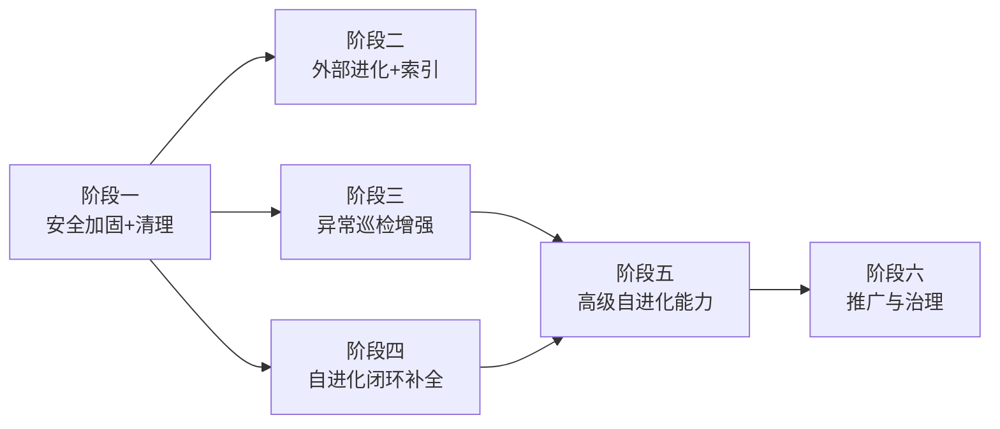

# OpenClaw 执行路线图（2026 Q2）

> 基于 2026-03-27 审计结果，按依赖关系和优先级分阶段执行。
> 配套文件：[todo.md](../todo.md)（待办）、[done.md](../done.md)（已完成）
> 
> **当前进度**：阶段一～五 ✅ 全部完成 | 阶段六待部署后启动

---

## 阶段一：安全加固与清理（4/1 — 4/5）✅ 已完成

> 先解决安全风险、清理技术债，给后续增强打好基础。

| # | 任务 | 预计工时 | 依赖 |
|---|------|---------|------|
| 1.1 | `git_sync_push` 增加密钥内容检测（P0 安全红线） | 2h | 无 |
| 1.2 | nofx 环境配置校验（TG delivery / webhook / env） | 1h | 无 |
| 1.3 | 删除 7 个冗余 Cron Job（保留 summary/dashboard 文件） | 1h | 无 |
| 1.4 | 删除废弃脚本（benchmark_orchestrator + consumer + 测试） | 0.5h | 1.3 |
| 1.5 | 启用 `daily_todo_digest`、降频 `algo_micro_optimizer` → 24h | 0.5h | 1.3 |
| 1.6 | 重命名 `unified_exception_logger` | 0.5h | 1.3 |
| 1.7 | nofx 日志验证：确认核心 cron job 运行正常 | 1h | 1.3-1.6 |

**阶段交付物**：清理后稳定运行 48h 无异常

---

## 阶段二：外部进化通道 + 索引重建（4/5 — 4/10）

> 脚本已就绪，只需注册 Cron Job 并重建索引。

| # | 任务 | 预计工时 | 依赖 |
|---|------|---------|------|
| 2.1 | 注册 3 个外部进化 Cron Job（上游/情报/GitHub，每日一次） | 1h | 阶段一完成 |
| 2.2 | 重写 `CRON_TASK_INDEX.md`（完整索引 + 功能说明） | 1h | 2.1 |
| 2.3 | 重写 `jobs_agent_mapping.md`（Agent→Job 映射） | 0.5h | 2.1 |

**阶段交付物**：3 个外部进化通道上线，索引文件准确反映实际状态

---

## 阶段三：异常巡检增强（4/7 — 4/12）

> 三项增强独立于其他模块，可并行开发。

| # | 任务 | 预计工时 | 依赖 |
|---|------|---------|------|
| 3.1 | 统一异常日志目录 `/root/.openclaw/logs/abnormal/` | 2h | 无 |
| 3.2 | 新增第 7 类异常分类：命令路径合法性校验 | 1h | 无 |
| 3.3 | 日志自动清理（7天压缩 / 30天删除） | 1.5h | 3.1 |

**阶段交付物**：异常日志统一归档 + 路径校验 + 自动清理

---

## 阶段四：自进化闭环补全（4/10 — 4/20）

> 补全审计发现的闭环缺失环节，从上到下按依赖顺序执行。
> 📐 架构详设：[配置自动进化](自动进化/配置自动进化/README.md)

| # | 任务 | 预计工时 | 依赖 |
|---|------|---------|------|
| 4.1 | `advisor` 输出自动写入 TODO（含去重 + 风险标记） | 3h | 无 |
| 4.2 | 新增 `config_diff_review` 定时任务（.openclaw diff→审核→同步） | 4h | 1.1 |
| 4.3 | `git_sync_push` 增加 Agent 审核层（第三层） | 3h | 4.2 |
| 4.4 | trace_id 全链路注入（Agent 入口 Hook + 跨 Agent 传播） | 4h | 无 |

**阶段交付物**：
- `本地配置 → 审核 → backup 仓库 → 密钥检测 → Agent 审核 → GitHub` 完整链路
- 全链路 trace_id 可观测

---

## 阶段五：高级自进化能力（4/20 — 4/30）

> 在闭环跑稳定后，叠加高级能力。

| # | 任务 | 预计工时 | 依赖 |
|---|------|---------|------|
| 5.1 | 记忆 → Skill/Hook 自动封装（draft 模式，需人工激活） | 6h | 阶段四完成 |
| 5.2 | 错误驱动进化（exception_logger + fault_knowledge_base 集成） | 4h | 阶段三完成 |
| 5.3 | TODO 截止时间解析 + 超期自动升级 | 2h | 无 |
| 5.4 | 任务派发 5 要素确认协议文档化 | 1h | 无 |
| 5.5 | 启用 `control_plane_optimization_advisor`（改造完成后） | 0.5h | 4.1 |

**阶段交付物**：完整的自进化循环 + 错误自修复 + 经验→技能转化

---

## 阶段六：推广与治理（5/1 — 5/10）🔄 进行中

> nofx 验证通过后推广到其他节点。

| # | 任务 | 预计工时 | 状态 |
|---|------|---------|------|
| 6.1 | nofx 全功能验收测试 | 2h | ✅ 已完成 |
| 6.2 | 推广到其余 4 台服务器 | 4h | ⏳ 放最后 |
| 6.3 | Lobster 仓库配置为 `external_readonly` | 0.5h | ⏳ Lobster 不在 nofx |
| 6.4 | 拆分 `policy_enforcer.py`（5970行）为独立模块 | 8h | ⏳ 待执行 |
| 6.5 | Agent 模型配置同步（4 项） | 1h | ✅ 已完成 |

---

## 依赖关系图

## 总工时估算

| 阶段 | 工时 | 窗口 |
|------|------|------|
| 阶段一 | ~6.5h | 4/1 — 4/5 |
| 阶段二 | ~2.5h | 4/5 — 4/10 |
| 阶段三 | ~4.5h | 4/7 — 4/12 |
| 阶段四 | ~14h | 4/10 — 4/20 |
| 阶段五 | ~13.5h | 4/20 — 4/30 |
| 阶段六 | ~15.5h | 5/1 — 5/10 |
| **合计** | **~56h** | **5 周** |

---

## 管理规则

1. **每完成一项**：从 `todo.md` 移到 `done.md`，补上完成描述
2. **每完成一个阶段**：更新本文件阶段状态，跑 48h 稳定性验证
3. **任务派发前确认 5 要素**：内容 / 流程 / 预期 / 角色 / 时间
4. **风险分级执行**：低风险自动、高风险人工审核
