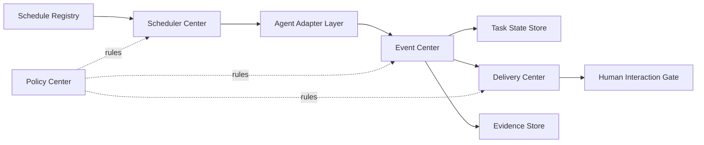

# Workflow 架构宣言（2026-03-13）

## 摘要

这份文档是新的硬边界文档，不是迁移计划，不是兼容方案，也不是临时修补说明。它回答 4 个必须长期稳定回答的问题：

- 现在到底有哪些任务在被调度
- 这些任务分别由谁负责、由谁执行
- 每条任务的流程、技能/运行时依赖、输出物、健康信号是什么
- 当任务跑在 OpenClaw 之外时，如何仍然被统一登记、追踪、审计、输出

当前仓库能够明确登记的基线分成三层：

- `23` 个现代受管 OpenClaw 定时任务：来自 `install_workflow_profile.py`、`cron_setup.py` 和各 installer
- `8` 个仍然出现在仓库 `cron/jobs.json` 里的 legacy 样本任务：仍需记账，但不再作为新架构默认主链
- `5` 类外部调度面：`systemd_timer`、`user_crontab`、`root_crontab`、`cron_d`、`saas_scheduler`

必须接受的事实只有一个：`cron/jobs.json` 只是当前仓库的一份基线样本，不是完整运行态真源。新的真源必须是统一的 `Schedule Registry`，由安装器、运行态和外部调度接入共同回写。

## 1. 硬决策

- 不做兼容层。旧 runner 的职责拆散后，不再保留“旧输出口径继续兼容”的承诺。
- 不允许 runner 混合“调度、执行、通知、派单、落盘”。
- 不允许 agent 直接处理第三方通知、状态写入、日志归档。
- 所有 workflow 必须先产出统一事件，再派生 `HumanView`、`AgentView`、`ExternalView`、`EvidenceRef`。
- 所有调度任务，不论运行在 `openclaw cron`、`systemd`、`crontab` 还是 SaaS 内部调度，都必须进入同一套任务登记与状态体系。
- 调度方式只是 `trigger surface`，不是业务模块边界。
- “定时任务属于某个 agent 的职责”不等于“任务逻辑写在 agent 里”。agent 只负责能力执行。
- 任何任务都不允许把技能依赖藏在 prompt 文本里；技能与运行时依赖必须进入显式登记。
- 任何任务都不允许绕过状态中心直接改任务状态。
- 任何外部调度任务如果没有登记，就视为未纳管任务。

## 2. 核心模块

| 模块 | 职责 | 输入 | 输出 | 禁止做什么 |
|---|---|---|---|---|
| `Scheduler Center` | 统一编排调度，消费 `Schedule Registry`，触发 `WorkflowRun` | `ScheduleInventoryEntry`、`Policy Center` 规则、运行态时钟/回调 | `WorkflowRun`、调度事件、调度失败事件 | 不允许直接拼聊天消息，不允许持有业务状态真源 |
| `Schedule Registry` | 统一登记全部定时任务与外部调度任务，是任务清单真源 | 安装器、外部接入器、运行态观测快照 | `ScheduleInventoryEntry`、变更事件 | 不允许执行任务，不允许直接告警 |
| `Event Center` | 统一接收运行事实，是唯一事实源 | `WorkflowRun`、`AgentInvocation` 结果、外部回执、观测事件 | `WorkflowEvent` | 不允许带渠道文案，不允许跳过结构化字段 |
| `Agent Adapter Layer` | 把 agent 包装成标准执行组件 | `AgentCapability`、`AgentInvocation` | 执行结果、标准失败原因、证据引用 | 不允许自己发第三方通知，不允许自写状态 |
| `Task State Store` | 统一维护工作流/任务状态机 | `WorkflowEvent` | `TaskState`、状态变更审计 | 不允许接受“任意脚本直接改状态” |
| `Delivery Center` | 统一派发给人、给 agent、给第三方 | `HumanView`、`AgentView`、`ExternalView` | 发送结果、`DeliveryRecord` | 不允许接收原始 runner 文本当事实 |
| `Evidence Store` | 统一保存日志、报告、证据、执行产物 | `WorkflowEvent`、执行报告、快照文件 | `EvidenceRef` | 不允许承担状态机职责 |
| `Human Interaction Gate` | 统一决定哪些给人看、哪些静默、哪些要人工确认 | `HumanView`、策略规则、任务优先级 | 人类可见消息、人工确认事件 | 不允许反向修改执行结果 |
| `Policy Center` | 统一超时、重试、升级、去重、冷却、SLA、人工介入规则 | 配置、历史事件、风险级别 | 调度/通知/重试规则 | 不允许直接执行具体业务任务 |

## 3. 统一对象与接口

### 3.1 核心对象

| 对象 | 作用 | 必填/关键字段 | 规则 |
|---|---|---|---|
| `WorkflowEvent` | 唯一事实事件 | `event_id`、`run_id`、`kind`、`status`、`severity`、`details`、`evidence_refs` | 一切视图都只能从这里派生 |
| `WorkflowRun` | 一次调度触发的总运行实例 | `run_id`、`schedule_id`、`trigger_surface`、`started_at`、`finished_at`、`status` | 一个触发只对应一个 `WorkflowRun` |
| `WorkflowTask` | 一个具体任务单元或派生修复任务 | `task_id`、`source_run_id`、`owner_agent`、`assignee`、`status` | 不允许被 runner 私下改写 |
| `ScheduleInventoryEntry` | 所有定时任务的统一登记对象 | 见下方字段清单 | 是任务清单真源 |
| `ScheduleTrigger` | 描述任务如何被触发 | `surface_type`、`trigger_definition`、`source_of_truth` | 只描述触发，不承载业务逻辑 |
| `AgentCapability` | 把“做什么”与“谁来做”解耦 | `capability_id`、`owner_domain`、`default_agent` | workflow 绑定能力，不直接绑死 agent 名 |
| `AgentInvocation` | 一次标准化 agent 调用 | `invocation_id`、`capability_id`、`executor_agent`、`input_ref`、`output_ref` | 统一入口，不允许各 workflow 自己拼命令协议 |
| `SkillBinding` | 声明任务/能力依赖的技能和运行时能力 | `binding_id`、`target_type`、`target_id`、`skills`、`runtime_requirements` | 不允许只写在 prompt 里 |
| `TaskState` | 统一状态机对象 | `state_id`、`entity_type`、`entity_id`、`status`、`updated_at` | 只允许 `Task State Store` 写入 |
| `HumanView` | 给人看的中文输出 | `title`、`summary`、`reason`、`progress` | 允许为空；为空就不通知人 |
| `AgentView` | 给其他 agent 的结构化派单/回传视图 | `assignee`、`payload`、`expected_outputs` | 不允许混入给人看的文案 |
| `ExternalView` | 给第三方渠道的输出视图 | `channel`、`payload`、`delivery_policy` | 不能越过 `Delivery Center` 直接发送 |
| `DeliveryRecord` | 记录发给了谁、发了什么、为何没发 | `delivery_id`、`view_type`、`target`、`status`、`reason` | 必须持久化 |
| `EvidenceRef` | 指向日志、报告、快照、执行产物 | `ref_id`、`ref_type`、`path_or_uri`、`producer` | 不等于人类输出 |

### 3.2 `ScheduleInventoryEntry` 必填字段

每条定时任务必须覆盖以下字段：

- `schedule_id`
- `schedule_name`
- `surface_type`
- `owner_agent`
- `executor_agent`
- `capability`
- `trigger_definition`
- `source_of_truth`
- `job_payload_or_command`
- `required_skills`
- `required_runtime`
- `outputs`
- `health_signals`
- `common_failures`
- `delivery_policy`
- `upgrade_notes`

`surface_type` 只允许从以下集合中取值：

- `openclaw_cron`
- `systemd_timer`
- `user_crontab`
- `root_crontab`
- `cron_d`
- `saas_scheduler`

### 3.3 当前 `SkillBinding` 基线

当前仓库还没有完整的统一 `SkillBinding` 注册表，但已经有一批可稳定识别的技能/运行时依赖，后续必须全部转成显式绑定：

| 绑定名称 | 来源 | 典型使用对象 | 说明 |
|---|---|---|---|
| `repo.skills_loader` | `install_workflow_profile.py` + 仓库 `skills/` | 全部 agent | 仓库 skills 会注入官方 loader |
| `runtime_required.frontend-design-ultimate` | `runtime-required-skills.json` | 需要前端/页面生成的任务 | 由 `ensure_runtime_skills.py` 补齐 |
| `runtime_required.summarize` | `runtime-required-skills.json` | 需要 summarize CLI 的任务 | 内置 summarize skill 依赖 |
| `runtime.web_capture` | `web_intel_collect_runner.py`、`api_test_audit.py` | `web_intel_collect_hourly`、`ops_api_test_audit` | `scrapling / playwright / selenium` |
| `runtime.github_skill_search` | `github_web_evolution_runner.py` | `ops_github_web_evolution_incremental` | `skill4agent` 为可选增强 |
| `runtime.memory_openviking_override` | `runtime-plugin-overrides/memory-openviking/` | 所有隔离 cron 任务 | 避免错误注入 transcript-like ingest |
| `runtime.policy_bridge` | `policy_enforcer.py`、`task_center.py` | 巡检、修复派生、执行回报 | 当前最重要的结构化 bridge |

## 4. 定时任务 Inventory 正文

### 4.1 inventory 读取原则

- `install_workflow_profile.py` + 各 installer + `cron_setup.py` 是现代受管任务的主来源。
- 仓库里的 `cron/jobs.json` 仍然保留了一批 legacy 样本任务，这些任务必须被记账，但不应继续被误认为新的默认主链。
- 对于同时存在“现代安装器定义”和“旧样本定义”的任务，以现代安装器行为为准。
- 只要 OpenClaw 创建、要求、依赖、审计、消费或闭环某个外部定时任务，它就必须进入 `Schedule Registry`。

### 4.2 OpenClaw Managed Schedules（现代受管任务）

| schedule_name | surface_type | owner_agent | executor_agent | purpose | trigger | flow_summary | required_skills_or_runtime | outputs | human_visibility | delivery_mode | health_signals | failure_signals | maintenance_entry |
|---|---|---|---|---|---|---|---|---|---|---|---|---|---|
| `todo_patrol_15m` `16cb8d03...` | `openclaw_cron` | `ops-agent` | `ops-agent` | 巡检 TODO、去重、分派非 OPS 待办 | `every 15m` | `todo_patrol.py -> 规范化 TODO -> coordinator/assignee` | `todo_patrol.py`、`task_center.db`、`policy_enforcer`、官方 cron | 巡检摘要、分派事件、去重结果 | 仅分派或异常时可见；空闲时应为静默 | `none` | `nextRunAtMs` 正常推进、`NO_REPLY` 空闲成功、分派数量 | `exec timeout`、路由失败、DB 锁冲突 | `install_todo_patrol_job.py`、`TODO_PATROL_POLICY_FLOW.md` |
| `task_executor_10m` `c2c75adf...` | `openclaw_cron` | `ops-agent` | `dynamic-by-assignee` | 消费 task-center pending 任务并调用对应 agent | `every 10m` | `task_executor_runner.py -> select pending -> invoke agent -> report-agent-result` | `task_executor_runner.py`、`task_center.db`、`policy-config.json`、`lightContext` | `executor-runs/*.json`、`agent_task_reports`、结果回写 | 默认只在失败/部分完成时给人看 | `announce` | `tasks_selected/executed/failed`、运行报告完整 | agent `partial/failed`、模型超时、DB 锁冲突 | `install_task_executor_job.py`、`policy/task_executor_runner.py` |
| `project_index_maintainer_4h` `5797cd5b...` | `openclaw_cron` | `project-agent` | `project-agent` | 维护项目索引与文档知识 | `every 4h fallback (skip when git HEAD unchanged)` | `project_index_maintainer.py -> compare indexed git head -> project-index-local/doc-knowledge` | `project-registry.json`、`task_center.db`、文档抓取、索引写入、索引状态文件 | `project-index-local/*`、知识索引、运行绑定、indexed head 留痕 | 一般静默；异常由巡检汇总 | `none` | 索引文件刷新、知识条目增长、git HEAD 变化可追踪、空闲 `NO_REPLY` | `network_error`、git/index drift、文档抓取失败 | `install_project_index_job.py`、`policy/project_index_maintainer.py` |
| `ops_incremental_monitor` `c9a4f4c4...` | `openclaw_cron` | `ops-agent` | `ops-agent` | 增量巡检 workflow/log/runtime 并派生修复任务 | `every 15m` | `ops_cron_runner.py --mode incremental -> detect risk -> create follow-up task` | `ops_cron_runner.py`、`cron-monitor-config.json`、`task_center.db` | `ops/cron-runs/*.json`、修复任务、中文摘要 | 仅有风险时给人看 | `announce` | `workflow_failures`、`stale_failures`、去重状态 | 超时、僵尸运行态、日志读取失败 | `cron_setup.py`、`ops_cron_runner.py` |
| `ops_full_calibration` `9bd05850...` | `openclaw_cron` | `ops-agent` | `ops-agent` | 全量校准扫描，增量异常时兜底 | `cron: 23 */6 * * *` | `ops_cron_runner.py --mode full` | 同上 | 全量巡检报告、风险清单 | 仅有风险时给人看 | `announce` | 全量扫描成功、风险项闭环 | 超时、全量读盘失败、状态漂移 | `cron_setup.py`、`ops_cron_runner.py` |
| `ops_daily_summary` `621ee42b...` | `openclaw_cron` | `ops-agent` | `ops-agent` | 每日巡检总结 | `cron: 5 0 * * *` | `ops_cron_runner.py --mode daily` | `ops_cron_runner.py`、巡检历史 | 每日汇总、风险概览 | 默认静默留痕 | `none` | 日报可生成、留痕完整 | 生成超时、摘要为空但未静默 | `cron_setup.py`、`ops_cron_runner.py` |
| `ops_system_schedule_audit` `f603d2ac...` | `openclaw_cron` | `ops-agent` | `ops-agent` | 审计 OpenClaw + 系统外部调度面 | `every profile cycle` | `system_schedule_snapshot.py -> diff snapshots -> risk reasons -> policy log/comm` | `systemctl`、`crontab`、`sudo -n`、`task_center.db`、快照存储 | `system-schedule/snapshots/*.json`、风险摘要 | 仅变更或高风险时可见 | `announce` | 指纹稳定、关键 timer 不丢失、快照可写 | `critical_timer_missing:*`、`root_crontab_changed`、命令退出失败 | `cron_setup.py`、`system_schedule_snapshot.py` |
| `ops_api_test_audit` `1a45d6d8...` | `openclaw_cron` | `ops-agent` | `ops-agent` | 全量 API 审计与数据有效性检查 | `cron expr configurable` | `api_test_audit.py -> HTTP/browser audit -> risk classification` | `http`、`playwright`、`selenium`、接口配置文件 | API 审计报告、风险事件、证据文件 | 高风险时可见 | `announce` | 返回值存在、JSON 合法、数据新鲜度达标 | 空返回、旧数据、浏览器/网络错误 | `cron_setup.py`、`api_test_audit.py` |
| `ops_daily_work_report_dingtalk` `9873ab34...` | `openclaw_cron` | `ops-agent` | `ops-agent` | 每日 todo/done 增量去重并发送钉钉 | `cron: 15 0 * * *` | `daily_work_report.py -> load tasks -> build digest -> post_dingtalk` | `task_center.db`、`runtime.env`、`DINGTALK_WEBHOOK_URL`、`DINGTALK_SECRET`、`lightContext` | 日报 JSON、钉钉投递、聊天摘要 | 默认静默留痕；由钉钉链路自行发送 | `none` | `dingtalk_ok`、增量去重成功、报告生成成功 | `webhook_missing`、`dingtalk_post_failed`、运行超时 | `cron_setup.py`、`daily_work_report.py` |
| `ops_self_evolution_weekly_todo` `9cf2677f...` | `openclaw_cron` | `ops-agent` | `ops-agent` | 周度复盘，只产出建议任务包 | `cron: 30 3 * * 1` | `self_evolution_todo.py -> score agents -> build TODO package` | `task_center.db`、积分/报告数据、低分保证策略 | TODO 建议包、复盘报告 | 默认静默；只在产出建议或异常时可见 | `none` | 复盘窗口有效、建议包生成成功 | 统计数据缺失、评分链断裂、超时 | `cron_setup.py`、`self_evolution_todo.py` |
| `ops_conversation_evolution_incremental` `2f7a6a53...` | `openclaw_cron` | `ops-agent` | `ops-agent` | 近期对话复盘，提炼 bug/流程问题/未闭环项 | `every configurable` | `conversation_evolution_runner -> evidence selection -> TODO package` | `conversation_evolution_runner.py`、OpenClaw home、报告目录 | 复盘报告、修复任务包 | 默认静默 | `none` | 最小证据量达标、重复去重有效 | 证据不足、读盘慢、调度间隔冲突 | `cron_setup.py`、`conversation_evolution_runner.py` |
| `ops_governance_evolution_incremental` `4f53f7b7...` | `openclaw_cron` | `optimization-agent` | `optimization-agent` | 治理进化增量扫描，可派生优化/审查任务，并可选创建/更新 auto-pr | `every 6h default` | `governance_evolution_runner.py -> scan workflow/hooks/plugins -> create tasks/optional PR` | `task_center.db`、`project-registry.json`、OpenClaw config、git fetch、可选 `gh auth` | 治理报告、优化任务、可选审查任务/PR | 默认静默，仅高价值结果可见 | `none` | 报告生成、任务派生成功、可选 PR 参数完整 | git 拉取失败、质量阈值不足、超时、PR 创建失败 | `cron_setup.py`、`governance_evolution_runner.py` |
| `ops_github_web_evolution_incremental` `8bc8e2ad...` | `openclaw_cron` | `optimization-agent` | `optimization-agent` | 搜索 GitHub/web 知识并打包进化任务 | `every 12h default` | `github_web_evolution_runner.py -> search -> archive -> task package` | `GITHUB_TOKEN`、Web root、可选 `skill4agent`、报告目录 | 搜索档案、进化报告、TODO 任务包 | 默认静默 | `none` | 新/更新仓库数量达标、质量分达标 | `network_error`、token 缺失、搜索结果不足 | `cron_setup.py`、`github_web_evolution_runner.py` |
| `ops_git_sync_push` `5dd96c0a...` | `openclaw_cron` | `optimization-agent` | `optimization-agent` | 自动同步工作流仓库并推送自进化改动 | `every 6h default` | `git_sync_push_runner.py -> pull/fetch -> commit -> push` | `git`、远程 URL 校验、包含/排除前缀规则 | Git 同步报告、提交/push 结果 | 默认静默，仅错误时升级 | `none` | 远程 URL 命中、变更集受控、push 成功 | 远程不匹配、冲突、push 失败 | `cron_setup.py`、`git_sync_push_runner.py` |
| `ops_auto_update_install_hourly` `a4d0b6fb...` | `openclaw_cron` | `ops-agent` | `ops-agent` | 拉取工作流仓库并自动执行安装器 | `every 1h` | `auto_update_install_runner.py -> git pull -> install_workflow_profile.py` | `git`、安装命令、远程 URL 校验、报告目录 | 更新安装报告、运行态刷新 | 默认静默，仅错误时升级 | `none` | pull 成功、install 返回 `ok`、报告落盘 | pull 超时、安装失败、远程漂移 | `cron_setup.py`、`auto_update_install_runner.py` |
| `ops_local_openclaw_git_backup` `31f0c650...` | `openclaw_cron` | `ops-agent` | `ops-agent` | 本地 `~/.openclaw` Git 备份，仅本地 commit | `every 1h` | `local_git_backup_runner.py -> exclude runtime noise -> local commit` | `git`、排除规则、`lightContext` | 本地 commit、备份摘要、失败告警 | 默认不展示成功；失败时需要可见 | `none` | 有变更时可 commit、噪音目录被排除 | 超时、Git 锁冲突、排除规则失效 | `install_local_openclaw_backup_job.py`、`local_git_backup_runner.py` |
| `reviewer_git_update_hourly` `d3859fd5...` | `openclaw_cron` | `reviewer` | `reviewer` | 小时级 PR 审查与自动合并 gate；不再推荐作为运行节点上的全仓高频扫描 | `every 1h` | `reviewer_cron_runner.py --mode hourly_git --check-pr [--pr-gate-only]` | reviewer runner、workspace、可选 merge approval、`lightContext`、可选 `gh` | PR 审查结果、审批命中记录、merge 执行动作 | 有发现或失败时可见 | `announce` | Open PR 可见、受控 PR 才能进入 merge gate、审批规则生效 | PR 列表读取失败、审批缺失、merge conflict、超时 | `install_reviewer_scan_jobs.py`、`reviewer_cron_runner.py` |
| `reviewer_incremental_daily_4am` `0f3ba2df...` | `openclaw_cron` | `reviewer` | `reviewer` | 每日 04:00 增量技术债审查 | `cron: 0 4 * * *` | `reviewer_cron_runner.py --mode daily_incremental --fix` | reviewer runner、workspace、可选修复命令、项目上下文门、`lightContext` | 审查报告、修复建议、可选 fix 调用 | 每日可见；无内容时应静默 | `announce` | 报告产出、去重生效、fix command 可执行 | 超时、上下文门失败、fix command 失效 | `install_reviewer_scan_jobs.py`、`reviewer_cron_runner.py` |
| `reviewer_recurring_bi_daily` `a9c4a133...` | `openclaw_cron` | `reviewer` | `reviewer` | 双日 recurring issue 扫描与去重 | `cron: 20 4 */2 * *` | `reviewer_cron_runner.py --mode bi_daily_recurring` | 同上 | recurring issue 报告、去重状态 | 有发现时可见 | `announce` | recurring issue 去重稳定 | 超时、重复告警失控 | `install_reviewer_scan_jobs.py`、`reviewer_cron_runner.py` |
| `reviewer_weekly_structure_review` `771fda88...` | `openclaw_cron` | `reviewer` | `reviewer` | 周级结构审查：耦合、重复、配置分散、边界清晰度 | `cron: 40 4 * * 1` | `reviewer_cron_runner.py --mode weekly_structure` | reviewer runner、项目上下文门、`lightContext` | 周报、结构性问题清单 | 周级可见 | `announce` | 结构问题可聚合、历史对比稳定 | 超时、报告为空但未静默 | `install_reviewer_scan_jobs.py`、`reviewer_cron_runner.py` |
| `web_intel_collect_hourly` `fa03a968...a1` | `openclaw_cron` | `web-agent` | `web-agent` | 周期采集互联网情报 | `every 1h` | `web_intel_collect_runner.py -> HTTP -> browser fallback -> parse` | `scrapling`、`playwright`、`selenium`、sources file、task center | raw/parsed/summary 产物、采集事件 | 默认静默 | `none` | 新数据收集成功、fallback 正常 | `403/429/503`、反爬页、浏览器失败 | `install_web_intel_jobs.py`、`web_intel_collect_runner.py` |
| `web_intel_review_optimization_4h` `fa03a968...a2` | `openclaw_cron` | `optimization-agent` | `optimization-agent` | 对采集结果做优化向复核与建议打包 | `every 4h` | `web_intel_review_runner.py --mode optimization` | review runner、task center、review reports | 优化建议、follow-up 任务包 | 默认静默 | `none` | 有效 review 产出、去重稳定 | `network_error`、review timeout、无有效样本 | `install_web_intel_jobs.py`、`web_intel_review_runner.py` |
| `web_intel_review_project_docs_6h` `fa03a968...a3` | `openclaw_cron` | `project-agent` | `project-agent` | 对采集结果做项目文档向复核 | `every 6h` | `web_intel_review_runner.py --mode project-doc` | review runner、project docs sources、task center | 文档更新建议、项目任务包 | 默认静默 | `none` | 文档源有效、建议可落地 | review timeout、源列表失效 | `install_web_intel_jobs.py`、`web_intel_review_runner.py` |

### 4.3 OpenClaw Managed Schedules（仓库仍可见的 legacy 样本任务）

这些任务仍然需要登记，因为它们出现在仓库 `cron/jobs.json` 中，代表历史运行面。它们不再是新架构的默认主链，但升级/维护时不能视而不见。

| schedule_name | surface_type | owner_agent | executor_agent | purpose | trigger | flow_summary | required_skills_or_runtime | outputs | human_visibility | delivery_mode | health_signals | failure_signals | maintenance_entry |
|---|---|---|---|---|---|---|---|---|---|---|---|---|---|
| `agent-factory 自动创建(P1/P2)` `57acbf75...` | `openclaw_cron` | `agent-factory` | `agent-factory` | 扫描 agent 缺口并自动创建高优先级 agent | `every 30m` | `agent_gap_queue.py -> auto_create_agents_from_queue.py` | agent factory workspace、队列文件 | 缺口队列、创建结果 | 默认静默 | `none` | 队列消耗正常、创建成功 | 创建脚本失败、队列堆积 | `cron/jobs.json`、agent-factory ops 脚本 |
| `daily_todo_digest_daily` `2ce5fe63...` | `openclaw_cron` | `ops-agent` | `ops-agent` | 每日 TODO 摘要 | `daily` | 历史日报脚本直出聊天摘要 | `daily_todo_digest.py` | 聊天摘要 | 可见 | `announce` | 摘要生成成功 | 路径漂移、脚本不稳定 | `cron/jobs.json`、`daily_todo_digest.py` |
| `log-watcher agent（双项目）` `fd8ae471...` | `openclaw_cron` | `ops-agent` | `ops-agent` | 隔离日志巡检与异常修复 | `every 15m` | `log-watcher.py` + flock 锁 | `bash`、`flock`、日志目录 | 异常摘要 | 异常时可见 | `announce` | 锁生效、异常数受控 | 锁冲突、脚本失效 | `cron/jobs.json`、legacy log-watcher |
| `ops 汇总（cron+todo+done）` `8752680b...` | `openclaw_cron` | `ops-agent` | `ops-agent` | 历史统一汇总链路 | `every 30m` | `ops_summary_pipeline.sh` 直出摘要 | shell pipeline、legacy ops 脚本 | 汇总文本 | 异常时可见 | `announce` | 汇总可生成 | 路径漂移、脚本过重 | `cron/jobs.json`、legacy ops pipeline |
| `optimization-agent 治理巡检` `948d7307...` | `openclaw_cron` | `optimization-agent` | `optimization-agent` | 历史治理巡检 | `cron` | `optimize_incremental_scan.py --mode governance` | optimization workspace | 治理建议 | 默认静默 | `none` | 建议产出 | 路径漂移、脚本老化 | `cron/jobs.json`、legacy optimize scripts |
| `optimize 全量校准` `7e12c6d4...` | `openclaw_cron` | `optimization-agent` | `optimization-agent` | 历史全量校准 | `cron` | `optimize_full_calibration.py` | optimization workspace | 校准结果 | 可见 | `announce` | 全量校准成功 | 运行慢、超时 | `cron/jobs.json`、legacy optimize scripts |
| `optimize 自我进化总结` `22b1712a...` | `openclaw_cron` | `optimization-agent` | `optimization-agent` | 历史自我进化总结 | `daily` | `optimize_incremental_scan.py --mode evolution` | optimization workspace | 经验总结 | 默认静默 | `none` | 总结生成成功 | 脚本过期、结果漂移 | `cron/jobs.json`、legacy optimize scripts |
| `optimize 频率策略管理` `8f9102f4...` | `openclaw_cron` | `optimization-agent` | `optimization-agent` | 历史频率管理器 | `daily` | `optimize_frequency_manager.py` | optimization workspace | 频率策略变更 | 可见 | `announce` | 策略切换正常 | 策略抖动、误触发 | `cron/jobs.json`、legacy optimize scripts |

### 4.4 External / Attached Schedules

| schedule_name | surface_type | owner_agent | executor_agent | purpose | trigger | flow_summary | required_skills_or_runtime | outputs | human_visibility | delivery_mode | health_signals | failure_signals | maintenance_entry |
|---|---|---|---|---|---|---|---|---|---|---|---|---|---|
| `Host systemd timers` | `systemd_timer` | `ops-agent` | `systemd` | 管控主机级 timer/service 调度面，并对关键 timer 做风险检查 | `system timer fire + snapshot poll` | 外部 timer 执行服务 -> `system_schedule_snapshot.py` 采样 -> 指纹对比 -> 事件/告警 | `systemctl`、`system_schedule_snapshot.py`、`task_center.db` | `system-schedule/snapshots/*.json`、风险原因、通信记录 | 仅变更/高风险时可见 | 通过 `ops_system_schedule_audit` 汇总输出 | 关键 timer 不丢失、单位数量稳定、快照可写 | `critical_timer_missing:*`、`systemctl exit`、快照写入失败 | `system_schedule_snapshot.py`、`cron_setup.py`、`~/.openclaw/ops/system-schedule/` |
| `Attached user crontab` | `user_crontab` | `ops-agent` | `host user cron` | 纳管用户级 cron 任务，包含 OpenClaw 附着的外部维护任务 | `crontab fire + snapshot poll` | 用户 cron 执行外部脚本 -> 快照记录 active lines -> 指纹变化生成事件 | `crontab -l`、快照存储、可选安装脚本 | user crontab 行集合、变化事件 | 仅变更/风险时可见 | 通过 `ops_system_schedule_audit` 汇总输出 | 行集稳定、来源可追踪 | `crontab exit`、未知条目漂入、调度漂移 | `system_schedule_snapshot.py`、`scripts/hardflow/remote-install-maintenance-cron.sh` |
| `Attached root crontab` | `root_crontab` | `ops-agent` | `root cron` | 纳管 root 级 privileged cron 面 | `root cron fire + snapshot poll` | `sudo -n crontab -l` 采样 -> 与历史对比 -> 事件化 | `sudo -n`、`crontab -l`、快照存储 | root crontab 行集合、风险原因 | 仅高风险时可见 | 通过 `ops_system_schedule_audit` 汇总输出 | root 行集合稳定、权限检查通过 | `root_crontab_changed`、`sudo denied`、未知 root 任务 | `system_schedule_snapshot.py`、主机权限策略 |
| `Attached /etc/cron.d entries` | `cron_d` | `ops-agent` | `cron daemon` | 纳管 package/project 安装到 `/etc/cron.d` 的任务 | `cron.d entry fire + snapshot poll` | 读取 `/etc/cron.d` 文件集 -> 对比文件名和内容指纹 -> 事件化 | 文件系统访问、快照存储 | `cron_d` 文件列表、内容摘要 | 仅变更/风险时可见 | 通过 `ops_system_schedule_audit` 汇总输出 | 目录存在、文件集稳定 | 目录缺失、文件漂移、未知条目新增 | `system_schedule_snapshot.py` |
| `Attached SaaS schedulers` | `saas_scheduler` | `integrating-agent` 默认 `ops-agent` 代管 | `external SaaS` | 把第三方机器人/SaaS 平台内部调度纳入统一登记与审计 | `vendor scheduler fire` | SaaS 调度触发 -> webhook/bridge -> `WorkflowRun` -> 统一事件/状态/证据 | webhook/gateway、鉴权、外部运行 ID 映射、`Schedule Registry` | 外部 run 映射、`DeliveryRecord`、回执证据 | 仅按策略展示；不能默认直出 | 必须经 `Delivery Center` | 外部 run id 可映射、回执完整、重试策略可追踪 | 未登记就上线、认证失败、孤儿 run、无法回执 | 未来必须登记到 `Schedule Registry`；当前仓库暂无稳定实例清单 |

## 5. 按 Agent 聚合职责

### `ops-agent`

- 负责任务：`todo_patrol_15m`、`task_executor_10m`、`ops_incremental_monitor`、`ops_full_calibration`、`ops_daily_summary`、`ops_system_schedule_audit`、`ops_api_test_audit`、`ops_daily_work_report_dingtalk`、`ops_self_evolution_weekly_todo`、`ops_conversation_evolution_incremental`、`ops_auto_update_install_hourly`、`ops_local_openclaw_git_backup`。
- 角色：多数是 `owner + executor`；在 `task_executor_10m` 中是 `owner`，实际 `executor` 按 assignee 动态分发。
- `AgentCapability`：`todo_dispatch`、`workflow_monitoring`、`system_schedule_audit`、`daily_reporting`、`task_execution_orchestration`、`runtime_backup`、`self_reflection_packaging`。
- 依赖：`policy_enforcer.py`、`task_center.db`、`system_schedule_snapshot.py`、`daily_work_report.py`、`git`、`runtime.env`、官方 cron、`lightContext`。
- 主要输出：巡检事件、修复任务、日报、系统调度快照、本地备份 commit、执行器报告。
- 维护入口：`agents/ops-agent/*`、`scripts/openclaw-ops/cron_setup.py`、`install_todo_patrol_job.py`、`install_task_executor_job.py`、`install_local_openclaw_backup_job.py`。

### `optimization-agent`

- 负责任务：`ops_governance_evolution_incremental`、`ops_github_web_evolution_incremental`、`ops_git_sync_push`、`web_intel_review_optimization_4h`，以及 legacy optimize 系列样本任务。
- 角色：多数是 `owner + executor`；同时会被 `task_executor_10m` 作为修复任务执行人调用。
- `AgentCapability`：`governance_evolution`、`github_web_evolution`、`workflow_git_sync`、`optimization_review`。
- 依赖：`governance_evolution_runner.py`、`github_web_evolution_runner.py`、`git_sync_push_runner.py`、`GITHUB_TOKEN`、可选 `skill4agent`、`project-registry.json`、git 远程校验。
- 主要输出：治理报告、优化任务、GitHub/web 搜索报告、仓库同步结果、可选 PR/审查任务。
- 维护入口：`agents/optimization-agent/*`、`cron_setup.py`、相关 runner 脚本、`runtime-required-skills.json`。

### `project-agent`

- 负责任务：`project_index_maintainer_4h`、`web_intel_review_project_docs_6h`。
- 角色：`owner + executor`；在上下文门链路中也会作为其他任务的前置 `executor`。
- `AgentCapability`：`maintain_project_index`、`project_context_preflight`、`review_project_docs`。
- 依赖：`project_index_maintainer.py`、`project-registry.json`、文档抓取、索引产物目录、task-center bridge。
- 主要输出：项目索引、文档知识索引、项目文档改造建议、前置上下文任务。
- 维护入口：`agents/project-agent/*`、`install_project_index_job.py`、`policy/project_index_maintainer.py`。

### `reviewer`

- 负责任务：`reviewer_git_update_hourly`、`reviewer_incremental_daily_4am`、`reviewer_recurring_bi_daily`、`reviewer_weekly_structure_review`。
- 角色：`owner + executor`；也可能作为治理链路的二次审查人。
- `AgentCapability`：`hourly_git_review`、`daily_incremental_review`、`recurring_issue_review`、`weekly_structure_review`。
- 依赖：`reviewer_cron_runner.py`、workspace、项目上下文门、可选 fix command、`lightContext`。
- 主要输出：技术债报告、结构性问题清单、fix 建议、可选执行命令。
- 维护入口：`agents/reviewer/*`、`install_reviewer_scan_jobs.py`、`reviewer_cron_runner.py`。

### `web-agent`

- 负责任务：`web_intel_collect_hourly`。
- 角色：`owner + executor`。
- `AgentCapability`：`collect_web_intelligence`。
- 依赖：`web_intel_collect_runner.py`、sources files、`scrapling`、`playwright`、`selenium`、OpenClaw web root。
- 主要输出：`raw/parsed/summary` 采集产物、采集事件、数据源健康信号。
- 维护入口：`agents/web-agent/*`、`install_web_intel_jobs.py`、`web_intel_collect_runner.py`。

### `agent-factory`

- 负责任务：当前只在 legacy 样本中可见 `agent-factory 自动创建(P1/P2)`。
- 角色：`owner + executor`。
- `AgentCapability`：`scan_agent_gaps`、`auto_create_high_priority_agents`。
- 依赖：缺口队列、factory workspace、创建脚本链。
- 主要输出：agent 创建结果、缺口队列状态。
- 维护入口：legacy `cron/jobs.json` 样本、agent factory workspace 脚本。

### `coordinator`

- 负责任务：当前没有直属定时任务，但它是调度体系中的默认 planner 与人机交互入口。
- 角色：`planner`、`default human gate owner`、`task_executor` 的默认 `actor/planner_id`。
- `AgentCapability`：`plan_route_tasks`、`human_clarification`、`cross_agent_assignment`。
- 依赖：`task_center`、路由规则、`Human Interaction Gate`、官方 channel bindings。
- 主要输出：任务分派、澄清结果、人工确认决定。
- 维护入口：`agents/coordinator`、`task_center.py`、`policy_enforcer.py`、通道配置。

## 6. 工作流与日志统一规则

### 6.1 标准运行链

1. `Schedule Registry` 提供 `ScheduleInventoryEntry`。
2. `Scheduler Center` 读取任务定义并创建 `WorkflowRun`。
3. `Agent Adapter Layer` 只按 `AgentCapability` 调用执行器，不关心聊天文案、派单和第三方投递。
4. 执行过程中持续产生 `WorkflowEvent`。
5. `Event Center` 把事实派生为 4 类结果：
   - `HumanView`
   - `AgentView`
   - `ExternalView`
   - `EvidenceRef + DeliveryRecord`
6. `Task State Store` 只根据事件推进状态机。
7. `Policy Center` 决定是否重试、升级、去重、要求人工介入。

### 6.2 输出规则

- “不给人看”不等于“不记录”。`HumanView` 为空时，只是代表不通知人。
- 任务简介、原因、结论、修复进展都属于视图层，不是事实层。
- runner 不允许现场拼接“给人看的最终文案”充当事实。
- 外部调度任务也必须进入同一事件链，不能只在 systemd/crontab/SaaS 那边留下孤立日志。
- 第三方 webhook 投递不等于第三方调度。Webhook 是 `Delivery Center` 的输出渠道；`saas_scheduler` 是 `ScheduleTrigger` 的一种来源。

### 6.3 当前证据落点基线

| 证据类型 | 当前主要落点 | 说明 |
|---|---|---|
| 官方 cron runs | `~/.openclaw/cron/runs/` | 官方调度表面的原始运行记录 |
| 运维巡检历史 | `~/.openclaw/ops/cron-runs/` | `ops_cron_runner.py` 的结构化运行文件 |
| task executor 报告 | `~/.openclaw/ops/task-center/executor-runs/` | `task_executor_10m` 执行报告 |
| 系统调度快照 | `~/.openclaw/ops/system-schedule/snapshots/` | 外部调度统一观测证据 |
| 每日日报 | `~/.openclaw/ops/daily-work/reports/` | `ops_daily_work_report_dingtalk` 报告 |
| web-intel 报告 | `~/.openclaw/ops/web-intel/reports/` | 采集与复核链报告 |
| reviewer 历史 | `~/.openclaw/ops/reviewer-scan-runs/` | reviewer cron 报告 |

新架构要求：这些路径未来都只能作为 `Evidence Store` 的物理落点，而不是事实源本身。事实源必须是结构化事件。

## 7. 升级与维护规则

### 7.1 新增任务必须做的事

- 先登记 `ScheduleInventoryEntry`，再写代码。
- 明确 `surface_type`、`owner_agent`、`executor_agent`、`capability`。
- 明确 `source_of_truth`、`job_payload_or_command`、`maintenance_entry`。
- 明确 `required_skills`、`required_runtime`，禁止只写在 prompt 里。
- 明确 `outputs`、`health_signals`、`common_failures`、`delivery_policy`。
- 明确这个任务产出的 `HumanView` 是否允许为空。

### 7.2 新增外部调度接入必须做的事

- 必须声明它属于 `systemd_timer`、`user_crontab`、`root_crontab`、`cron_d` 或 `saas_scheduler` 中的哪一类。
- 必须给出 `source_of_truth` 和 `maintenance_entry`。
- 必须说明 OpenClaw 如何拿到外部运行 ID、回执、错误码和证据。
- 必须让外部运行结果进入 `WorkflowRun -> WorkflowEvent -> DeliveryRecord/EvidenceRef` 主链。
- 如果不能进入主链，就不允许宣称“已纳管”。

### 7.3 明确禁止的行为

- 不允许任何任务直接发 Telegram/DingTalk/Webhook 而不经过 `Delivery Center`。
- 不允许任何任务直接写 `TaskState`。
- 不允许任何任务在 prompt 里暗藏运行时依赖而不登记。
- 不允许把外部调度当成“系统外问题”而不进 `Schedule Registry`。
- 不允许继续维护“runner 自己拼通知、自己写日志、自己派单”的结构。

### 7.4 维护检查单

- 先查 `Schedule Registry` 是否存在该任务登记。
- 再查任务是 `owner` 问题还是 `executor` 问题。
- 再查 `Evidence Store` 是否已有运行证据。
- 再查 `Task State Store` 是否与事实事件一致。
- 再查 `DeliveryRecord` 是否证明“发了什么、没发什么、为什么没发”。
- 最后才决定是否改 runner、agent、prompt 或安装器。

---

这份文档的目标不是让系统“永不失败”，而是让失败始终落在统一边界内：谁负责、谁执行、为什么失败、证据在哪、有没有通知人、有没有派生修复任务，都必须能在同一套结构里回答。
