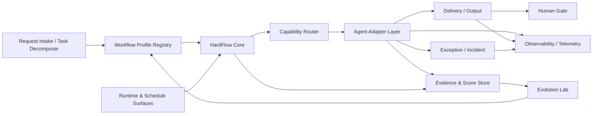

# Workflow 架构宣言（2026-03-13）

## 摘要

这份文档是 OpenClaw 工作流体系的硬边界文档。  
从 2026-03-22 起，本项目的目标形态不再描述成“很多 skill + 很多 runner”，而是描述成：

`HardFlow Core + Workflow Profile Registry + Capability Routing + Evidence & Score Store + Evolution Lab`

如果补全为实施所需的完整底座，至少还应显式包含：

- `Delivery / Output Layer`
- `Human Interaction Gate`
- `Exception / Incident Layer`
- `Observability / Telemetry Layer`

当前最重要的架构结论只有一条：

`系统的默认产品是编码工作流，skill 只是能力实现，HardFlow 是共享底座。`

也就是说：

- `coding-default` 是唯一默认 workflow profile
- workflow 选择发生在“需求澄清 + 任务拆分”之后，而不是在最前面拍脑袋选定
- 其他 workflow 以后可以扩展，但必须复用同一套 HardFlow Core
- 自我进化只能先改 candidate，再通过评分晋升 stable
- workflow 绑定 capability，不直接绑死 skill

---

## 1. 硬决策

### 1.1 默认产品决策

- 整体总流程固定为：`需求输入 -> 需求澄清 -> 任务拆分 -> 选择 workflow profile -> 进入执行闭环`
- 默认 workflow profile 固定为 `coding-default`
- 默认入口命令 `bash scripts/hardflow/hardflow-run.sh workflow ...` 代表 `coding-default@stable`
- 未来新增 `research-default`、`ops-default`、`docs-default` 等 profile 时，默认入口仍不切换
- 只有显式配置 `workflow_profile_id` 时，才允许偏离默认编码工作流
- 当需求主要输出是代码、配置、测试、重构、修复时，workflow selector 默认选择 `coding-default`

### 1.2 分层决策

- `Request Intake / Workflow Selector` 负责需求澄清、任务拆分和 workflow 选择
- `HardFlow Core` 负责阶段编排、Gate、证据、验收、完成前验证、评分回流
- `Workflow Profile` 负责定义阶段图、能力绑定、hook 策略、评分策略和 runtime 需求
- `Capability` 是 workflow 与 agent/skill 之间的稳定接口
- `Skill` 是 capability 的一种实现，不再是架构的一等公民
- `Hook` 是 runtime 护栏，不承载业务流程真值

### 1.3 进化决策

- 任何自我进化都不能直接改线上默认稳定流程
- 所有升级都必须走 `stable -> candidate -> benchmark -> compare -> promote/rollback`
- 没有 `baseline / candidate / delta` 的改动，不算 workflow 进化，只算普通变更
- 评分结果必须能回流到 workflow、capability、skill 三层，而不是只给一份总分

### 1.4 真值源决策

- workflow 的长期真值源是仓库内的 profile/manifest 与安装器
- runtime 只是真值的运行态投影，不是长期设计文档
- 运行态漂移必须被导出、对比、告警，但不能成为新的 SSOT
- 外部调度若未进入 `Schedule Registry`，一律视为未纳管

---

## 2. 目标架构

### 2.1 Request Intake / Workflow Selector

负责接收用户需求，完成：

- 需求澄清
- 需求质量评分
- 任务拆分
- workflow profile 选择

这一步是所有 workflow 的统一前置层。

### 2.2 Workflow Profile Registry

负责登记所有 workflow profile，是“系统能跑哪些工作流”的真值源。

### 2.3 HardFlow Core

负责统一的阶段机、评分门禁、验收门禁、完成前验证、回流整改与产物落盘。

### 2.4 Capability Router

负责把 workflow stage 需要的能力路由给合适的 agent、skill 或 role-only agent。

### 2.5 Agent Adapter Layer

把不同 agent 的调用方式统一成结构化执行组件，禁止 workflow 自己拼接隐式 prompt 协议。

### 2.6 Delivery / Output Layer

负责统一输出、人机/系统投递与格式协议。

### 2.7 Human Interaction Gate

负责人工确认、人工补料、人工恢复执行。

### 2.8 Exception / Incident Layer

负责异常分类、异常升级、事故记录与自动恢复策略。

### 2.9 Evidence & Score Store

统一保存运行证据、评分结果、回归数据、升级比较结果，是“好不好”的事实层。

### 2.10 Observability / Telemetry

负责 token、耗时、成本、失败率、重试次数等运行指标。

### 2.11 Evolution Lab

负责 candidate 构建、基准任务重跑、分数对比、晋升和回滚。

---

## 3. 五层分工

| 层 | 负责什么 | 真值源 | 禁止做什么 |
| --- | --- | --- | --- |
| `Request Intake Layer` | 接收需求、澄清目标、拆分任务、选择 workflow | 协调器规则、需求评分、任务拆分结果 | 跳过澄清直接选 workflow |
| `Workflow Profile Layer` | 定义 workflow 是什么、有哪些阶段、默认走法是什么 | 仓库内 profile/manifest/ADR | 直接持有运行态状态 |
| `HardFlow Core Layer` | 统一阶段机、Gate、验收、完成前验证、评分回流 | `scripts/hardflow/*` 与 score policy | 把 skill 写成流程真值 |
| `Capability Layer` | 把 workflow 需求映射成稳定能力接口 | capability manifest / binding manifest | 直接等同于某个具体 skill |
| `Delivery / Human Layer` | 统一输出、人工确认、异常升级 | 输出协议、人工门禁策略、异常策略 | 让各 workflow 自己拼格式和人工逻辑 |
| `Runtime Layer` | 承接安装、启停、hook、生效配置、调度执行 | `install_workflow_profile.py`、runtime overlay、schedule registry | 反向充当长期设计文档 |
| `Evidence / Telemetry / Evolution Layer` | 存证、监控、评分、候选比较、晋升回滚 | scorecard、run report、upgrade report、telemetry | 只有报告，没有准入决策 |

---

## 4. 默认工作流：`coding-default`

### 4.1 目标

`coding-default` 是系统的唯一默认工作流，服务于“需求 -> 实现 -> 测试 -> 评审 -> 验收 -> 完成”的完整编码闭环。

注意：

- 它不是整个平台的第一步
- 它是需求澄清与任务拆分之后，被默认选中的执行工作流
- 如果后续任务被识别为研究、运维、文档等类型，才转去其他 profile

### 4.2 默认阶段图

1. 进入前提：需求已澄清、任务已拆分、workflow 已选定
2. 实现
3. 测试修复循环
4. 评审
5. Gate 评分
6. 部署前质量门禁
7. 部署后验收
8. 完成前验证
9. 升级反馈

### 4.3 默认多角色闭环

`coding-default` 至少包含以下 4 类角色，不允许单 agent 一路直通：

1. `planner / decomposer`
2. `implementer`
3. `reviewer / verifier`
4. `scorer / gate`

这样做的目的不是堆角色，而是把“生成、审查、验证、评分”拆开，降低单角色幻觉风险。

---

## 5. 核心对象

### 5.1 `WorkflowProfile`

每个 workflow profile 至少包含：

- `profile_id`
- `version`
- `channel`：如 `stable` / `candidate`
- `default_entry`
- `stage_graph`
- `required_capabilities`
- `hook_policy`
- `score_policy`
- `runtime_requirements`
- `promotion_policy`

### 5.2 `CapabilityBinding`

每个 capability 至少包含：

- `capability_id`
- `owner_domain`
- `default_agent`
- `allowed_agents`
- `required_skills`
- `required_runtime`
- `verification_contract`

### 5.3 `PromotionBundle`

每次自我进化的比较对象至少包含：

- `target_kind`：`workflow` / `skill` / `binding`
- `target_id`
- `baseline_version`
- `candidate_version`
- `benchmark_runs`
- `baseline_score`
- `candidate_score`
- `delta`
- `promotion_decision`

---

## 6. 评分与晋升

### 6.1 评分对象

评分至少覆盖 4 个层级：

1. `workflow_run`
2. `stage`
3. `capability`
4. `agent_or_skill`

### 6.2 晋升规则

- candidate 必须在基准任务集上重跑
- candidate 必须产出结构化 scorecard
- 没有显著回归，且关键维度净提升，才允许晋升
- 关键回归包括：证据质量下降、失败率上升、越权修改增加、验证遗漏增加

### 6.3 回滚规则

出现以下任一情况，candidate 直接回滚：

- Gate 关键维度低于 stable
- 证据结构缺失
- 完成前验证链断裂
- 运行态依赖增加但文档与 manifest 未同步

---

## 7. 升级规则

### 7.1 先改什么

1. 先改 ADR 和架构文档
2. 再改 workflow profile / manifest
3. 再改 installer / runtime binding
4. 最后才改 runner 与自动化行为

### 7.2 不允许什么

- 不允许把 workflow 升级逻辑藏在 prompt 里
- 不允许把 skill 文本当成 workflow 真值
- 不允许让 runtime 手工现改先于仓库模板
- 不允许让自我进化直接覆盖 stable 默认流

### 7.3 当前阶段的收口原则

当前阶段只做仓内自升级，不做外部下载市场。  
因此这份架构宣言明确：

- 先把 `coding-default` 做成稳定默认产品
- 先把 stable/candidate 晋升机制做实
- 先让 capability 成为稳定接口
- 后续再考虑外部 workflow 或 skill 的下载与安装

---

## 8. 成功标准

当下面 6 条都成立时，说明架构收口完成：

1. 任何人都能回答系统默认 workflow 是什么
2. 任何 workflow 改动都能定位到 profile/manifest，而不是先改 runtime
3. 任何 skill 变更都能回答它服务的是哪个 capability
4. 任何升级都能给出 baseline/candidate/delta
5. 任何 candidate 都不能绕过晋升直接成为默认流
6. 新增 workflow 时是“新增 profile”，而不是复制一套 runner 链
