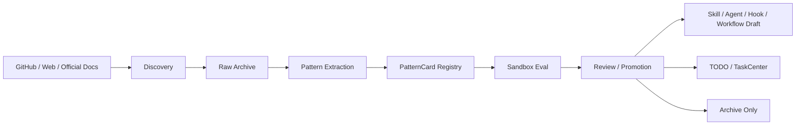

# External Pattern Learning Pipeline

**Goal:** 将“网上搜索更专业的 agent / skill / workflow / prompt”从零散人工行为，收敛为一条受管、可审计、可复用的外部模式学习流水线。

**Architecture:** 以现有 `ops_github_web_evolution_incremental`、`web_intel_collect_hourly`、`web_intel_review_*` 为发现层，新增统一的 `PatternCard` 抽取、沙箱评估、晋升治理三层，把外部资料沉淀为本仓可复用的 skills、agents、hooks、workflow 设计资产，而不是仅保存链接或 prompt 原文。

**Tech Stack:** 现有 Python ops layer、GitHub 搜索、网页采集、`skill4agent` 检索、TaskCenter、`policy_enforcer`、文档归档目录、可选 worktree / sandbox 验证。

---

## Assumptions

- 当前目标是先建立“外部模式学习能力”，不是立即重写现有 workflow。
- 外部资料的价值主要来自方法、边界、权限、评估方式，不来自单段 prompt 文本本身。
- 任何外部模式在进入生产链路前，都必须经过本地结构化、评估和人工可审查的晋升过程。
- 近期优先复用现有 `github_web_evolution_runner.py` 与 `web_intel_collect_runner.py`，不新建一套完全独立的抓取体系。

## Problem Statement

当前系统已经具备：

- 搜 GitHub / Web 的能力
- 采集网页证据的能力
- 把发现结果打包成 TODO / task 的能力
- 通过 `policy_enforcer` 和 `TaskCenter` 做任务治理的能力

但当前仍缺少一个中间层，用于回答下面几个关键问题：

- 搜到的仓库、文章、技能，到底哪一类值得学
- 学到的内容应该如何抽取，而不是把全文堆进归档目录
- 哪些只是“灵感”，哪些已经足够变成正式 skill / agent / hook / workflow
- 如何验证一个外部模式是否真的优于当前做法

如果没有这层，搜索只会持续产出“信息”，不会稳定产出“能力资产”。

## Non-Goals

- 不做全网通用爬虫平台。
- 不做“自动安装一切外部 skill”的高风险链路。
- 不把外部 prompt 原样并入本仓主规则。
- 不绕过 `TaskCenter`、`policy_enforcer`、`Schedule Registry` 另起治理旁路。

## Option Comparison

### Option A: 继续人工搜索 + 手工挑选

- 做法：继续由人或 agent 临时搜索，再人工挑选可参考的 prompt、skills、workflows。
- 优点：实现成本最低。
- 缺点：不可积累、不可审计、不可复用，结果强依赖当时上下文。

### Option B: 搜索结果直接自动安装或自动合并

- 做法：搜索到外部 agent / skill 后，直接安装或写入本仓。
- 优点：自动化程度高。
- 缺点：风险最高，容易引入权限、质量、许可、风格冲突问题。

### Option C: 外部模式学习流水线（推荐）

- 做法：搜索只负责“发现”，中间增加结构化抽取、质量评分、沙箱评估、晋升治理，再决定是否产出正式资产。
- 优点：风险可控，长期可积累，可和现有 workflow 体系兼容。
- 缺点：比单纯搜索多一层工程设计。

**Recommendation:** 采用 Option C。你当前仓库已经具备“搜索”和“任务治理”两端能力，缺的就是中间的“模式资产化”层；补齐这层，比新造一套 agent 框架更有价值。

## Design Principles

- 搜索只是入口，模式抽取才是核心产物。
- 外部资料必须先结构化，再允许进入任务或资产层。
- 技能依赖、权限边界、评估方式必须显式登记，不能藏在 prompt 文本里。
- 默认保守：先归档、再评估、后晋升。
- 以官方方法论和可执行仓库为主，博客、视频、推文只作为线索，不直接晋升。

## Source Tiers

### Tier 1: Official Method Sources

用于学习“正确范式”，优先级最高：

- Anthropic Claude Code: subagents / skills / hooks / plugins / agent teams
- Anthropic prompt engineering / eval guidance
- OpenAI Agents SDK: parallel agents / handoffs / guardrails
- GitHub 官方搜索语法与筛选规则

### Tier 2: Executable Community Assets

用于学习“别人是怎么落地的”，包括：

- 带 `SKILL.md`、`AGENTS.md`、`CLAUDE.md`、`.claude/settings.json`、`hooks.json` 的公开仓库
- 带脚本、模板、验证流程、目录结构的可执行 skill / agent / plugin 仓库

### Tier 3: Curated Indexes

用于降低搜索噪声：

- curated awesome list
- skill index / marketplace
- agent / plugin 索引仓库

### Tier 4: Weak Signals

只作为线索，不直接晋升：

- 博客文章
- 视频
- 推文 / 论坛帖子
- 演示型 prompt 集

## What To Learn From External Assets

外部资产的学习重点不是“复制 prompt”，而是抽取下面这些结构：

- 这个模式解决的真实问题是什么
- 它的触发条件是什么
- 它把任务拆成了哪些子步骤
- 它用了哪些工具与权限边界
- 它如何做 handoff / review / guardrail
- 它如何验证结果质量
- 它的失败路径和回退策略是什么

## Core Artifact: PatternCard

新增统一中间对象：`PatternCard`。

每个候选外部模式都必须先转换成 `PatternCard`，而不是直接变成 skill 或 prompt。

详细字段契约、枚举、校验和 JSON 结构见：

- [2026-03-14-pattern-card-field-spec.md](./2026-03-14-pattern-card-field-spec.md)
- [2026-03-14-agent-skill-hook-绑定现状与优化清单.md](../2026-03-14-agent-skill-hook-绑定现状与优化清单.md)
- [2026-03-13-workflow-architecture-manifesto.md](./2026-03-13-workflow-architecture-manifesto.md)

### Schema Authority

- `PatternCard` 的 JSON 真值结构以字段规范文档为准，本文件不再重复定义另一套字段表。
- 实现、校验器、测试、样例 JSON、自动生成产物必须使用字段规范中的 canonical nested paths。
- 本文件如果在叙述里使用 `title`、`source_url`、`artifact_type` 这类短写，只表示语义，不代表 JSON 顶层键。

### Canonical Minimum Paths

- `pattern_id`
- `status`
- `identity.title`
- `identity.artifact_type`
- `identity.workflow_shape`
- `source.source_url`
- `source.source_kind`
- `source.captured_at`
- `source.license_or_usage_note`
- `extraction.problem`
- `extraction.trigger_conditions`
- `contracts.input_contract`
- `contracts.output_contract`
- `contracts.tooling`
- `operational.permissions`
- `operational.guardrails`
- `scoring.adoptability_score`
- `scoring.risk_level`
- `evidence[*]`

## Scoring Model

候选模式不做单一“好坏”判断，而是拆成多维分：

- `signal_score`: 来源质量、维护活跃度、是否官方或高质量仓库
- `fit_score`: 与 OpenClaw 当前架构的贴合程度
- `safety_score`: 权限、脚本、外部依赖、潜在副作用
- `eval_score`: 是否有明确验证方式
- `novelty_score`: 是否补充了本仓当前缺失能力
- `reuse_score`: 是否可沉淀为多个 workflow 共用资产

最终产出：

- `adoptability_score`
- `promotion_recommendation`: `archive_only` / `sandbox_eval` / `draft_asset` / `human_review_required`

## End-to-End Flow

## Mapping To Current Repository

### Discovery Layer

复用现有：

- `scripts/openclaw-ops/github_web_evolution_runner.py`
- `scripts/openclaw-ops/web_intel_collect_runner.py`
- `scripts/openclaw-ops/web_sources_runtime.py`

这里负责：

- 搜索 query pack
- GitHub repo / skill 结果拉取
- 网页正文和证据采集
- 原始归档

### Review Layer

复用现有：

- `web_intel_review_optimization_4h`
- `web_intel_review_project_docs_6h`

这里负责：

- 初步过滤低质量来源
- 输出人类可读摘要
- 发现值得继续处理的候选

### Governance Layer

复用现有：

- `TODO_PATROL_POLICY_FLOW.md` 所定义的 TODO -> `policy_enforcer` -> `TaskCenter` 入口
- `task_executor_10m`

这里负责：

- 把候选模式转成受管任务
- 阻止绕过策略直接进入执行
- 保留失败、重试、升级、人工确认能力

## Schema Alignment

`PatternCard` 只负责表达“外部候选模式是什么”，不直接替代现有调度清单或任务包 schema。

### Schedule Layer

- 定时任务与外部调度的真值仍然是 `ScheduleInventoryEntry`
- 现有关键字段沿用：
  - `capability`
  - `required_skills`
  - `required_runtime`
- 这一层回答的是：“哪个调度存在、由谁负责、长期依赖什么运行时能力”

### Task Layer

- 单个 TaskCenter 任务包当前以 `assignee` 为主
- 若后续补能力约束，应在任务层新增：
  - `required_capabilities`
  - `required_skills`
  - `allowed_agents`
- 这一层回答的是：“这个具体任务本次允许谁执行、必须满足什么能力”

### Projection Rule

- `PatternCard` -> `Promotion Gate` -> `Schedule proposal` 或 `Task proposal`
- `PatternCard` 本身不直接变成 `ScheduleInventoryEntry`，也不直接等同于 TaskCenter schema
- 若外部模式需要落成任务或调度，必须由晋升流程显式投影到现有 schema，而不是在不同文档里再发明一套同名字段

## Proposed New Components

### 1. Pattern Extractor

建议新增 `pattern_extractor.py`：

- 输入：已归档的 GitHub / Web / official docs 内容
- 输出：标准化 `PatternCard`
- 责任：抽取结构，不直接给出“是否合并到生产”

### 2. Pattern Registry

建议新增归档目录，例如：

- `docs/patterns/cards/`
- `docs/patterns/reviews/`
- `docs/patterns/benchmarks/`

也可以放到 `~/.openclaw/web/patterns/` 作为运行态数据，但项目内至少保留可审查摘要。

### 3. Sandbox Evaluator

建议新增 `pattern_sandbox_eval.py`：

- 输入：`PatternCard`
- 输出：评估报告
- 责任：在隔离 worktree 或受限环境中验证该模式是否真的提升结果质量

### 4. Pattern Promotion Gate

建议新增 `pattern_promotion_gate.py`：

- 输入：评估报告 + `PatternCard`
- 输出：正式资产草案、TODO 或仅归档结论
- 责任：只有通过 gate 的候选，才允许进入仓库资产层

## Query Strategy

现有 `github_web_evolution_runner.py` 已经具备 query pack 和 `skill4agent` 搜索能力，但关键词仍偏 OpenClaw 自身。

建议扩充为 4 类 query：

### A. Framework Queries

- `claude code skills hooks plugins workflow archived:false`
- `codex skills agents workflow archived:false`
- `agent sdk handoff guardrail workflow archived:false`
- `mcp server workflow agent tools archived:false`

### B. Asset Shape Queries

- `SKILL.md workflow review archived:false`
- `AGENTS.md code review guardrail archived:false`
- `CLAUDE.md hooks plugin workflow archived:false`
- `hooks.json claude code archived:false`

### C. Domain Queries

- `browser automation anti bot playwright workflow archived:false`
- `code review multi agent workflow archived:false`
- `eval guardrail agent workflow archived:false`
- `context engineering skill workflow archived:false`

### D. Freshness / Quality Filters

结合 GitHub qualifiers：

- `stars:>=10`
- `pushed:>=2025-01-01`
- `archived:false`
- 必要时增加 `topic:`、`language:`、`in:readme`

## Evaluation Benchmarks

外部模式只有在本地 benchmark 中证明有效，才值得晋升。

建议先做 4 组最小 benchmark：

### Benchmark 1: Review Quality

- 输入：固定一组真实代码变更
- 对比：当前 reviewer 流程 vs 外部 review pattern
- 指标：问题发现率、误报率、建议可执行性

### Benchmark 2: Workflow Decomposition

- 输入：固定一组中等复杂任务
- 对比：当前 task packet vs 外部 task decomposition pattern
- 指标：任务边界清晰度、依赖识别率、返工率

### Benchmark 3: Guardrail Effectiveness

- 输入：故意构造危险命令、过宽权限、低质量输出
- 对比：当前规则 vs 外部 guardrail pattern
- 指标：拦截率、误拦率、恢复路径清晰度

### Benchmark 4: Web Intelligence Robustness

- 输入：反爬、429、结构变化页面
- 对比：现有采集流程 vs 外部 web pattern
- 指标：恢复成功率、证据完整度、噪音控制

## Promotion Paths

候选模式通过评估后，只允许进入以下路径之一：

### Path A: Archive Only

适用于：

- 有参考价值，但不适合当前仓库
- 许可或安全边界不清晰
- 只是理念参考，不适合直接资产化

### Path B: Draft Asset

适用于：

- 已经能明确转成 skill / agent / hook / plugin / command 草案
- 但仍需人工确认

### Path C: TODO Task

适用于：

- 候选模式本身不直接并入仓库
- 但能引出明确改造任务

### Path D: Rejected

适用于：

- 质量、适配度或安全性不达标

## Storage and Ownership

### Recommended Project Storage

- `docs/plans/`：方案与演进文档
- `docs/patterns/cards/`：结构化 `PatternCard`
- `docs/patterns/reviews/`：人工或 agent review 摘要
- `docs/patterns/benchmarks/`：评估结果

### Ownership

- `optimization-agent`：主负责发现、抽取、评估和晋升建议
- `ops-agent`：负责调度、策略、任务治理和告警
- `project-agent`：负责把高价值模式沉淀进项目文档和知识索引
- `reviewer`：负责在晋升前做质量和边界审查

## Policy Requirements

这条流水线必须遵守现有硬边界：

- 不允许绕过 `policy_enforcer`
- 不允许未经登记直接进入正式 workflow
- 不允许把技能依赖只写在 prompt 里
- 不允许在没有评估的情况下自动引入外部脚本或权限

对于任何需要执行外部脚本、安装外部 skill、启用外部 hook 的候选，默认要求：

- `human_review_required`
- 显式记录 `permissions`
- 显式记录 `license_or_usage_note`
- 显式记录失败回退策略

## Rollout Plan

### Phase 1: Document and Registry First

- 先定义 `PatternCard` 契约
- 建立归档目录
- 把外部学习结果从“搜索报告”升级为“结构化卡片”

### Phase 2: Add Extraction

- 在 `github_web_evolution_runner.py` 后增加 `PatternCard` 产出
- 将 `skill4agent` 和网页归档结果统一进入抽取层

### Phase 3: Add Sandbox Eval

- 新增 benchmark 任务与评估脚本
- 将候选模式分流到 `archive_only` / `sandbox_eval` / `draft_asset`

### Phase 4: Add Promotion Gate

- 通过 `policy_enforcer` 将高价值候选转成 TODO 或正式资产草案
- 把通过验证的模式回写到项目 skills / agents / docs

## Minimal Verification

这份方案落地后，最小验证标准应为：

1. 能定期发现新的外部候选来源。
2. 每个候选都能产出结构化 `PatternCard`。
3. 至少一类 benchmark 能自动比较“当前模式 vs 外部模式”。
4. 晋升路径必须经过 `TaskCenter` 或正式文档资产化流程。
5. 能清楚回答“某个外部模式为什么被采纳，为什么没被采纳”。

## Risks

- 搜索噪声过大，导致系统只是在收集链接。
- 过度崇拜“别人更专业的 prompt”，忽略本地约束与数据面。
- 未做评估就引入外部脚本或高权限 hooks。
- 结构化过度复杂，导致维护成本高于收益。

## Open Questions

- `PatternCard` 应写入项目仓库，还是主要存放在运行态目录再回写摘要。
- benchmark 是否先只覆盖 `reviewer` / `optimization-agent` 两条链路。
- 是否需要单独维护一个 `official_sources.json` 与 `community_sources.json`。
- 是否把晋升后的资产直接生成到 `skills/`，还是先只生成草案文档。

## References

- Anthropic Claude Code Subagents
- Anthropic Claude Code Skills
- Anthropic Claude Code Hooks
- Anthropic Claude Code Agent Teams
- Anthropic Prompt Engineering Overview
- OpenAI Agents SDK Parallel Agents
- OpenAI Agents SDK Handoffs
- OpenAI Agents SDK Guardrails
- GitHub Repository Search Qualifiers
- curated community index repositories for Claude Code ecosystems
