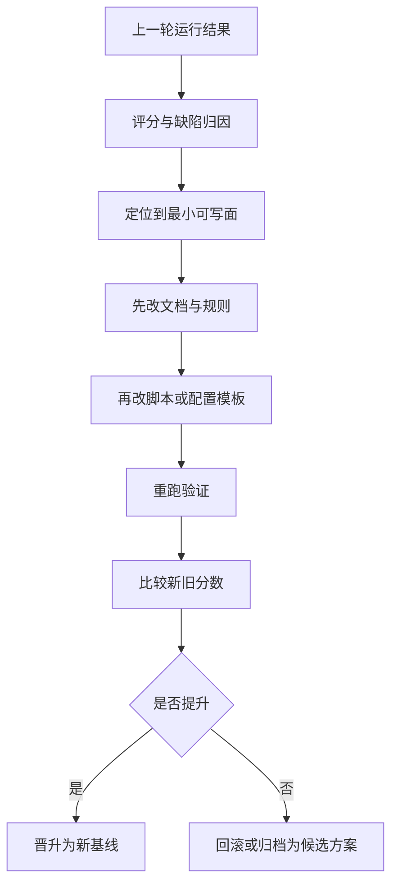

# 2026-03-21 OpenClaw 工作流与技能自动进化升级设计

更新时间：2026-03-21（北京时间）

## 1. 文档定位

这份文档回答的是一个更具体的问题：

- 如果要让 `OpenClaw` 工作流升级更快，应该把“升级动作”设计成什么样
- 如果某一块表现不好，应该先改哪一层、哪几个文件
- 如果 agent 的工作质量不稳定，应该如何通过评分回路升级 workflow 与 skill，而不是只修一次结果

它不是替代以下文档，而是在它们之上补一层“升级控制面”：

- `docs/plans/2026-03-13-workflow-architecture-manifesto.md`
  - 回答“默认产品与目标架构是什么”
- `docs/plans/2026-03-14-external-pattern-learning-pipeline.md`
  - 回答“外部模式未来如何进入本仓”
- `docs/2026-03-19-openclaw-工作流治理与执行闭环升级说明.md`
  - 回答“当前已经纳入主链的治理与执行闭环有哪些”
- `docs/2026-03-20-openclaw-workflow-主升级方案.md`
  - 回答“当前阶段优先补哪几项升级”

本文件只聚焦一件事：

`把 OpenClaw 的工作流升级，变成一套文档先行、评分驱动、可快速迭代、可晋升回滚的小步进化流程。`

---

## 2. 当前边界

本轮架构收口明确以下边界：

- 当前阶段只做仓内自升级
- 暂不做外部 workflow / skill 下载市场
- 默认产品是 `coding-default`
- workflow 的选择发生在需求澄清与任务拆分之后
- `HardFlow Core` 是共享底座，不等于某个单独业务流

这意味着本文件讨论的“自动进化”，只包含：

1. 默认编码工作流的 profile 升级
2. capability 绑定升级
3. skill 规范升级
4. hook / score / 验收策略升级

也意味着平台总流程应统一为：

`需求输入 -> 澄清 -> 拆分 -> workflow 选择 -> 执行 -> 验证 -> 评分反馈`

不包含：

1. 从外部自动下载工作流
2. 外部 workflow 自动安装到线上默认流
3. 未经基准任务验证就直接晋升默认流

---

## 3. 为什么“快”首先代表文字

对于工作流系统，真正拖慢升级速度的，通常不是“代码不够快”，而是下面几件事：

1. 不知道该改哪一层
2. 不知道这个问题到底是 workflow 问题、skill 问题，还是 runtime 问题
3. 改完以后不知道有没有比上一轮更好
4. 同样的问题下一轮又重复出现，只能继续手修

因此，想让升级变快，首先要把以下三件事写清楚：

1. 架构地图
   - 每一层负责什么
   - 升级某类问题时优先改哪里
2. 升级规则
   - 文档先改什么
   - 代码后改什么
   - 哪些运行态文件不该直接碰
3. 评分回路
   - 如何判断上一轮哪里做得不好
   - 如何把低分映射到 workflow / capability / skill 的具体修改点

结论是：

`工作流想要快迭代，必须先是文本驱动、结构清晰、修改面小、评分可回放。`

---

## 4. 本次确认的核心决策

### 4.1 文档先行，代码后行

任何 workflow 升级、skill 升级、agent 行为升级，先落成文档规则，再决定是否新增脚本、job、gate 或运行态产物。

### 4.1.1 需求先行，workflow 后选

workflow 不是接收到需求后的第一步。  
第一步永远是：

1. 理解用户需求
2. 明确目标、约束、成功标准
3. 做任务拆分
4. 再决定使用哪个 workflow profile

因此默认 `coding-default` 的正确定位是：

- 默认执行工作流
- 不是默认第一步

### 4.2 升级必须找到“最小可写面”

不要一上来就改整套系统。每次升级先回答：

- 这是哪一层的问题
- 这一层里最小的修改入口是什么
- 是否能只改一份文档、一份 skill、一份 installer 或一个 runner

### 4.3 每次升级都必须有“上一轮分数”和“这一轮分数”

如果没有比较对象，就不叫进化，只叫改动。

每次升级至少要回答：

- 上一轮低分在哪里
- 这次改动试图提升哪一项
- 改后是否确实更好

### 4.4 Workflow 与 Skill 必须分开进化

- `workflow` 负责调度、状态机、闭环和执行路径
- `skill` 负责指导 agent 如何做、怎么判断、哪些动作不能做

很多低分问题表面上像执行失败，实际根因是：

- workflow 路由不清
- skill 规范太弱
- 评分维度不对
- 验证产物不够

因此不能只修 runner，也不能只修 prompt。

### 4.5 进化必须区分 stable 与 candidate

每次升级都必须先回答：

- 这次改的是 `stable` 还是 `candidate`
- 这次比较对象是谁
- 这次成功标准是什么
- 失败时如何回滚

从现在开始，推荐统一口径：

- `coding-default@stable`
  - 默认线上编码工作流
- `coding-default@candidate`
  - 候选升级版本，只用于重跑、评分、比较

同理，workflow 之外的 skill 或 binding 升级，也应先在 candidate 通道验证，而不是直接覆盖 stable。

---

## 5. 升级对象分层

### 5.1 架构层

回答：

- 系统有哪些层
- 各层边界是什么
- 哪些东西是 SSOT，哪些只是运行态投影

典型问题：

- 不知道应该改仓库模板还是改运行态
- 不知道某个能力到底属于 workflow、capability、skill 还是 runtime

### 5.2 Workflow 编排层

回答：

- 需求澄清后如何进入 workflow selector
- 哪些 job 负责发现问题
- 哪些 job 负责派单
- 哪些 job 负责执行
- 哪些 job 负责 push / PR / review / human confirm

典型问题：

- 频率不合适
- 派单路径不对
- 某条闭环断了

### 5.3 Capability / Skill 规范层

回答：

- workflow stage 需要什么能力
- 某个 capability 默认交给谁
- agent 在某类任务里应该如何思考、输出、验证
- 哪些行为是禁止的
- 失败模式是什么

典型问题：

- agent 总是缺证据
- agent 改动范围过大
- agent 不会先看架构再改

### 5.4 评分与验收层

回答：

- 如何给一次 workflow run 打分
- 如何给 capability / skill 使用效果打分
- 低分时该往哪一层回流

典型问题：

- 做完了，但不知道算不算更好
- 分数和改动之间没有映射

### 5.5 Runtime 安装与启停层

回答：

- 哪些能力当前只是仓库模板
- 哪些能力已经安装到运行态
- 如何启用、停用、对齐、重装

典型问题：

- 仓库里有，线上没开
- 线上改过，仓库文档没同步

---

## 6. 如果要升级某块，应该改哪里

下表的目标不是“把所有文件都列全”，而是给未来的 agent 一个清晰落点。

| 升级目标 | 优先修改入口 | 说明 | 不建议先改 |
| --- | --- | --- | --- |
| 需求入口、任务拆分、workflow 选择逻辑 | 协调器规则、需求评分规则、任务拆分规则、profile selector 文档 | 这是平台总入口 | 一上来就硬套某个 workflow |
| 工作流整体边界、层次、职责 | `docs/plans/2026-03-13-workflow-architecture-manifesto.md`、`skills/library/openclaw-workflow-manager/references/workflow-map.md` | 先修地图，再修实现 | 直接改 `~/.openclaw/*` |
| 默认编码工作流定义 | workflow profile 文档、HardFlow README、ADR | 先把 `coding-default` 固化成制度默认 | 继续把默认流藏在执行习惯里 |
| profile 安装、启停、重装方式 | `scripts/openclaw-ops/install_workflow_profile.py`、`scripts/openclaw-ops/uninstall_workflow_profile.py` | 整体对齐优先 | 手工多处编辑 runtime 配置 |
| 单个 job 的频率、payload、安装行为 | `install_*_job.py`、`cron_setup.py`、`cron/jobs.json` | 先改 installer，再考虑模板 | 只在线上手改 jobs |
| 发现问题与建单逻辑 | `self_evolution_todo.py`、`conversation_evolution_runner.py`、`governance_evolution_runner.py`、`github_web_evolution_runner.py` | 这是“发现层” | 直接把结果写死到任务中心 |
| 执行、派单、能力门禁 | `policy/task_executor_runner.py`、`policy/task_center.py`、能力 manifest 相关文件 | 这是“执行层” | 用 prompt 临时绕过 preflight |
| Git push / PR 闭环 | `git_sync_push_runner.py`、`install_governance_evolution_job.py` | push 与 PR 归 workflow 管，不归 skill 管 | 让 agent 手写随意 git 流程 |
| 项目上下文与索引 | `install_project_index_job.py`、`policy/project_index_maintainer.py` | 这是“上下文准备层” | 让执行 agent 自己临时扫全仓 |
| Capability / Skill 行为规范 | capability manifest、`skills/library/<skill>/SKILL.md`、`references/` | 先看 capability，再细化 skill | 只在 agent prompt 里临时补一句 |
| 外部模式接入 | `docs/plans/2026-03-14-external-pattern-learning-pipeline.md`、后续 pattern card 相关资产 | 先评估，再接入 | 直接复制外部 workflow |
| 评分规则与 gate | `scripts/hardflow/*`、相关评分文档 | 负责“好不好”的标准 | 只靠主观描述“这次更好了” |
| 运行态 overlay 边界 | `openclaw/openclaw.json`、`install_workflow_profile.py` | overlay 改仓库源，不改运行态现值 | 直接在线上改到不可回放 |
| 晋升与回滚策略 | upgrade scorecard / roadmap / ADR | 这是“能不能成为默认流”的规则 | 用口头判断替代分数对比 |

一句话原则：

`能改仓库模板，就不先改运行态；能改 installer，就不先改产物；能改 capability 或 skill 规范，就不先靠临时 prompt。`

---

## 7. Workflow 自动进化的标准回路

### 7.1 输入

每轮至少读取这些输入：

- 上一轮 run 报告
- task executor 执行结果
- reviewer / governance / self evolution 报告
- 日志和失败原因
- 对应的 score 或质量判断
- `stable / candidate` 版本信息

### 7.2 归因

每个低分问题先归到下面 4 类之一：

1. `architecture_gap`
   - 地图不清、边界不清、职责冲突
2. `workflow_gap`
   - 频率、路由、gate、执行路径设计不对
3. `skill_gap`
   - 能力指导不够、反模式未覆盖、验证规则不够硬
4. `runtime_gap`
   - 配置漂移、安装不一致、manifest 缺失、服务状态异常

### 7.3 输出

每轮输出不应只包含“修复结果”，还应包含：

- 本轮低分项
- 归因分类
- 修改落点
- 新旧分数对比
- 是否值得晋升为新的默认行为

---

## 8. candidate / stable 晋升模型

### 8.1 默认通道

建议从现在开始，把默认编码工作流的升级统一成以下两个通道：

1. `coding-default@stable`
   - 默认线上工作流
2. `coding-default@candidate`
   - 候选升级版本

### 8.2 晋升条件

candidate 只有在下面条件同时成立时，才能晋升 stable：

1. 基准任务集重跑完成
2. 关键 Gate 没有回归
3. 证据质量不低于 stable
4. 关键失败模式没有新增
5. 文档、manifest、score policy 已同步

### 8.3 回滚条件

出现以下任一情况直接回滚：

1. G0-G6 任一关键维度劣化
2. completion verification 链断裂
3. 验收产物缺失
4. capability 边界变更但未同步文档
5. 候选版依赖新增但运行态未声明

---

## 9. 建议引入的评分维度

### 9.1 Workflow 评分维度

| 维度 | 含义 |
| --- | --- |
| `structure_clarity` | 问题是否能快速映射到正确层级 |
| `change_locality` | 改动是否集中在最小可写面 |
| `execution_stability` | runner / task-executor 是否稳定 |
| `closure_rate` | 闭环是否真实完成，而不是只产生 TODO |
| `evidence_quality` | 证据、日志、scorecard 是否完整 |
| `verification_discipline` | 是否保持完成前验证纪律 |
| `promotion_safety` | 是否避免 candidate 直接污染 stable |

### 9.2 Capability / Skill 评分维度

| 维度 | 含义 |
| --- | --- |
| `trigger_precision` | 何时使用该能力或 skill 是否清晰 |
| `instruction_clarity` | agent 是否容易理解该怎么做 |
| `boundary_clarity` | 什么能做、什么不能做是否明确 |
| `verification_discipline` | 是否要求留下可回放证据 |
| `failure_reduction` | 是否减少了重复低分问题 |
| `operational_reuse` | 是否能在多个 workflow 里复用 |

### 9.3 必存对比字段

未来每轮升级至少保存：

- `baseline_score`
- `candidate_score`
- `delta`
- `top_improvements`
- `top_regressions`
- `promotion_decision`

没有这些字段，就不应宣称“完成了一次进化”。

---

## 10. 当前最小实施建议

如果只做一轮最小收口，优先顺序应是：

1. 文档与 ADR 先确认默认 `coding-default`
2. 让 HardFlow README 明确自己是 Core，不是唯一业务流
3. 把 capability 与 skill 的边界写入 binding 文档
4. 让 upgrade scorecard 明确 stable/candidate 对比
5. 最后再补正式 workflow profile manifest
