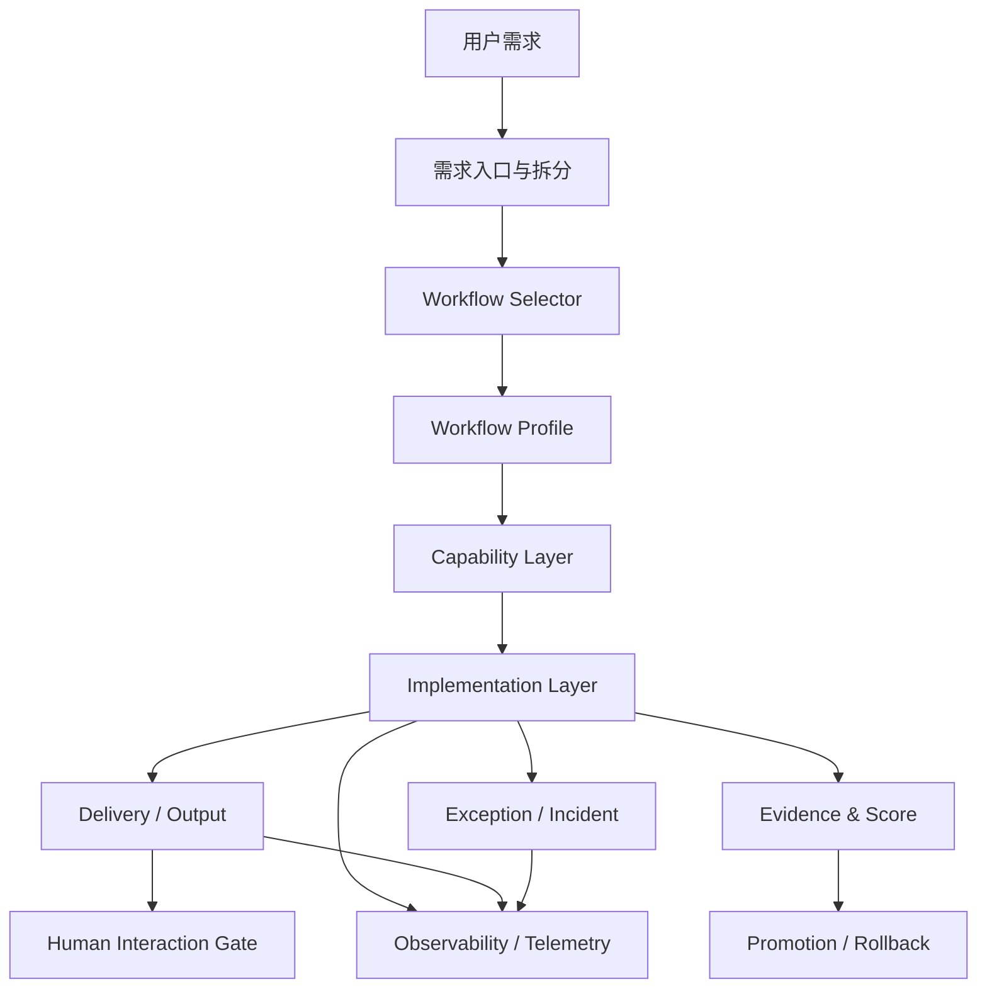

# 2026-03-22 OpenClaw 基建清单与 Manifest 最小规格
更新时间：2026-03-22（北京时间）

## 1. 文档定位

这份文档回答 3 个实施层面的问题：

1. 哪些能力属于平台基建，而不是某个 workflow 私有逻辑
2. 基建、workflow、capability、skill、进化层之间应该如何分层
3. 后续如果要把这些能力真正落地，最小 manifest 字段应该有哪些

本文件是“实现前规格文档”，目标是避免后续继续把：

- 需求分析
- 任务拆分
- 浏览器执行
- 评分
- 自我进化

混写到某一条 workflow 里，导致平台无法扩展。

---

## 2. 一句话结论

平台总逻辑固定为：

`用户提需求 -> 需求澄清 -> 任务拆分 -> 选择 workflow -> 执行 -> 验证 -> 评分反馈 -> candidate/stable 晋升`

其中：

- 基建负责“提供能力”
- workflow 负责“决定怎么组合使用这些能力”
- capability 负责“定义某一步需要什么能力”
- skill 负责“具体怎么做”
- 进化层负责“改 candidate、做对比、决定是否晋升”
- 输出层负责“把结果用统一格式送给人、系统和其他 agent”
- 监控层负责“记录 token、耗时、成本、失败率等运行数据”

最关键的边界是：

`评分框架放基建，评分标准放 workflow。`

---

## 3. 四层模型

### 3.1 基建层

负责平台共享的稳定能力。

### 3.2 工作流层

负责定义“某类任务怎么跑”。

### 3.3 能力实现层

负责把 capability 真正落地成 agent、skill、tool 调用。

### 3.4 进化层

负责 candidate 变更、基准任务重跑、分数对比与晋升回滚。

### 3.5 输出与人工层

负责统一输出格式、统一投递、人机协作和人工确认。

### 3.6 异常与监控层

负责异常分类、异常升级、运行监控、成本计量与审计指标。

---

## 4. 哪些属于基建

下面这些都属于平台基建，而不是某条 workflow 的私有逻辑。

### 4.1 需求入口基建

负责：

- 接收用户需求
- 记录目标、约束、成功标准、范围边界
- 需求质量评分
- 缺信息时回问或补充

说明：

- 这不是 `coding-default` 私有逻辑
- 这是所有 workflow 的共同前置层

### 4.2 任务拆分与状态机基建

负责：

- 任务拆分
- 依赖关系
- 状态流转
- 重试
- 并行/串行约束
- 子任务聚合

说明：

- 拆分能力是基建
- 拆成几层、怎么拆，属于 workflow 策略

### 4.3 Workflow Registry 基建

负责：

- 注册有哪些 workflow profile
- 默认 workflow 是什么
- 哪个是 stable
- 哪个是 candidate
- 每个 workflow 的版本与渠道

### 4.4 Capability Registry 基建

负责：

- 注册 capability
- capability 对应默认 agent
- capability 允许哪些 agent
- capability 依赖哪些 skill / runtime / tools
- capability 的验证契约

说明：

- workflow 不直接依赖 skill
- workflow 先绑定 capability

### 4.5 Tool Runtime 基建

负责：

- shell
- git
- 文件系统
- 浏览器
- 联网检索
- 抓取
- API 调用
- 截图
- 代码执行

说明：

- “浏览器执行器”属于基建
- “这个 workflow 要打开哪个页面、点哪个按钮”属于 workflow 或 capability 实现

### 4.6 Evidence Store 基建

负责：

- 日志
- 截图
- 命令输出
- 报告
- scorecard
- 运行产物
- benchmark 结果

### 4.7 Scoring Engine 基建

负责：

- 收集证据
- 汇总评分输入
- 计算分数
- 生成 baseline/candidate/delta
- 产出 promotion decision 所需对比数据

说明：

- 这是评分框架
- 不是某个 workflow 自己私有的一段脚本

### 4.8 Promotion / Rollback 基建

负责：

- candidate 注册
- benchmark 重跑
- stable/candidate 对比
- 晋升
- 回滚
- 发布记录

### 4.9 Delivery / Output 基建

负责：

- 统一往人输出
- 统一往 IM / 群 / 面板 / 邮件输出
- 统一往其他 agent 输出
- 统一输出标准格式
- 输出等级与目标路由

说明：

- 输出框架属于基建
- 输出内容由 workflow、policy 和当前上下文决定

### 4.10 Human Interaction Gate 基建

负责：

- 哪些情况必须人工确认
- 哪些问题需要人工补料
- 哪些风险必须暂停执行
- 人工确认后如何恢复工作流

说明：

- 人工介入机制属于基建
- 是否触发可由 workflow 或 policy 决定

### 4.11 Exception / Incident 基建

负责：

- 异常分类
- 自动重试 / 中止 / 降级
- 是否升级为人工协助
- 生成 follow-up task 或 incident
- 统一异常输出结构

说明：

- 异常处理框架属于基建
- 不同 workflow 可以覆盖异常策略

### 4.12 Observability / Audit / Telemetry 基建

负责：

- trace
- 审计日志
- drift 检测
- 告警
- 失败归因
- token 用量
- 耗时
- 成本
- 重试次数
- 成功率
- 每阶段耗时
- 每个 capability 的稳定性指标

### 4.13 Security / Policy 基建

负责：

- 权限控制
- 密钥管理
- 风险门禁
- 白名单
- 超时
- 重试
- 人工确认策略

### 4.14 Runtime Install / Sync 基建

负责：

- 安装
- 重装
- 对齐
- 校验
- 漂移修复

---

## 5. 哪些不属于基建

下面这些不该直接做成基建真值。

### 5.1 某条 workflow 的阶段图

例如：

- `coding-default` 里先实现再测试
- `research-default` 里先搜集证据再归纳

这些属于 workflow profile。

### 5.2 某个 capability 的具体 prompt 或 skill 文本

这属于能力实现层，不属于基建真值。

### 5.3 某个浏览器流程的页面步骤

浏览器执行器是基建，但具体点哪里、抓什么，是 workflow 或 capability 私有逻辑。

### 5.4 某个 workflow 的 Gate 阈值

评分引擎是基建。  
某个 workflow 的阈值、维度、veto 规则是 workflow 策略。

### 5.5 某个 workflow 的输出文案内容

统一输出协议属于基建。  
具体发什么文案、哪些字段对人可见、是否静默，属于 workflow / policy 策略。

---

## 6. 评分应该放哪里

这是最容易混乱的点，结论如下。

### 6.1 属于基建的评分部分

- 证据采集
- scorecard 数据模型
- baseline/candidate 对比
- delta 计算
- promotion decision 框架
- benchmark 结果存储

### 6.2 属于 workflow 的评分部分

- 评分维度
- 各维度阈值
- veto 规则
- gate 顺序
- 哪些阶段必须过门禁

### 6.3 推荐规则

统一采用：

- `Scoring Engine`
  - 平台基建
- `Score Policy`
  - workflow profile 的一部分

---

## 6.4 输出、异常、人工介入放哪里

### 属于基建的部分

- 输出协议
- 输出通道
- 输出路由
- 人工确认机制
- 异常分类框架
- incident 记录
- 统一监控指标

### 属于 workflow 的部分

- 什么情况下输出
- 输出等级与优先级
- 哪些异常可自动吞并
- 哪些异常必须升级人工
- 哪些字段对人公开

### 推荐规则

统一采用：

- `Delivery / Output Layer`
  - 平台基建
- `Human Interaction Gate`
  - 平台基建
- `Exception Policy`
  - workflow / policy 可配置
- `Output Policy`
  - workflow / policy 可配置

---

## 7. 基建清单

下面这张表可以直接作为后续实施 checklist。

| 基建模块 | 是否必须 | 作用 | 当前建议 |
| --- | --- | --- | --- |
| `Request Intake` | 必须 | 需求澄清与结构化输入 | 先做 |
| `Task Decomposer` | 必须 | 任务拆分与依赖输出 | 先做 |
| `Workflow Selector` | 必须 | 需求后选择 workflow | 先做 |
| `Workflow Registry` | 必须 | 管理 workflow profile 与 stable/candidate | 先做 |
| `Capability Registry` | 必须 | 管理能力与默认执行者 | 先做 |
| `Task State Store` | 必须 | 管理任务状态、依赖、重试 | 先做 |
| `Tool Runtime` | 必须 | 浏览器、shell、联网、文件等执行器 | 先做 |
| `Evidence Store` | 必须 | 统一存证 | 先做 |
| `Scoring Engine` | 必须 | scorecard / delta / compare | 先做 |
| `Delivery / Output Layer` | 必须 | 统一输出、人机/系统投递 | 先做 |
| `Human Interaction Gate` | 必须 | 人工确认、人工补料、人工恢复 | 先做 |
| `Exception / Incident Layer` | 必须 | 异常分类、降级、升级、事故记录 | 先做 |
| `Observability / Telemetry` | 必须 | token / 耗时 / 成本 / 失败率 | 先做 |
| `Promotion / Rollback` | 必须 | candidate 晋升 stable | 先做 |
| `Observability / Audit` | 必须 | trace、日志、审计、告警 | 先做 |
| `Security / Policy` | 必须 | 权限、风险、超时、人工门禁 | 先做 |
| `Runtime Install / Sync` | 必须 | 安装、重装、对齐、校验 | 先做 |
| `Benchmark Suite` | 强烈建议 | 比较 candidate 与 stable | 尽快做 |
| `Load Balancer` | 后置 | 根据数据裁剪环节与分配执行资源 | 最后做 |

---

## 8. 最小 Manifest 字段表

下面这几张表是后续最小实现建议。

### 8.1 `WorkflowProfile` 最小字段

| 字段 | 必填 | 说明 |
| --- | --- | --- |
| `profile_id` | 是 | workflow 唯一标识，例如 `coding-default` |
| `version` | 是 | profile 版本 |
| `channel` | 是 | `stable` / `candidate` |
| `display_name` | 是 | 人类可读名称 |
| `description` | 是 | 用途说明 |
| `entry_conditions` | 是 | 进入该 workflow 的条件 |
| `stage_graph` | 是 | 阶段图定义 |
| `required_capabilities` | 是 | 该 workflow 依赖的 capability 列表 |
| `score_policy_ref` | 是 | 评分策略引用 |
| `hook_policy_ref` | 否 | hook 策略引用 |
| `runtime_requirements` | 否 | 运行时依赖 |
| `promotion_policy_ref` | 是 | 晋升/回滚策略引用 |
| `enabled` | 是 | 是否启用 |
| `default_selected_for` | 否 | 默认适用任务类型 |

### 8.2 `WorkflowSelectionRecord` 最小字段

| 字段 | 必填 | 说明 |
| --- | --- | --- |
| `selection_id` | 是 | 本次选择记录 ID |
| `request_id` | 是 | 来源需求 ID |
| `task_bundle_id` | 是 | 任务拆分结果 ID |
| `selected_profile_id` | 是 | 选中的 workflow |
| `selection_reason` | 是 | 为什么选择该 workflow |
| `selection_inputs` | 是 | 输入特征摘要 |
| `fallback_profile_ids` | 否 | 候补 workflow |
| `operator` | 是 | 由谁选择，agent 或 human |
| `created_at` | 是 | 创建时间 |

### 8.3 `CapabilityBinding` 最小字段

| 字段 | 必填 | 说明 |
| --- | --- | --- |
| `capability_id` | 是 | 能力 ID |
| `display_name` | 是 | 能力名称 |
| `owner_domain` | 是 | 所属域 |
| `default_agent` | 是 | 默认执行 agent |
| `allowed_agents` | 是 | 允许的 agent |
| `required_skills` | 否 | 依赖的 skill |
| `required_runtime` | 否 | 依赖的 runtime |
| `tool_requirements` | 否 | 依赖的工具能力，例如 browser |
| `input_contract` | 是 | 输入契约 |
| `output_contract` | 是 | 输出契约 |
| `verification_contract` | 是 | 验证要求 |
| `failure_modes` | 否 | 常见失败模式 |

### 8.4 `TaskEnvelope` 最小字段

| 字段 | 必填 | 说明 |
| --- | --- | --- |
| `task_id` | 是 | 任务 ID |
| `request_id` | 是 | 来源需求 ID |
| `workflow_profile_id` | 是 | 归属 workflow |
| `stage_id` | 是 | 当前阶段 |
| `required_capabilities` | 是 | 当前任务需要的能力 |
| `required_skills` | 否 | 当前任务需要的 skill |
| `allowed_agents` | 否 | 当前任务允许的 agent |
| `dependencies` | 否 | 依赖任务 |
| `input_refs` | 是 | 输入证据/上下文引用 |
| `expected_outputs` | 是 | 预期产物 |
| `verification_contract` | 是 | 验证要求 |
| `priority` | 是 | 优先级 |
| `status` | 是 | 状态 |

### 8.5 `ScorePolicy` 最小字段

| 字段 | 必填 | 说明 |
| --- | --- | --- |
| `policy_id` | 是 | 评分策略 ID |
| `workflow_profile_id` | 是 | 所属 workflow |
| `dimensions` | 是 | 评分维度 |
| `thresholds` | 是 | 阈值 |
| `gate_order` | 是 | gate 顺序 |
| `veto_rules` | 否 | 一票否决规则 |
| `min_evidence_count` | 否 | 最小证据数量 |
| `promotion_requirements` | 是 | 晋升要求 |

### 8.6 `OutputPolicy` 最小字段

| 字段 | 必填 | 说明 |
| --- | --- | --- |
| `policy_id` | 是 | 输出策略 ID |
| `targets` | 是 | 输出目标，例如 human / agent / im / panel |
| `formats` | 是 | 支持的输出格式 |
| `severity_rules` | 是 | 严重程度映射 |
| `visibility_rules` | 是 | 哪些字段可见 |
| `silence_rules` | 否 | 哪些情况静默 |
| `escalation_rules` | 否 | 哪些情况强制升级人工 |

### 8.7 `HumanGatePolicy` 最小字段

| 字段 | 必填 | 说明 |
| --- | --- | --- |
| `policy_id` | 是 | 人工门禁策略 ID |
| `trigger_conditions` | 是 | 触发人工介入的条件 |
| `required_inputs` | 否 | 需要人工补充的信息 |
| `resume_rules` | 是 | 人工确认后如何恢复 |
| `timeout_rules` | 否 | 长时间未响应的处理方式 |
| `fallback_actions` | 否 | 无人处理时的兜底动作 |

### 8.8 `IncidentRecord` 最小字段

| 字段 | 必填 | 说明 |
| --- | --- | --- |
| `incident_id` | 是 | 异常/事故 ID |
| `source_run_id` | 是 | 来源运行 ID |
| `workflow_profile_id` | 是 | 来源 workflow |
| `stage_id` | 否 | 来源阶段 |
| `severity` | 是 | 严重级别 |
| `category` | 是 | 异常分类 |
| `summary` | 是 | 异常摘要 |
| `evidence_refs` | 是 | 关联证据 |
| `auto_actions` | 否 | 自动执行过哪些动作 |
| `human_required` | 是 | 是否需要人工 |
| `status` | 是 | 当前状态 |

### 8.9 `TelemetryRecord` 最小字段

| 字段 | 必填 | 说明 |
| --- | --- | --- |
| `record_id` | 是 | 监控记录 ID |
| `workflow_profile_id` | 是 | 来源 workflow |
| `run_id` | 是 | 来源运行 |
| `stage_id` | 否 | 来源阶段 |
| `capability_id` | 否 | 来源 capability |
| `agent_id` | 否 | 来源 agent |
| `token_input` | 否 | 输入 token |
| `token_output` | 否 | 输出 token |
| `latency_ms` | 是 | 耗时 |
| `cost_estimate` | 否 | 成本估算 |
| `retry_count` | 否 | 重试次数 |
| `status` | 是 | 成功/失败/部分成功 |

### 8.10 `PromotionBundle` 最小字段

| 字段 | 必填 | 说明 |
| --- | --- | --- |
| `bundle_id` | 是 | 晋升包 ID |
| `target_kind` | 是 | `workflow` / `capability` / `skill` |
| `target_id` | 是 | 目标对象 |
| `baseline_version` | 是 | 基线版本 |
| `candidate_version` | 是 | 候选版本 |
| `benchmark_suite_id` | 是 | 基准任务集 |
| `baseline_score` | 是 | 基线分数 |
| `candidate_score` | 是 | 候选分数 |
| `delta` | 是 | 差异 |
| `top_regressions` | 否 | 主要回归项 |
| `top_improvements` | 否 | 主要提升项 |
| `promotion_decision` | 是 | 晋升结果 |
| `rollback_plan` | 否 | 回滚方案 |

---

## 9. 推荐的默认选择规则

当前阶段建议先固定一套简单 selector 规则，不要一开始就做复杂动态学习。

### 9.1 默认进入 `coding-default` 的任务

- 写代码
- 改代码
- 修 Bug
- 重构
- 配置修改
- 测试修复
- 接口改造
- 发布前验证

### 9.2 后续可扩展到其他 workflow 的任务

- 纯调研
- 纯运维
- 纯文档
- 纯数据分析

### 9.3 当前原则

不确定时：

`优先进入 coding-default，而不是优先新开 workflow。`

---

## 10. 当前阶段的最小落地顺序

1. 先把 `WorkflowSelectionRecord` 加入文档与任务模型
2. 再把 `WorkflowProfile` manifest 正式落地
3. 再让 task 层补齐 `workflow_profile_id`
4. 再补 `OutputPolicy`、`HumanGatePolicy`、`IncidentRecord`、`TelemetryRecord`
5. 再补 `ScorePolicy` 与 `PromotionBundle` 的结构化产物
6. 最后再考虑多 workflow 扩展和负载均衡

---

## 11. 成功标准

当下面这些问题都能被结构化回答时，说明基建边界已经站稳：

1. 用户这个需求为什么进入了这个 workflow
2. 这条 workflow 依赖了哪些 capability
3. 这些 capability 由哪些 agent/skill/tool 实现
4. 这次执行留下了哪些证据
5. 什么时候该自动输出，什么时候该人工介入
6. token、耗时、成本、失败率是怎样的
7. candidate 为什么能晋升，或者为什么被回滚
8. 某个环节到底属于基建，还是属于某条 workflow 的私有逻辑
