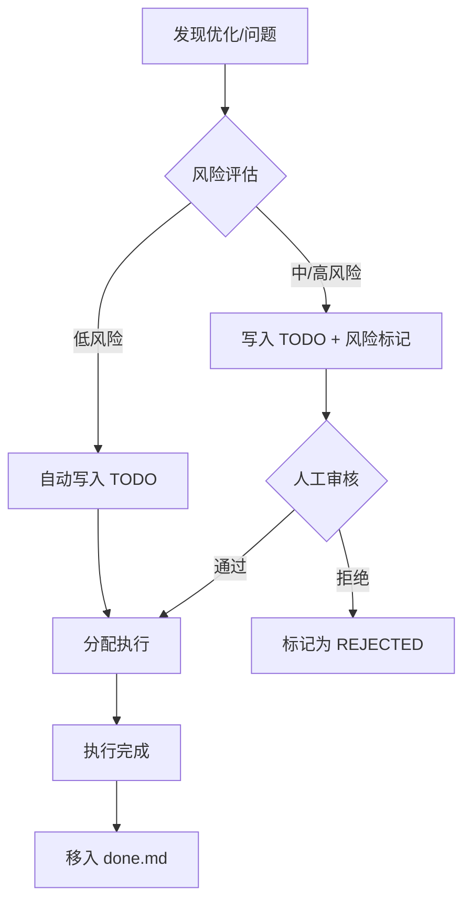

# 任务派发 5 要素确认协议

> 版本：v1.0 | 2026-03-28
> 适用范围：所有通过 advisor / coordinator / ops-agent 自动或手动派发的任务

## 1. 5 要素清单

所有任务派发前必须完整列清以下 5 个要素，确认无误后才可执行：

| # | 要素 | 图标 | 说明 |
|---|------|------|------|
| 1 | **任务具体内容** | 📋 | 需求背景、要做的事、包含的范围 |
| 2 | **实现流程/细节** | 🔄 | 准备怎么做、分几步执行、用到哪些工具/逻辑 |
| 3 | **预期实现效果** | 🎯 | 最终交付产出、要达成的目标 |
| 4 | **执行角色** | 👤 | 分配给哪个 Agent / 模块执行 |
| 5 | **时间要求** | ⏰ | 优先级、截止时间、是否加急 |

## 2. 风险分级

| 级别 | 判定标准 | 处理方式 |
|------|----------|----------|
| 🟢 低风险 | 不涉及数据变更/生产环境/安全配置 | advisor 自动写入 TODO |
| 🟡 中风险 | 涉及配置变更/Cron 调整/非关键服务 | advisor 写入 TODO 并标记 `⚠️需确认` |
| 🔴 高风险 | 涉及生产数据/安全策略/外部 API/资金 | 必须人工审核后才可执行，标记 `🚨需人工审核` |

## 3. 流程图



## 4. TODO 行格式

```markdown
- [ ] 🟢 [2026-04-01] [截止:2026-04-15] 优化 XXX 模块性能 —— 预期提升 30% [advisor:a1b2c3d4]
- [ ] 🔴 [2026-04-01] [截止:2026-04-10] 修复安全漏洞 YYY 🚨需人工审核 [advisor:e5f6a7b8]
```

字段说明：
- `🟢/🟡/🔴`: 风险级别
- `[日期]`: 创建日期
- `[截止:日期]`: 截止时间（可选）
- `[advisor:指纹]`: 用于去重的 MD5 指纹

## 5. 超期处理

由 `todo_deadline_checker.py` 定期检测：
- 超期 → 追加 `🔴超期N天` 标记
- 3 天内到期 → 追加 `⚠️即将到期` 标记
