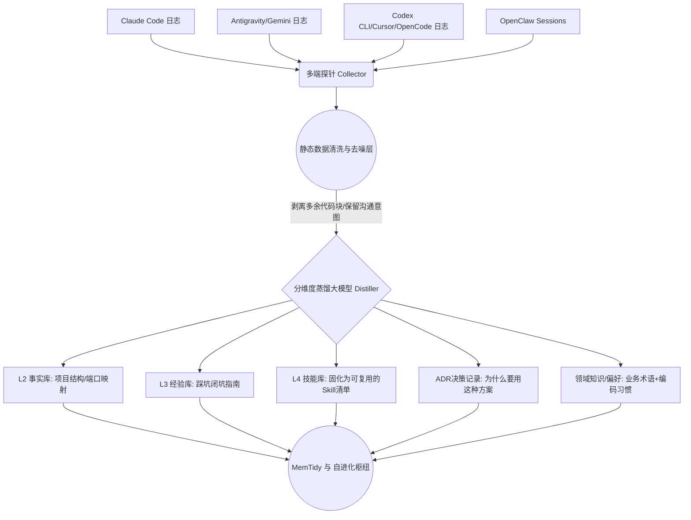

# 架构设计：跨端捕获引擎

## 1. 核心链路流转图 (Data Flow)

## 2. 数据源锚点解析 (实地数据结构探测)
- **Claude Code**: 挂载全局锚点 `~/.claude.json` 以及工作区隐藏的 `.claude/` 历史元数据池。
- **Antigravity / Gemini**: 监测宿主机独立大脑层 `~/.gemini/antigravity/brain/*/logs/` 下散落的 Markdown 碎片与元数据。
- **OpenClaw**: 直接读取内建的轻量级 JSON / JSONL 记忆层 `~/.openclaw/sessions/` 与 `memory/`。
- **Codex CLI**: 探测 `~/.codex/` 下极为庞大的 SQLite 日志池（如 `logs_1.sqlite` 达到 200MB 以上，开启了 WAL）极其外挂 `session_index.jsonl`，提取负担最重。
- **Cursor**: 劫持宿主机的本地缓存目录 `~/AppData/Roaming/Cursor/User/workspaceStorage/*/`，精准挂载提取对应 工作区 ID 的 `state.vscdb` (内置键值对 SQLite)。
> ⚠️ **瞬时冷备原则 (DB Isolation)**：针对底层 SQLite 源（特别是上述 Cursor vscdb 和 Codex log_1开启 WAL 的主库），由于高频并发特征，禁止探针直连挂载长连接。提取前先将 `db/wal/shm` 三件套文件瞬间拷贝复制到系统 `tmp/` 快照只读提取，严格避免 `database is locked` 脏读导致相关 IDE 卡死或数据损坏。

## 3. 设计原则
- **容错防空**：当某个 IDE 助手无数据时不报错，平滑静默。
- **Schema 结构防御锁**：IDE 助手的底层结构迭代极快。每次预提取前必须 Hash 校验 SQLite/JSON 数据结构预期。检测到不识别的表字段变动立即熔断该探针并报警，严禁盲目吞咽异常造成脏知识污染。

## 4. 核心解决机制：增量提取与时空解耦
- **增量游标机制与防撕裂滑动 (Cursor & Overlapping Chunking)**：极力避免全量扫描带来的 Token 爆炸和认知细节丢失。引入 `.sync_cursor` 统一游标管理器，精确记录各数据源最后处理的 Offset/Time/ID。每次提取**仅处理增量数据**。拆分文本块时彻底摒弃粗暴硬分块，必须保留首尾冗余 Overlap 区间（或基于会话 Turn 为界），杜绝关键报错逻辑由于分片导致的“语义跨窗撕裂”。
- **空间隔离与回源嗅探 (Spatial Mapping & SniffingFallback)**：跨端聊天必然横跨多个项目，必须在探针挂载 `Workspace ID`。针对全局日志（未带工作区标识），应使用正则探寻消息里的文件绝对路径以尝试反向嗅探关联项目；实在缺失时标记归入公共 `Global_Context` 降级区，严防上下文跨项目污染。
- **时空状态快照 (Git Semantic Tagging)**：在抓取任意记录时，强制挂载当时所在工作目录的 `Git HEAD Commit Hash` 与当前分支状态。供大模型追溯现场结构。
- **带信度仲裁的人类干预层 (Confidence Arbitrator)**：由于跨端提取必然存在大量极轻微冲突，为防止“由于滥弹窗导致的开发者无脑过审疲劳”，引入**蒸馏置信度评分 (Confidence Score)**。仅针对【L3核心经验翻转】或【架构性互斥】抛出 CLI 控制台挂起；对于高信度低危事实更改，执行自动熔合 (Auto-Merge) 并落盘备查。
