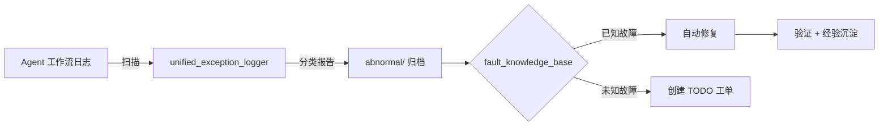

# 巡检故障闭环工作流

> 状态：✅ 已上线 | 触发方式：每6小时自动触发 / 异常事件触发
> 上级目录：[专项场景工作流](../README.md)

## 功能概述

自动化的异常发现→根因分析→自动修复→效果验证→经验沉淀全流程。通过统一异常日志巡检器扫描所有 Agent 的工作流日志，按 7 类异常自动分类，与故障知识库匹配后执行自动修复或创建 TODO 工单。

## 核心能力

1. **7类异常自动分类** — API 错误 / 文件系统 / 配置 / Agent 通信 / 系统 / 路径校验 / 通用
2. **MD5 指纹去重** — 同一异常不重复告警
3. **增量扫描** — 仅扫描近 N 小时日志，避免全量重扫
4. **故障知识库匹配** — 已知故障自动修复（`success_rate > 0.8`），未知故障创建工单
5. **日志生命周期** — 7天压缩归档 / 30天自动删除
6. **诚信审计** — 每日审计 Agent 声明真实性（claim_verification_auditor）

## 核心组件

| 组件 | 路径 | 规模 |
|------|------|------|
| 异常巡检器 | `skills/library/log-monitor/scripts/unified_exception_logger.py` | 18KB |
| 故障知识库 | `skills/library/log-monitor/scripts/fault_knowledge_base.py` | 13KB |
| 诚信审计器 | `skills/library/openclaw-security-audit/scripts/claim_verification_auditor.py` | 20KB |
| 错误驱动进化协议 | `docs/协议与规范/错误驱动进化协议.md` | 协议定义 |

## 关联定时任务

| Cron 任务 | Agent | 频率 |
|-----------|-------|------|
| system_exception_patrol | coordinator | 每6小时 |
| claim_verification_audit | coordinator | 每日 05:00 |

## 数据流

