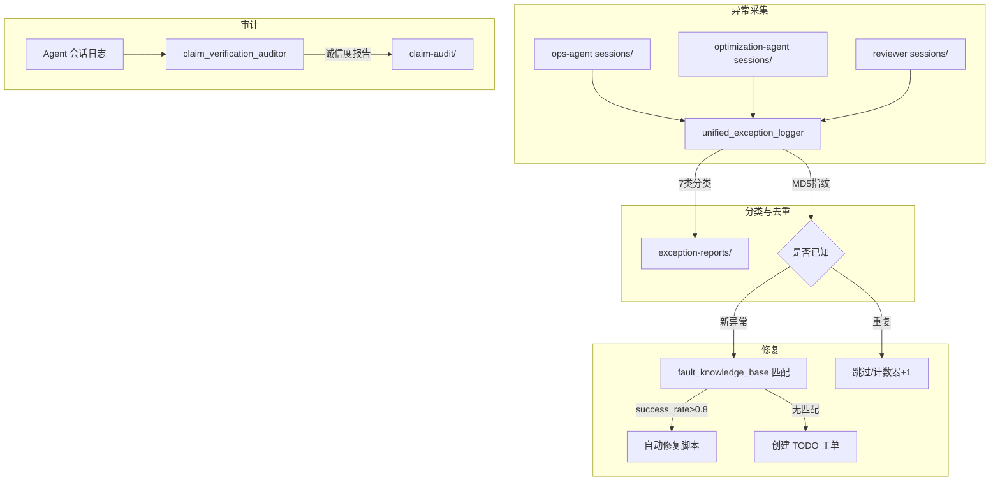

# 巡检故障闭环工作流 — 架构设计

> 版本：v1.0 | 2026-03-29

## 数据流

## 异常分类规则

| 类型 | 关键词匹配 | 修复策略 |
|------|-----------|---------|
| api_error | timeout, 429, 401, connection refused | 重试+限流退避 |
| filesystem_error | permission denied, no such file, disk full | 权限修复/目录创建 |
| config_error | invalid json, missing key, parse error | config_watchdog 回滚 |
| agent_communication_error | handoff failed, no response | coordinator 重分配 |
| system_error | OOM, segfault, zombie process | 进程重启/内存清理 |
| path_validation_error | path traversal, unsafe path | 路径白名单校验 |
| general_error | 未匹配上述分类 | 工单化人工处理 |
