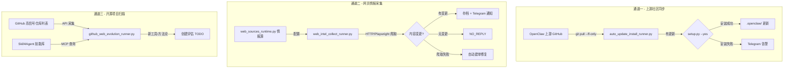

# 情报采集分析工作流 — 架构设计

> 版本：v1.0 | 2026-03-29

## 三通道架构

## 情报源管理

| 组件 | 路径 | 说明 |
|------|------|------|
| 情报源运行时 | `web_sources_runtime.py` (13KB) | 情报源注册/查询/状态管理 |
| 供应商目录 | `vendor_source_catalog.py` (6KB) | 技术供应商跟踪 |
| 情报评审器 | `web_intel_review_runner.py` (42KB) | 采集结果结构化评审 |

## 故障恢复策略

| 失败类型 | 处理方式 |
|----------|----------|
| HTTP 超时 | 指数退避重试（3次） |
| 网页结构变化 | 记录异常 + 创建修复工单 |
| API 限速 | 延迟队列，24h 后重试 |
| 凭证过期 | Telegram 告警 + TODO |
