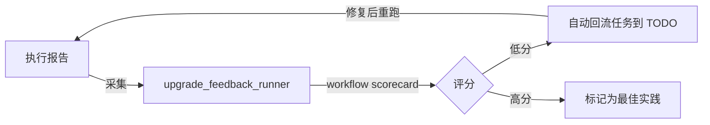

# 自进化优化工作流 — 架构设计

> 版本：v1.0 | 2026-03-29
> 子功能详设：[配置自动进化](../../自动进化/配置自动进化/README.md)

## 五层进化架构

```mermaid
graph TB
    subgraph L1 - 代码质量评审
        A1[reviewer_cron_runner] -->|daily/weekly| B1[评审报告]
        B1 -->|fix 命令| C1[自动执行修复]
    end
    subgraph L2 - 执行数据分析
        A2[upgrade_feedback_runner] -->|workflow scorecard| B2[评分报告]
        A3[control_plane_optimization_advisor] -->|优化建议| B3[TODO.md]
    end
    subgraph L3 - 配置与代码同步
        A4[git_sync_push_runner] -->|6h| B4[GitHub 仓库]
        A5[governance_evolution_runner] -->|增量扫描| B5[治理任务]
    end
    subgraph L4 - Hook 健康检测
        A6[algo_micro_optimizer] -->|hook-selftest| B6[健康度报告]
    end
    subgraph L5 - 策略进化
        A7[self_evolution_todo] -->|全量自检| B7[进化 TODO]
        A8[agent_self_evolution] -->|多维评估| B8[Agent 优化报告]
    end
```

## 评审模式清单

| 模式 | 脚本 | 频率 | 范围 |
|------|------|------|------|
| 每日增量评审 | `reviewer_cron_runner --mode daily_incremental` | 每日 04:00 | 增量变更文件 |
| 每周结构扫描 | `reviewer_cron_runner --mode weekly_structure` | 每周一 04:40 | 文件组织/依赖/冗余 |
| 每周安全审计 | `reviewer_cron_runner --mode weekly_security` | 每周一 05:00 | 密钥/权限/注入 |
| 每周文档新鲜度 | `reviewer_cron_runner --mode weekly_doc_freshness` | 每周一 05:30 | 文档与代码同步 |

## 升级反馈闭环

## 配置同步四层流转

详见 [配置自动进化](../../自动进化/配置自动进化/README.md)：
- A 层（GitHub 仓库）→ B 层（服务器 Clone）→ C 层（.openclaw 运行时）
- 反向：C 层变更 → local_snapshot → B 层 → git_sync_push → A 层
