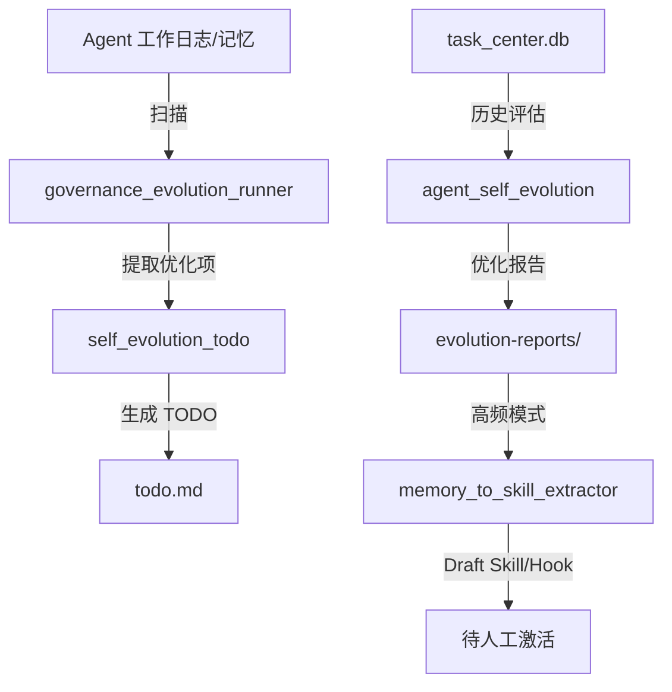

# 记忆知识沉淀工作流

> 状态：✅ 已上线 | 触发方式：每日/每周低峰期自动触发 / 人工触发
> 上级目录：[专项场景工作流](../README.md)

## 功能概述

自动化的记忆整理、知识蒸馏、经验沉淀系统。从 Agent 的对话记忆和工作日志中提取可复用的最佳实践、优化建议，自动封装为 Skill/Hook（draft 模式），并清理冗余内容降低 Token 消耗。

## 核心能力

1. **知识蒸馏** — 从记忆/日志中提取可复用的最佳实践
2. **经验→技能封装** — 高频修复模式自动封装为 Hook/Skill（draft 模式，需人工激活）
3. **行为模式优化** — 基于 task_center 历史评估 Agent 行为，生成优化建议
4. **治理进化** — 增量扫描仓库变更，提取优化项并自动碎片化处理
5. **自进化 TODO** — 每周全量自检，生成治理任务

## 核心组件

| 组件 | 路径 | 规模 |
|------|------|------|
| 记忆→技能提取器 | `scripts/openclaw-ops/memory_to_skill_extractor.py` | 7KB |
| 自进化 TODO | `scripts/openclaw-ops/self_evolution_todo.py` | 50KB |
| 治理进化引擎 | `scripts/openclaw-ops/governance_evolution_runner.py` | 69KB |
| 对话进化引擎 | `scripts/openclaw-ops/conversation_evolution_runner.py` | 48KB |
| Agent 自进化评估 | `scripts/openclaw-ops/agent_self_evolution.py` | 15KB |
| 技能进化评审 | `scripts/openclaw-ops/skill_evolution_review.py` | 9KB |

## 关联定时任务

| Cron 任务 | Agent | 频率 |
|-----------|-------|------|
| optimize 自我进化总结 | optimization-agent | 每日 04:37 |
| agent_self_evolution | ops-agent | 每周一 04:00 |
| ops_self_evolution_weekly_todo | ops-agent | 每周一 03:30 |
| ops_governance_evolution_incremental | optimization-agent | 每6小时（⏸ 当前禁用） |

## 数据流

