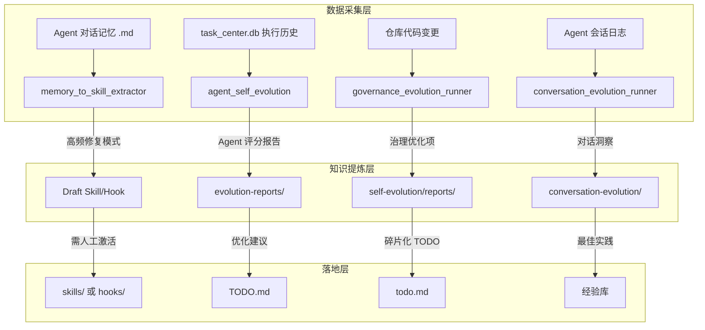

# 记忆知识沉淀工作流 — 架构设计

> 版本：v1.0 | 2026-03-29

## 分层数据流

## Agent 自进化评估维度

| 维度 | 权重 | 数据来源 |
|------|------|----------|
| 成功率 | 30% | tasks.status 统计 |
| 效率 | 20% | tasks.duration_ms |
| 质量 | 30% | tasks.result_score + stability_score |
| 可靠性 | 20% | token_records.cost + consecutiveErrors |

## 治理进化策略

- **增量模式**：仅扫描自上次以来的 git diff（`--mode incremental`）
- **最小间隔**：180分钟内不重复执行
- **碎片化处理**：大型优化建议自动拆解为多个原子 TODO
- **上下文门禁**：`--project-context-gate` 确保新任务附带项目上下文
