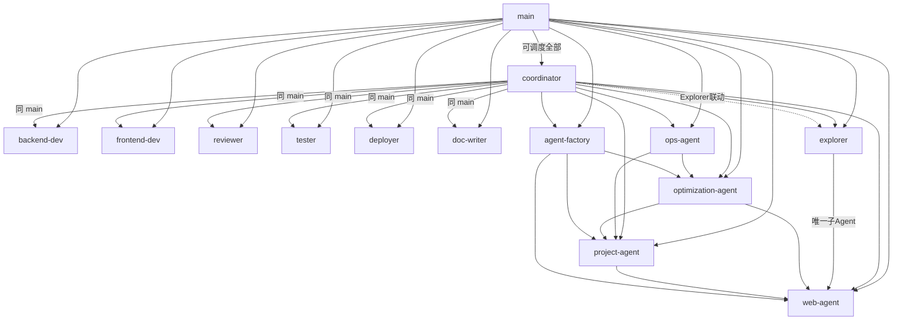

# 多 Agent 体系 — 权威注册中心

> **⚠️ 本文档是 Agent 注册的单一权威来源 (Single Source of Truth)**
> 新增、变更、下线任何 Agent 必须在此文档中更新，运行时配置从本文档派生。
>
> 最后更新：2026-03-31

---

## 1. 架构概述

OpenClaw 采用 **14 Agent 协作架构**，按职责分为 4 层。另有 1 个路由别名（`self-evolution-agent` → 实际由 `optimization-agent` 处理）。

```
┌─────────────── 调度层 ───────────────┐
│  main (总入口)  ←→  coordinator (分配) │
└──────────┬────────────────┬──────────┘
           │                │
┌──────────▼──────┐  ┌──────▼──────────┐
│    探索层        │  │    执行层        │
│  explorer (灵感) │  │  backend-dev    │
│                  │  │  frontend-dev   │
│                  │  │  reviewer       │
│                  │  │  tester         │
│                  │  │  deployer       │
│                  │  │  doc-writer     │
└──────────────────┘  └────────────────┘
┌───────────── 运维 / 进化层 ──────────┐
│  ops-agent        project-agent      │
│  optimization-agent                  │
│  self-evolution-agent                │
│  agent-factory    web-agent          │
└──────────────────────────────────────┘
```

---

## 2. Agent 完整注册表

### 2.1 调度层

| # | Agent ID | 显示名 | 模型 | 子Agent数 | 核心职责 |
|---|----------|--------|------|:---------:|----------|
| 1 | `main` | 大总管 | gpt-5.4 | 13 | 默认入口，总调度，可调度除 self-evolution-agent 外的所有 Agent |
| 2 | `coordinator` | 协调员 | gpt-5.4 | 13 | 任务协调与分配，Deepdive-Lite 需求澄清，Explorer 联动 |

### 2.2 探索层

| # | Agent ID | 显示名 | 模型 | 子Agent数 | 核心职责 |
|---|----------|--------|------|:---------:|----------|
| 3 | `explorer` | 探索者 / 灵感引擎 | gpt-5.4-mini | 1 (web-agent) | 发散思维、跨领域联想、需求边界探索。**不写代码**，只输出灵感清单与方向建议 |

### 2.3 执行层

| # | Agent ID | 显示名 | 模型 | 子Agent数 | 核心职责 |
|---|----------|--------|------|:---------:|----------|
| 4 | `backend-dev` | 后端开发 | gpt-5.3-codex | 0 | 后端功能实现（Django/Python） |
| 5 | `frontend-dev` | 前端开发 | gpt-5.3-codex | 0 | 前端功能实现（Vue/React） |
| 6 | `reviewer` | 代码审核 | gpt-5.4 | 0 | 代码评审 + 安全审计 |
| 7 | `tester` | 测试验收 | glm-4.7 | 0 | 测试用例编写 + 验收执行 |
| 8 | `deployer` | 部署执行 | glm-4.7 | 0 | 部署操作执行 |
| 9 | `doc-writer` | 文档撰写 | glm-4.7 | 0 | 技术文档、变更日志 |

### 2.4 运维 / 进化层

| # | Agent ID | 显示名 | 模型 | 子Agent数 | 核心职责 |
|---|----------|--------|------|:---------:|----------|
| 10 | `ops-agent` | 运维代理 | glm-4.7 | 2 | Cron 巡检、运维告警、系统监控 |
| 11 | `project-agent` | 项目代理 | gpt-5.3-codex | 1 | 项目索引、结构审查、规划 |
| 12 | `optimization-agent` | 优化代理 | gpt-5.3-codex | 2 | 自动进化、配置优化、增量扫描 |
| 13 | `agent-factory` | Agent工厂 | gpt-5.3-codex | 3 | 创建/管理新 Agent |
| 14 | `web-agent` | Web代理 | glm-4.7 | 0 | 网页交互、搜索验证 |

### 2.5 路由别名（非独立 Agent）

| 别名 ID | 实际处理者 | 关键词 | 说明 |
|---------|-----------|--------|------|
| `self-evolution-agent` | `optimization-agent` | 自我进化、经验沉淀、历史会话复盘 | 仅在 `routing-rules.json` 中定义路由关键词，无独立 SOUL.md 和运行时配置。实际的自进化工作由 `optimization-agent` 的 `optimize_incremental_scan.py --mode evolution` 执行 |

---

## 3. 调度拓扑 — 谁可以调度谁



**规则**：
- `main` 和 `coordinator` 是全局调度者，可调度除 `self-evolution-agent` 外的所有 Agent
- `explorer` 只可调度 `web-agent`（用于搜索验证灵感），**严禁调度执行型 Agent**
- 执行层 Agent（`backend-dev` 等）无子调度能力（`allowAgents = 0`）
- `self-evolution-agent` 仅由 `routing-rules.json` 路由触发，不在任何 Agent 的 `allowAgents` 列表中

---

## 4. 注册完整性审计（四维对账）

> 每次新增/下线 Agent 后，必须对照此表检查四个维度的一致性。

| Agent ID | ① SOUL.md | ② agent_index.json | ③ capability-registry | ④ capability-manifest | 状态 |
|----------|:---------:|:------------------:|:---------------------:|:--------------------:|:----:|
| `main` | ✅ | ✅ | ✅ | ✅ | 正常 |
| `coordinator` | ✅ | ✅ | ✅ | ✅ | 正常 |
| `explorer` | ✅ | ✅ 已补齐 | ❌ 待同步 | ✅ | ⚠️ 需同步 registry |
| `backend-dev` | ✅ | ✅ | ✅ | ✅ | 正常 |
| `frontend-dev` | ✅ | ✅ | ✅ | ✅ | 正常 |
| `reviewer` | ✅ | ✅ | ✅ | ✅ | 正常 |
| `tester` | ✅ | ✅ | ✅ | ✅ | 正常 |
| `deployer` | ✅ | ✅ | ✅ | ✅ | 正常 |
| `doc-writer` | ✅ | ✅ | ✅ | ✅ | 正常 |
| `ops-agent` | ✅ | ✅ | ✅ | ✅ | 正常 |
| `optimization-agent` | ✅ | ✅ | ✅ | ✅ | 正常 |
| `project-agent` | ✅ | ✅ | ✅ | ✅ | 正常 |
| `agent-factory` | ✅ | ✅ | ✅ | ✅ | 正常 |
| `web-agent` | ✅ | ✅ | ✅ | ✅ | 正常 |

> **注**：`self-evolution-agent` 为路由别名，不计入审计

### 四维定义

| 维度 | 文件路径 | 说明 |
|------|----------|------|
| ① SOUL.md | `agents/<agent-id>/SOUL.md` | Agent 角色定义（行为准则/能力边界/输出规范） |
| ② agent_index.json | `~/.openclaw/agents/agent_index.json` | 运行时绑定（模型/工作空间/子调度权限） |
| ③ capability-registry | `scripts/openclaw-ops/policy/capability-registry.json` | 能力注册（preflight 校验用） |
| ④ capability-manifest | `~/agents/agent_capability_manifest.json` | 任务执行器能力声明（本地 preflight 用） |

---

## 5. 已知缺陷与待办

- [x] ~~**explorer 未部署到运行时**~~：已补齐到 `agent_index.json` 和 `agent_capability_manifest.json`（2026-03-31）
- [ ] **explorer 需同步到 capability-registry.json**：远端 NOFX 服务器的 `capability-registry.json` 尚未包含 explorer
- [x] ~~**self-evolution-agent 缺 SOUL.md**~~：确认为 `optimization-agent` 的路由别名，无需独立注册
- [ ] **main/coordinator 的 allowAgents 已包含 explorer**：本地已更新，需同步到远端
- [ ] **配置同步机制缺失**：没有自动化脚本将本文档的变更同步到四个维度的配置文件中

---

## 6. 相关文件索引

### 6.1 Agent 定义文件

| 文件路径 | 说明 | 权威性 |
|----------|------|:------:|
| `agents/<agent-id>/SOUL.md` | 角色定义、行为准则、能力边界 | 🟢 设计态权威 |
| **本文档** (`docs/基础设施/多Agent体系/README.md`) | Agent 注册中心，全局视图 | 🟢 全局权威 |

### 6.2 运行时配置文件

| 文件路径 | 说明 | 生成方式 |
|----------|------|----------|
| `~/.openclaw/agents/agent_index.json` | 运行时绑定索引 | `generate_runtime_binding_manifests.py` 自动生成 |
| `~/.openclaw/agents/agent_index.md` | Markdown 可读版 | 同上，自动生成 |
| `~/agents/agent_capability_manifest.json` | 任务执行器 preflight 能力声明 | 手动维护 |

### 6.3 策略与路由文件

| 文件路径 | 说明 |
|----------|------|
| `scripts/openclaw-ops/policy/capability-registry.json` | 能力域注册（capabilities + agent_defaults） |
| `scripts/openclaw-ops/policy/routing-rules.json` | 任务路由规则（关键词 → assignee 映射） |
| `cron/jobs.json` | 定时任务 → Agent 映射 |

### 6.4 模型管理

| 文件路径 | 说明 |
|----------|------|
| `scripts/openclaw-ops/switch_model_tier.py` | 模型档位切换脚本 |
| `scripts/openclaw-ops/model_tier_profiles.json` | 模型档位配置（标准/经济/高性能） |

---

## 7. 运维 SOP

### 7.1 新增 Agent 检查清单

1. [ ] 在本文档「Agent 完整注册表」中添加条目
2. [ ] 创建 `agents/<agent-id>/SOUL.md` 角色定义
3. [ ] 更新 `agent_index.json`（或运行 `generate_runtime_binding_manifests.py`）
4. [ ] 更新 `capability-registry.json` 的 `agent_defaults` 部分
5. [ ] 更新 `agent_capability_manifest.json`
6. [ ] 如需 Cron 调度，更新 `cron/jobs.json`
7. [ ] 如需被其他 Agent 调度，更新调度者的 `allowAgents`
8. [ ] 更新本文档「注册完整性审计」表

### 7.2 下线 Agent 检查清单

1. [ ] 在本文档中标记为 `[已下线]`，保留历史记录
2. [ ] 从 `agent_index.json` 移除
3. [ ] 从 `capability-registry.json` 移除
4. [ ] 从 `agent_capability_manifest.json` 移除
5. [ ] 从所有 Agent 的 `allowAgents` 中移除
6. [ ] 清理 `cron/jobs.json` 中相关定时任务
7. [ ] 归档（不删除）`agents/<agent-id>/SOUL.md`
