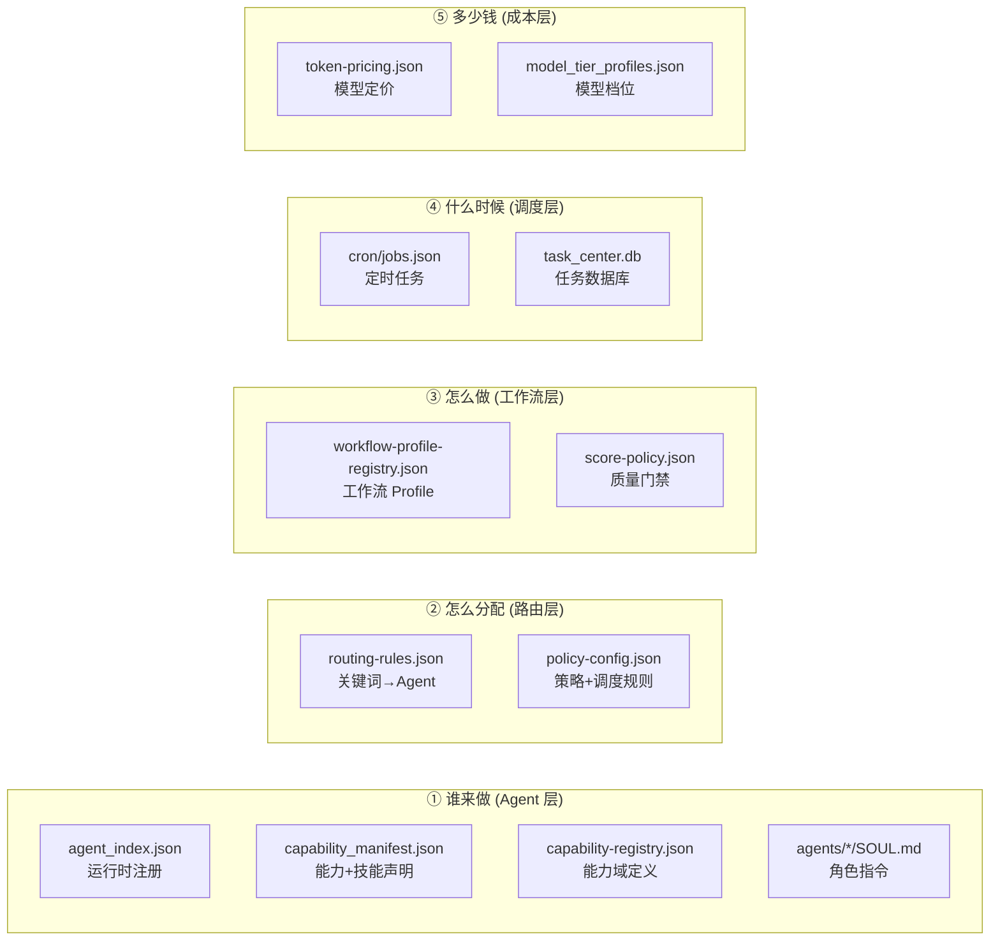
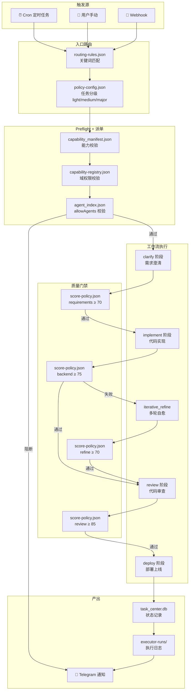

# OpenClaw 控制面全景 — 系统运行架构手册

> **最后更新：2026-04-27**
> 本文档是 OpenClaw 历史控制面的全局运行指南，涵盖：谁在运行、怎么调度、工作流如何流转、配置在哪里改。
> nofx 当前 Hermes workflow runtime 已精简为 `arbitrageagent` / `spreadagent` 两个 live profile，模型均为 `openai-codex/gpt-5.5`；本文中 14 Agent 口径仅代表历史 OpenClaw 注册表，不代表 nofx 当前运行态。

---

## 1. 回答你的核心问题

| 问题 | 现状 | 位置 |
|------|------|------|
| **有哪些 Agent** | 历史 OpenClaw 注册表：14 个 Agent + 1 路由别名；nofx 当前运行态：2 个 Hermes profile + workflow stage owner 标签 | [多Agent体系/README.md](file:///H:/GitHub/openclaw-hardflow-backup-20260302/docs/基础设施/多Agent体系/README.md) |
| **Agent 用什么能力/技能** | `agent_capability_manifest.json` | `~/agents/agent_capability_manifest.json` |
| **工作流有哪些** | 5 个 Profile（4 个编码 + 1 个治理） | `~/.openclaw/ops/policy/workflow-profile-registry.json` |
| **整个流程是什么** | 见下方 §3. 端到端流程图 | — |
| **有没有总控台** | ❌ **没有可视化控制台** | 目前全靠 JSON 文件 + Cron 日志 |

> [!IMPORTANT]
> **当前最大的治理缺陷：没有统一的可视化控制台。** 所有控制都散落在 10+ 个 JSON 配置文件中，变更靠手工编辑，状态靠 Telegram 推送 + 日志文件追溯。这是后续需要优先解决的问题。

---

## 2. 控制面全景地图

### 配置文件职责一览

### 详细文件索引

| 层级 | 文件 | 路径 | 你改它干嘛 |
|------|------|------|-----------|
| **① Agent 层** | `agent_capability_manifest.json` | `~/agents/` | 新增/修改 Agent 的能力和技能声明 |
| | `agent_index.json` | `~/.openclaw/agents/` | Agent 运行时绑定（模型/工作空间/子调度） |
| | `capability-registry.json` | `~/.openclaw/ops/policy/` | 能力域定义（哪些 Agent 拥有什么能力） |
| | `SOUL.md` | `agents/<agent-id>/` | 修改 Agent 的角色指令/行为边界 |
| **② 路由层** | `routing-rules.json` | `~/.openclaw/ops/policy/` | 修改关键词→Agent 的自动路由规则 |
| | `policy-config.json` | `~/.openclaw/ops/policy/` | 修改全局策略（模型选择/积分/风险/调度） |
| **③ 工作流层** | `workflow-profile-registry.json` | `~/.openclaw/ops/policy/` | 修改工作流阶段/门禁/验证合约 |
| | `score-policy.json` | `~/scripts/hardflow/` | 修改质量评分的门禁配置 |
| **④ 调度层** | `jobs.json` | `~/.openclaw/cron/` | 修改定时任务频率/参数 |
| | `task_center.db` | `~/.openclaw/ops/task-center/` | 任务状态数据库（SQLite，不手动改） |
| **⑤ 成本层** | `token-pricing.json` | `~/.openclaw/ops/policy/` | 模型 token 定价 |
| | `model_tier_profiles.json` | `~/scripts/openclaw-ops/` | 模型档位（标准/经济/高性能） |

---

## 3. 端到端流程图

---

## 4. 工作流 Profile 清单

| Profile ID | 显示名 | 通道 | 阶段数 | 状态 |
|------------|--------|------|:------:|:----:|
| `coding-default` | 默认编码工作流 | stable | 5 | ✅ |
| `coding-default` | 默认编码工作流 | canary | 5 | ✅ |
| `coding-default` | 默认编码工作流 | experimental | 5 | ✅ |
| `governance-evolution` | 治理进化工作流 | stable | 3 | ✅ |
| `hardflow-pipeline` | HardFlow 全流程 | stable | 7 | ✅ |

### 编码工作流阶段

| 阶段 | 门禁 | 校验 | 说明 |
|------|------|------|------|
| `clarify` | requirements ≥ 70 | 需求完整性检查 | project-agent 澄清 |
| `implement` | backend ≥ 75 | 测试证据 ≥ 3 项 | 实际编码 + 验证 |
| `iterative_refine` | refine ≥ 70 | 修复后测试通过 | 失败重试自愈 |
| `review` | review ≥ 85 | 安全 + 质量审查 | reviewer 独立评审 |
| `deploy` | (无独立门禁) | 部署后测试 | deployer 执行 |

---

## 5. Cron 定时任务

| 任务 ID | 频率 | Agent | 说明 |
|---------|------|-------|------|
| 增量巡检 | 15 分钟 | ops-agent | 系统健康检查 |
| 任务执行器 | 10 分钟 | coordinator | 执行未闭环任务 |
| 全量校准 | 每周 | optimization-agent | 策略/配置全量审计 |
| 自进化 | 每周 | optimization-agent | 经验沉淀 + 改进 |
| HardFlow 审查 | 触发式 | project-agent | 代码变更审查 |

---

## 6. 当前缺什么？改什么在哪改？

### 常见操作速查

| 我想... | 改哪个文件 |
|---------|-----------|
| 新增一个 Agent | [运维 SOP](file:///H:/GitHub/openclaw-hardflow-backup-20260302/docs/基础设施/多Agent体系/README.md) §7.1 |
| 修改 Agent 的模型 | `policy-config.json` → `agent_model_overrides` |
| 修改 Agent 能调度谁 | `agent_capability_manifest.json` → `allow_agents` |
| 修改任务路由关键词 | `routing-rules.json` → `assignee_rules` |
| 修改质量门禁分数 | `score-policy.json` → 对应 gate 的 `pass_line` |
| 修改 cron 频率 | `jobs.json` → 对应 job 的 `interval_minutes` |
| 修改工作流阶段 | `workflow-profile-registry.json` → `profiles.stages` |
| 切换模型档位 | 运行 `switch_model_tier.py` |

### 缺失的能力（待建设）

| 缺失项 | 影响 | 建议优先级 |
|--------|------|:---------:|
| **可视化总控台** | 无法一览 Agent/任务/工作流状态，只能看JSON和日志 | 🔴 高 |
| **配置变更审计** | 改了配置不知道谁改的、什么时候改的 | 🟡 中 |
| **配置自动同步** | 本文档改了，四个 JSON 文件不会自动更新 | 🟡 中 |
| **Agent 健康看板** | 不知道哪个 Agent 在线、响应延迟多少 | 🟡 中 |
| **任务看板** | 看不到未闭环任务列表和执行进度 | 🟡 中 |
