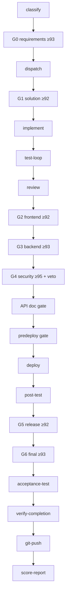
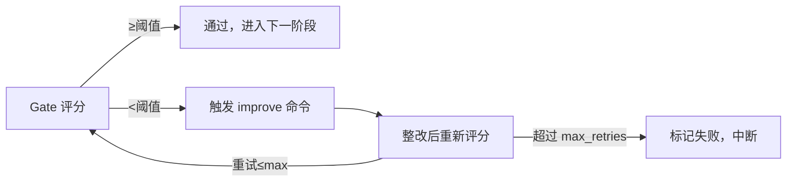

# ACP 全链路编码工作流 — 架构设计

> 版本：v1.0 | 2026-03-29
> 详细实现见 [`scripts/hardflow/README.md`](../../../scripts/hardflow/README.md)

## 1. 分层架构

| 层 | 职责 | 代表文件 |
|----|------|----------|
| **HardFlow Core** | 阶段机、Gate、验收、完成前验证、评分、证据 | `hardflow-run.sh` |
| **Workflow Profile** | 默认编码工作流的阶段图与能力绑定 | `coding-default@stable` |
| **Skill** | capability 的实现说明 | `skills/by_domain/` |
| **Hook** | 运行时护栏与审计 | `hooks/hardflow-*` |

## 2. 主流程图



## 3. 回流整改机制



## 4. 产物目录

```
.workflow/
├── runs/<run_id>/
│   ├── timeline.log              # 阶段时间线
│   ├── issues.ndjson             # 问题记录
│   ├── scorecards/*.json         # 各 Gate 评分卡
│   ├── score-gate-audit.ndjson   # 评分审计日志
│   ├── acceptance/deployment.json # 部署验收结果
│   └── verification/completion.json # 完成前验证
├── gates/*.json                   # 门禁状态
├── hook-audit/commands.log        # Hook 审计
├── task.json                      # 当前任务
└── progress.txt                   # 进度标记
```

## 5. 进化与晋升

- `coding-default@stable`：当前稳定版本
- `coding-default@candidate`：候选版本（自我进化先改 candidate）
- upgrade feedback / workflow scorecard / skill review 的目标：candidate 重跑 → stable/candidate 对比 → 晋升或回滚
