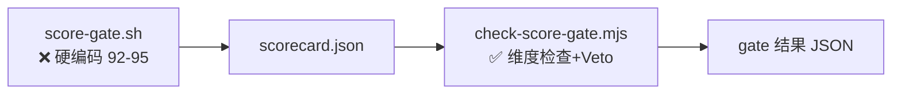
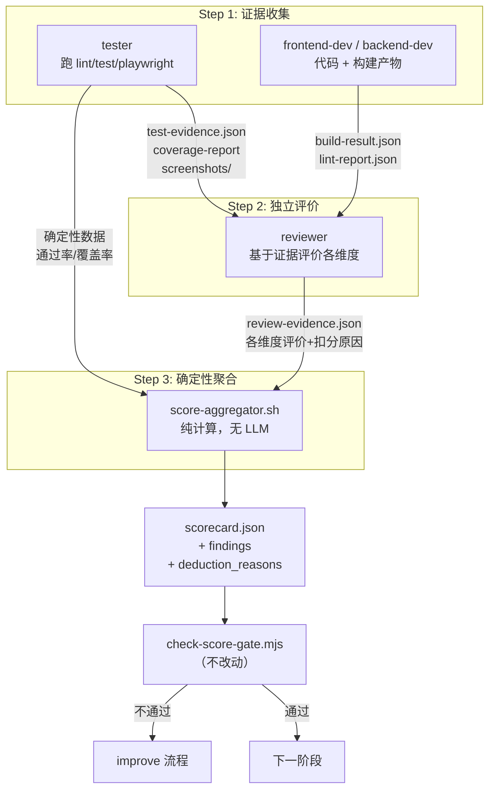

# ACP 评分系统升级 — 架构设计

> 版本：v2.0 | 2026-03-29（v2: 引入 证据→评价→聚合 三步流水线）
> 父级架构：[ACP 全链路编码工作流 架构](../architecture.md)

## 1. 核心原则

**产出证据的人 ≠ 评价的人 ≠ 做事的人**

评分不是一个脚本调用，而是一个**三步流水线**：

```
Step 1 — 证据收集 (Evidence)
  执行 Agent 在各自环节产出结构化证据
  tester 跑测试 → test-evidence.json
  frontend-dev 产出代码 + playwright 截图 → build-evidence/

Step 2 — 独立评价 (Evaluation)  
  由另一个 Agent (reviewer) 基于证据给出评价
  reviewer 看截图 → visual_design 评价
  reviewer 看代码 → code_structure 评价

Step 3 — 确定性聚合 (Aggregation)
  纯计算脚本，不调 LLM
  读取各方证据和评价 → 按权重公式 → scorecard.json
```

## 2. 当前评分管道（被架空状态）



**问题**：上游 `score-gate.sh` 全部输出固定高分 → 下游 38 个维度检查从未真正执行。

## 3. 目标评分管道（三步流水线）



## 4. 各 Gate 的证据链与角色分派

### G0 Requirements (需求质量)

| 步骤 | 角色 | 产出 | 评分方式 |
|------|------|------|---------|
| 证据 | coordinator | 需求文档、边界定义、验收标准 | — |
| 评价 | reviewer | 各维度评价 JSON | LLM 评价 |
| 聚合 | 聚合器 | scorecard.json | 100% 基于 reviewer 评价 |

### G1 Solution (方案适配度)

| 步骤 | 角色 | 产出 | 评分方式 |
|------|------|------|---------|
| 证据 | coordinator | 技术方案、数据模型、风险分析 | — |
| 评价 | reviewer | 各维度评价 JSON | LLM 评价 |
| 聚合 | 聚合器 | scorecard.json | 100% 基于 reviewer 评价 |

### G2 Frontend (前端质量)

| 步骤 | 角色 | 产出 | 评分方式 |
|------|------|------|---------|
| 证据 | tester | lint-report.json, 截图, build-result.json | 确定性工具 |
| 评价 | reviewer | visual_design / interaction_quality 等评价 | LLM + 截图 |
| 聚合 | 聚合器 | scorecard.json | 确定性(lint/build) 40% + LLM评价 60% |

### G3 Backend (后端质量)

| 步骤 | 角色 | 产出 | 评分方式 |
|------|------|------|---------|
| 证据 | tester | typecheck.log, unit-test-results.json | 确定性工具 |
| 评价 | reviewer | architecture_design / api_contract 等评价 | LLM 评价 |
| 聚合 | 聚合器 | scorecard.json | 确定性(typecheck/test) 40% + LLM评价 60% |

### G4 Security (安全门禁)

| 步骤 | 角色 | 产出 | 评分方式 |
|------|------|------|---------|
| 证据 | tester | 安全扫描报告 (dependency audit, secrets scan) | 确定性工具 |
| 评价 | reviewer | 安全维度评价 + findings 列表 | LLM + 确定性 |
| 聚合 | 聚合器 | scorecard.json + security_findings | critical/high → veto |

### G5 Release (发布就绪)

| 步骤 | 角色 | 产出 | 评分方式 |
|------|------|------|---------|
| 证据 | tester | test-results.json, coverage-report.json, regression.json | 确定性工具 |
| 评价 | reviewer | deployment_reliability / rollback_readiness 评价 | LLM 评价 |
| 聚合 | 聚合器 | scorecard.json | 确定性(test/coverage) 70% + LLM评价 30% |

### G6 Final (终审)

| 步骤 | 角色 | 产出 | 评分方式 |
|------|------|------|---------|
| 证据 | tester / deployer | smoke-test.json, deploy.log | 确定性工具 |
| 评价 | reviewer | code_review_quality / documentation_completeness 评价 | LLM 评价 |
| 聚合 | 聚合器 | scorecard.json | 确定性 30% + LLM评价 70% |

## 5. 证据目录结构

```
.workflow/runs/<run_id>/
├── evidence/                        # 证据目录（新增）
│   ├── lint-report.json             # tester 产出
│   ├── test-results.json            # tester 产出
│   ├── coverage-report.json         # tester 产出
│   ├── build-result.json            # tester 产出
│   ├── typecheck.log                # tester 产出
│   ├── security-scan.json           # tester 产出
│   ├── screenshots/                 # tester 截图
│   │   ├── homepage.png
│   │   └── login.png
│   └── review-evidence.json         # reviewer 评价产出
├── scorecards/                      # 聚合器产出（已有）
│   ├── requirements.json
│   ├── frontend.json
│   └── ...
├── score-gate-audit.ndjson          # 审计日志（已有）
└── timeline.log                     # 时间线（已有）
```

## 6. scorecard.json 输出 Schema（增强版）

```jsonc
{
  "gate": "frontend",
  "overall": 82,
  "summary": "前端视觉设计较弱，代码结构良好",

  "dimensions": {
    "visual_design": 72,
    "information_architecture": 88,
    "interaction_quality": 78,
    "responsive_accessibility": 90,
    "code_structure": 92
  },

  // 扣分原因（每维度列出具体问题）
  "deduction_reasons": {
    "visual_design": [
      "主色调过于单一，缺少辅色对比",
      "卡片间距不一致（12px vs 16px）"
    ],
    "interaction_quality": [
      "按钮 hover 无视觉反馈"
    ]
  },

  // 证据来源（追溯链）
  "evidence_sources": {
    "deterministic": {
      "lint_pass": true,
      "lint_warnings": 3,
      "build_success": true,
      "test_pass_rate": 0.94,
      "coverage": 78.5,
      "source_files": [
        ".workflow/runs/current/evidence/lint-report.json",
        ".workflow/runs/current/evidence/test-results.json"
      ]
    },
    "llm_evaluation": {
      "evaluator_agent": "reviewer",
      "model": "openai-codex/gpt-5.4",
      "skill_version": "hardflow-score-rubric@v1",
      "source_file": ".workflow/runs/current/evidence/review-evidence.json"
    }
  },

  "findings": [],
  "security_findings": [],
  "generated_at": "2026-03-29T12:00:00Z"
}
```

## 7. 与 HardFlow 现有流程的融合

```
hardflow-run.sh 现有流程（不需要改编排顺序）：

classify → dispatch → implement
  ↓
test-loop     ← tester 跑测试，新增：产出 evidence/*.json
  ↓
review        ← reviewer 审查，新增：产出 evidence/review-evidence.json
  ↓
score-gate    ← 改造重点：读取 evidence/ 目录 → 聚合计算 → scorecard.json
  ↓
deploy → post-test → git-push
```

**关键洞察**：HardFlow 的执行顺序已经天然支持这个流水线。tester 和 reviewer 在 score-gate 之前就已经执行了，只需要让他们额外输出结构化证据文件。

## 8. 进化闭环接通方案

```
HardFlow 运行 → score-gate-audit.ndjson (含证据源+扣分原因)
  ↓ 适配器
转换为 executor report 格式
  ↓
upgrade_analysis.py → analyze_reports()
  ↓
弱项维度识别 → 对应 Skill 升级建议
  ↓
升级 hardflow-score-rubric → 重新评分验证
```
