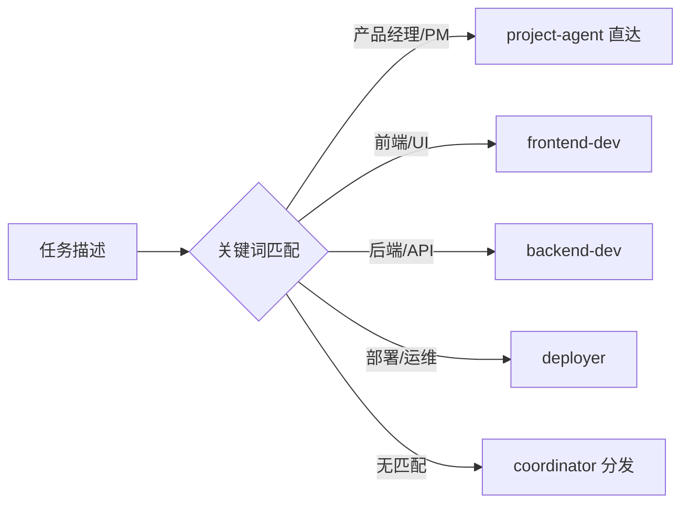

# 通用运营工作流 — 架构设计

> 版本：v1.0 | 2026-03-29

## 1. 整体架构

```mermaid
graph TB
    subgraph 输入层
        A[人工触发] --> C[Policy Enforcer]
        B[Cron 事件] --> C
    end
    subgraph 调度层
        C --> D{风险评估}
        D -->|低风险| E[自动分配 Agent]
        D -->|高风险| F[人工审核队列]
        F --> E
        E --> G[Task Center DB]
    end
    subgraph 执行层
        G --> H[Task Executor]
        H --> I[目标 Agent]
        I -->|report-agent-result| J[评分闭环]
        J -->|失败≥3次| K[升级人工]
    end
    subgraph 可观测层
        G --> L[TODO Patrol]
        G --> M[Daily Digest]
        G --> N[Daily Report]
        L --> O[Telegram 通知]
        M --> O
        N --> O
    end
```



## 2. 数据模型

### 2.1 Task Center 核心表

| 表 | 说明 | 关键字段 |
|----|------|----------|
| `tasks` | 任务主表 | task_id, type, status, action, risk_level, assignee, result_score, stability_score |
| `task_events` | 事件日志 | event_id, task_id, event_type, actor, timestamp |
| `task_phases` | 阶段记录 | phase_id, task_id, phase_name, duration_ms |
| `token_records` | Token 消耗 | task_id, agent_id, model, input_tokens, output_tokens, cost |

### 2.2 评分公式

```
raw_score = result_score × 0.70 + stability_score × 0.30
final_grade = quantize(raw_score)  # A/B/C/D/F
```

## 3. 任务路由策略



路由规则文件：`scripts/openclaw-ops/policy/routing-rules.json`（14KB，含分类权重和别名映射）

## 4. 通知策略

| 场景 | 通知方式 |
|------|----------|
| 正常完成 | 仅回传规划者 + 写入 Task Center（`NO_REPLY`） |
| 异常/失败 | Telegram 消息 + 写入 Task Center |
| 失败≥3次 | 升级人工 + Telegram 告警 |
| 日报/摘要 | 每日定时推送 Telegram |
