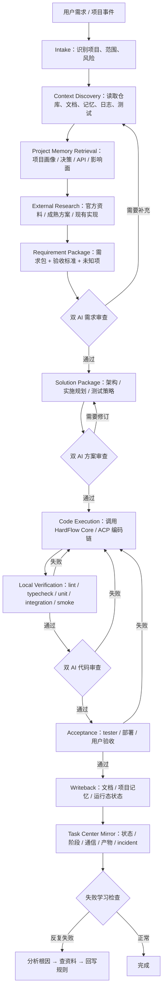
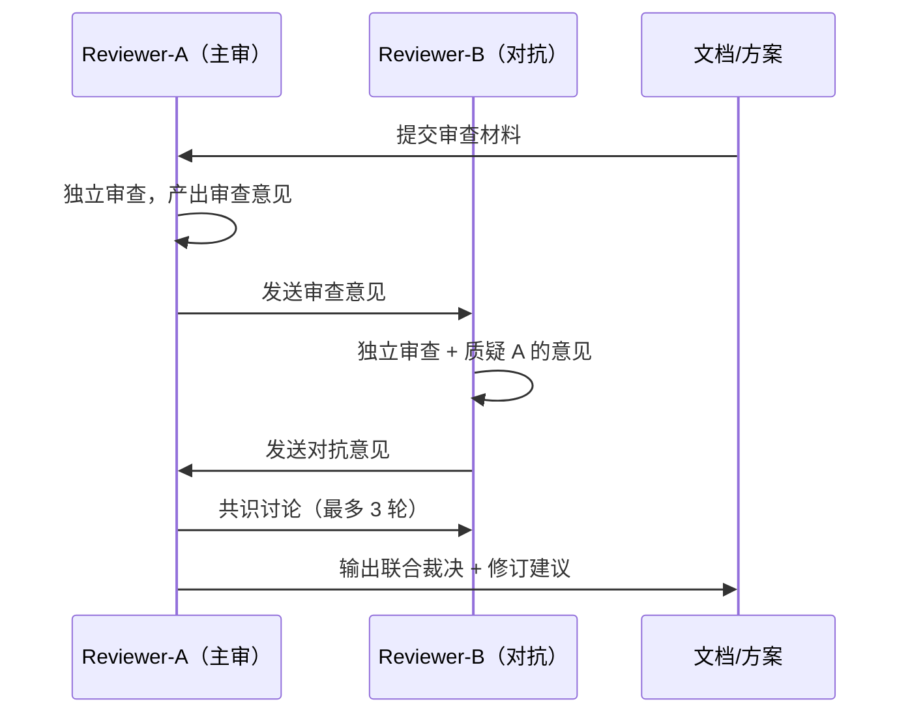
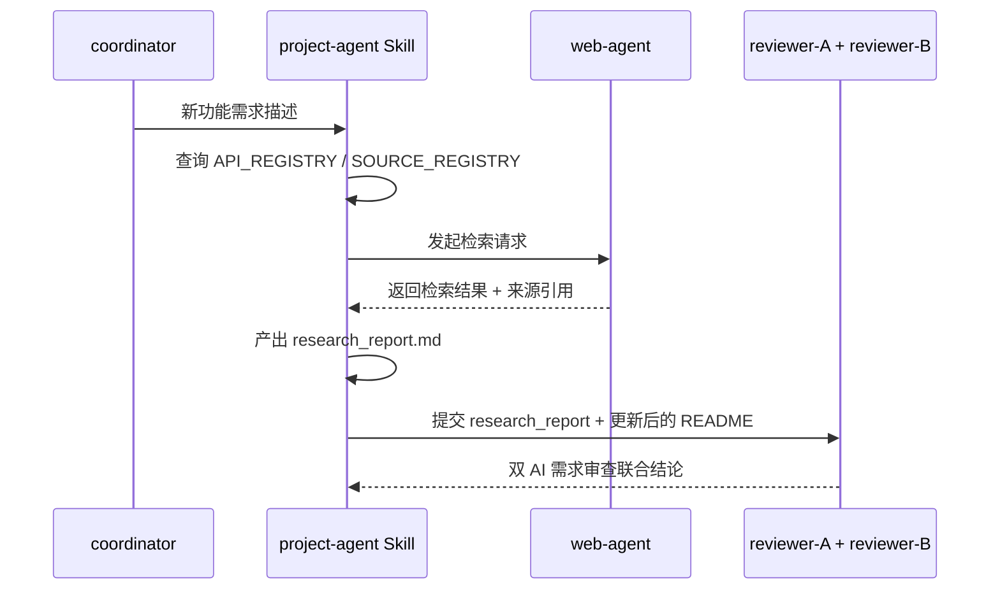

# 项目交付优先工作流 — 架构设计

> 版本：v0.6 | 2026-04-27（补齐 Task Center backlog runner 持续推进闭环）
> 需求文档：[README.md](README.md)

## 1. 设计目标

本工作流的核心目标不是让系统不断研究自己，也不是只把工作流安装到某个宿主，而是让系统稳定完成一整套编码交付：自动探索需求、生成方案、编码、测试、审核代码、修复、验收和回写。

设计原则如下：

1. **端到端状态机优先**：每个需求必须落到明确状态，不能只停在聊天、文档或半自动执行。
2. **检索是第一反应**：任何新需求、新功能，第一反应就是查项目事实源、官方资料和成熟方案，不浪费时间和 token 自己从零研究。
3. **先修文档和规则，再修实现**。
4. **双 AI 对抗式审查**：不是 1 个 AI 审核就完了，要 2 个 AI 互相探讨、互相质疑，得出最优方案。
5. **失败学习 → 文档回写**：模型做不好的任务，分析根因后修改文档纠偏，不让它继续瞎做。
6. **project-agent 成为项目事实源 owner**，不同项目有不同记忆模块。
7. **OpenClaw / Hermes 只是宿主**：运行宿主必须自适应，但不改变流水线本身。
8. **自进化完全不做**——不是降级，是从主链完全移除。目标是把整个流程实现全自动。

## 2. 总体流程



### 2.0 单一控制面裁决

为了让整套流程清晰、可控、可追踪、可定位、可维护，系统只保留一条主流水线和一个控制面：

| 目标 | 裁决 | 落点 |
|------|------|------|
| 清晰 | 只允许一条 `project-delivery-pipeline` 状态机，不再按 runtime 并行维护多套业务流程 | `skills/library/project-delivery-pipeline/scripts/pipeline_runner.py` |
| 可控 | 每个阶段都有门禁、放行信号和失败回退动作 | `pipeline_state.json` + `state-machine.md` |
| 可追踪 | 每次运行必须写入 run artifacts，可选镜像到 Task Center | `.workflow/pipeline-runs/<run_id>/` + `task_center.db` |
| 可定位 | 编码前必须经过项目记忆检索，确认影响模块、文件、测试、文档和历史决策 | `.workflow/project-memory/<project_key>/IMPACT_MAP.json` |
| 可维护 | 默认使用本地结构化记忆 + keyword/symbol 检索，向量 RAG / GraphRAG 只做可插拔增强 | `RETRIEVAL_MANIFEST.json` |

**任务中心裁决**：`.workflow/pipeline-runs/<run_id>/` 是证据目录，不是人工查看主入口；`task_center.db` 是统一控制面。启用 `--record-task-center` 后，流水线必须写入：

1. `tasks`：单次 `project_delivery_pipeline` 任务总状态、下一步、失败阶段。
2. `stage_runs`：每个阶段的开始、结束、状态、产物路径。
3. `module_communications`：coordinator 到 project-agent / web-agent / reviewer / implementation / test-agent 的阶段交接。
4. `task_outputs`：最终人类可读输出。
5. `task_incidents`：阻断、验收失败、需要回到需求或编码的原因。

### 2.0.1 事件到任务的自动桥接

Task Center 不只接收人工输入的编码需求，也必须接收运营事件，避免 TODO、异常和人工升级散落在不同入口：

| 事件来源 | 桥接脚本 | Task Center 行为 | 人工边界 |
|----------|----------|------------------|----------|
| 到期 TODO | `skills/library/todo-patrol/scripts/deadline_to_task_bridge.py` | 创建 `todo_deadline_candidate`；低风险为 `dispatch_pipeline` 并交给 `coordinator`，高风险为 `await_human_confirm` 并进入 `human-inbox` | 低风险由 backlog runner 继续推进；高风险必须人工确认 |
| 增量异常日志 | `skills/library/log-monitor/scripts/exception_to_task_bridge.py` | 按异常 fingerprint 去重创建 `ops_exception` 任务，并写 `task_incidents` | `critical` 级别默认等待人工确认，普通异常交给 `coordinator` |
| 待确认/待澄清/已升级任务 | `skills/library/control-plane-ops/scripts/policy/human_inbox.py` | 统一查询 `need_human_confirm`、`needs_clarification`、`escalated`、`escalate_human` | 提供 `confirm / decline / clarify` 命令，所有人工动作留痕 |

对应默认 cron：

1. `todo_deadline_checker_daily`：继续负责 TODO 到期标记。
2. `todo_deadline_to_task_bridge_daily`：每日 00:05 把到期 TODO 按风险转为自动调度候选或人工确认候选。
3. `system_exception_patrol`：继续负责异常巡检报告。
4. `system_exception_to_task_bridge`：每 6 小时把异常巡检结果转为运维任务。

### 2.0.2 Task Center 待办持续推进

2026-04-27 服务器聊天记录复核显示，nofx 上真实链路虽然能通过 `spreadagent` 人工触发 `smart-arb-pipeline`，但没有从 Task Center 自动取待办继续推进的执行器。新增 `scripts/openclaw-ops/backlog_runner.py` 作为受控续跑器：

| 规则 | 行为 |
|------|------|
| 默认频率 | `backlog_runner_30m` 每 30 分钟运行一次，每次最多推进 1 个任务 |
| pending 来源 | 默认只允许 `todo_patrol`、`todo-deadline-bridge`、`repo_hygiene_reviewer`，或 `task_id` 以 `todo-` 开头 |
| failed 来源 | 只有显式 `--include-failed` 时才尝试；默认仅允许 `hermes`、`todo_patrol` 且 `next_action` 属于 `return_to_code_execution`、`return_to_deployment`、`run_external_research`、`fix_memory_writeback`、`fix_git_publish` |
| 安全门禁 | `need_human_confirm`、`needs_clarification`、未确认高风险、`escalate_human` 一律跳过，继续停在 `human_inbox.py` |
| 防循环 | 默认每个任务只记录 1 次 `backlog_runner_attempt`，达到 `--max-attempts-per-task` 后不再重复续跑 |
| 执行方式 | 调用 runtime 内安装的 `python3 <runtime_home>/ops/smart_arb_pipeline_entry.py --live --profile spreadagent --source backlog-runner --emit-json --requirement <安全包>`，后续仍走需求、编码、验证、代码审查、deployment、记忆回写和 Git 发布门禁 |

该 runner 不替代人工确认队列，也不直接修改 TODO 文件。它只把已经在 Task Center 内可执行的低风险 backlog 转交给统一项目交付流水线。

### 2.1 状态机定义

| 状态 | 目标 | 主要产物 | 放行条件 |
|------|------|----------|----------|
| `intake` | 识别项目、需求来源、风险等级和是否需要外部检索 | `run_meta.json` | 项目与需求入口明确 |
| `context_snapshot` | 自动读取仓库、文档、历史决策、测试和运行日志 | `context_snapshot.md` | 已覆盖当前项目事实源 |
| `project_memory_context` | 读取/初始化项目记忆模块，定位全局最合适修改点 | `project_memory_context.md`、`.workflow/project-memory/<key>/` | 已明确候选模块/文件/测试/文档，或返回需求/方案修订 |
| `external_research` | 查官方资料、成熟方案、相关 repo、API/changelog | `research_report.md` | 来源足够支撑需求讨论 |
| `requirement_package` | 生成范围、非目标、验收标准、待确认项 | `requirements.md` | 需求包字段完整 |
| `requirements_review` | 双 AI 对抗式审查需求合理性 | `requirements_review.md` + `command_requirements_review_1/2.json` | 两条不同命令、不同 `reviewer_role` 的 reviewer command 均裁决 `ready_for_solution` |
| `solution_package` | 生成架构、实施规划、测试策略、回滚策略 | `solution.md` / `implementation_plan.md` | 方案足够指导实现 |
| `solution_review` | 双 AI 对抗式审查方案 | `solution_review.md` + `command_solution_review_1/2.json` | 两条不同命令、不同 `reviewer_role` 的 reviewer command 均裁决 `ready_for_implement` |
| `code_execution` | 调用 HardFlow Core / ACP 执行编码 | `patch_summary.md` | 实现完成且无未解释偏差 |
| `verification` | 执行 lint、typecheck、unit、integration、smoke、部署验证 | `verification_report.md` + `command_verification_*.json` | 关键验证通过或缺口已记录 |
| `code_review` | 双 AI 审核代码是否按方案执行 | `code_review.md` + `command_code_review_1/2.json` | 两条不同命令、不同 `reviewer_role` 的 reviewer command 均裁决 `pass` |
| `acceptance` | tester / 用户 / 运行态验收 | `delivery_evidence.md` | 验收证据足够 |
| `writeback` | 更新 README、架构、实施规划、done/todo、项目记忆 | `writeback_report.md` | 事实源已同步 |

### 2.2 自动探索边界

自动探索可以做：

1. 读取当前仓库代码、文档、测试、配置、脚本、历史提交和本地项目记忆。
2. 读取运行日志、状态接口、dry-run 结果和非破坏性诊断命令。
3. 查询官方文档、官方 changelog、官方 SDK/repo、成熟开源实现和已登记第三方来源。
4. 汇总需求、未知项、风险、验收标准和建议方案。

自动探索不能擅自做：

1. 不能替用户决定业务范围、商业策略、产品取舍或高风险架构转向。
2. 不能在未获授权时执行破坏性命令、生产写操作、资金操作、密钥变更或外部发布。
3. 不能因为“看起来合理”就跳过需求审查、方案审查、测试或代码审查。
4. 不能把 runtime 宿主差异写进业务流程；宿主差异只能留在 runtime adapter/installer 层。

### 2.3 运行宿主适配层

所有宿主兼容性都应作为同一流水线的 runtime adapter，不再为 OpenClaw/Hermes 或其他 runtime 拆业务流程：

| 适配项 | 裁决 |
|--------|------|
| runtime home | 默认 `~/.hardflow-runtime`，也可显式传 `--runtime-home <path>` |
| runtime name | 默认从目录名推导，也可显式传 `--runtime-name <name>` |
| OpenClaw/Hermes | 只作为示例路径：`~/.openclaw`、`~/.hermes` |
| job payload | 安装时按目标 runtime home 渲染，不把 `.openclaw` 写死到业务流程 |
| 记忆/任务中心 | 跟随当前 runtime home，可通过参数覆盖 |
| 安装入口 | `python setup.py --runtime-home <runtime_home> --runtime-name <runtime_name>` |

裁决：最终安装入口必须基于技能化架构，不继续扩展已废弃的 `cron_setup.py / install_*_job.py` 调用链。

### 2.4 Live 命令适配层

状态机不把 Hermes、OpenClaw、HardFlow 或任意 agent CLI 写死到业务流程里，而是提供受信任命令适配层：

| 阶段 | 命令入口 | 证据 |
|------|----------|------|
| 外部 research | `--research-command` / `--research-report-file` / `--source-url` | `research_report.md` + `command-runs/external_research-*.json` |
| 编码执行 | `--code-command` / `--patch-summary-file` | `patch_summary.md` + `command-runs/code_execution-1.json` |
| 验证 | 多个 `--verification-command` / `--verification-report-file` | `verification_report.md` + `command-runs/verification-*.json` |
| 代码审核 | `--code-review-command` / `--code-review-file` | `code_review.md` + verdict gate |
| 记忆写回 | `--write-project-memory` / `--memory-write-command` | `memory_writeback_report.md` + `CHANGELOG.ndjson` |
| Git 发布 | `--git-publish-command` | `git_publish_report.md` + `git_publish_input_patch_report` |
| 待办续跑 | `backlog_runner.py --pipeline-command <smart-arb-pipeline>` | `task_outputs.output_type=backlog_runner_attempt` + pipeline run id |

live 模式不能只靠模板完成：research、编码、验证、代码审查和项目记忆写回缺少真实证据时，状态机会阻断并写入下一步动作。
启用 Git 发布时，runner 会在记忆写回成功后准备发布输入：优先使用 `memory_writeback` 隔离工作区 patch，缺失时仅回退到已验收的 `code_execution` patch，不会把 `command_cwd` 中未过门禁的脏改动打包发布。

### 2.5 Hermes Profile Smoke

Hermes 验证不创建第二条流程，统一通过 `hermes_profile_smoke.py` 调用同一个状态机：

```bash
python skills/library/project-delivery-pipeline/scripts/hermes_profile_smoke.py \
  --runtime-home ~/.hermes \
  --agent-mode hybrid \
  --provider zai \
  --emit-json
```

| 模式 | 用途 |
|------|------|
| `echo` | 本地确定性 agent，验证非 dry-run 状态机、Task Center、command-runs 和记忆写回 |
| `hybrid` | 一次 Hermes chat 生成 research/code/review bundle，本地命令执行 verification；推荐作为 native smoke |
| `hermes-chat` | 全阶段逐段 Hermes chat，用于 provider 调试；每阶段都会冷启动 Hermes，不作为默认门禁 |

2026-04-24 实测：WSL `/home/ubuntu/.hermes` 上 `hybrid-single-chat` smoke 通过，run_id=`hermes-profile-smoke-20260424T135014Z`，Task Center task=`project-delivery:hermes-profile-smoke-20260424T135014Z`。旧逐段调用路径中 research/code/review 分别耗时数分钟，verification 曾超过 300 秒；因此默认 smoke 已改为单次 bundle。

## 3. 角色分工

| 角色 | 新职责 | 不再承担 |
|------|--------|----------|
| `coordinator` | 接收任务、调度角色、维护总流程节奏 | 代替项目 owner 做长期知识维护 |
| `project-agent` | 维护项目介绍、架构边界、规划、API surface、外部来源、项目记忆 | 直接修改业务代码 |
| `web-agent` | 官方 docs、changelog、成熟 repo、行业方案检索 | 代替 reviewer 做裁决 |
| `reviewer-A`（主审） | 独立审查需求/方案/代码，产出初始意见 | 只在代码完成后出现 |
| `reviewer-B`（对抗） | 质疑 A 的意见，补充盲点，提出替代方案 | 只做走过场式审查 |
| `implementation-agent` | 按批准后的需求包和方案包实现代码，可拆分为 backend/frontend/scripts/docs | 自行决定需求边界与架构方向 |
| `test-agent` | 运行 lint、typecheck、unit、integration、smoke、部署验证并汇总证据 | 代替 reviewer 做需求和方案质量判断 |
| `runtime-adapter` | 将同一流水线映射到 OpenClaw / Hermes 的路径、job payload、状态目录 | 改变业务流程或创建宿主专属分叉 |

### 3.1 project-agent 形态定义

> 2026-04-21 架构评审补充

`project-agent` **不是一个独立的 Agent**（不需要 SOUL.md + manifest + 独立注册）。它是一组 Skill + 脚本的组合，由 `coordinator` 按需调度：

| 组件 | 形态 | 说明 |
|------|------|------|
| `project-profile-manager` | Skill | 项目画像的 CRUD 操作 |
| `api-registry-manager` | Skill | API 注册表与来源维护 |
| `project-memory-writer` | 脚本 | 消费蒸馏报告中的 `project_routed_artifacts`，写入项目记忆 |
| `source-registry-watcher` | cron 脚本 | 定期检查已注册的官方来源更新 |

选择 Skill 组合而非独立 Agent 的原因：

1. 避免把阶段 owner 继续注册成常驻 Agent；nofx 当前 live 入口实测只有 `arbitrageagent` / `spreadagent` 两个 Hermes profile，阶段 owner 是逻辑标签与隔离 workspace，不等于 14 个常驻 agent
2. 项目维护操作本质上是按需调度，不需要常驻进程
3. 复用 coordinator 已有的 Skill 调度能力，实施成本最低


## 4. 双 AI 对抗式审查模型

> 2026-04-22 根据用户核心需求重构：不是 1 个 AI 审核就完了，要 2 个 AI 互相探讨、互相质疑。

### 4.0 对抗式审查原则

**为什么需要 2 个 AI？**

就算把完整的方案给了 AI，做出来的产品也会有很多问题。单个 AI 审查容易走过场——它倾向于认为自己的方案是对的。2 个 AI 互相质疑，能发现单个 AI 的盲点。

**对抗式审查流程**：



**角色分工**：

| 角色 | 职责 | 选型策略 |
|------|------|----------|
| Reviewer-A（主审） | 第一轮独立审查，产出初始意见 | 选不同于实现者的 AI 模型 |
| Reviewer-B（对抗） | 质疑 A 的意见，补充盲点，提出替代方案 | **必须选不同于 A 的 AI 模型**（不允许同模型换 prompt） |

> **铁律**：A 和 B 必须使用不同的底层模型（如 A 用 Claude → B 用 Gemini，或 A 用 GPT → B 用 Claude）。同模型换 prompt 不算"不同 AI"——同一个模型的思维盲点是一样的，换 prompt 无法弥补。

**共识规则**：

1. A 和 B 意见一致 → 直接通过/驳回
2. A 和 B 意见冲突 → 最多再讨论 2 轮（总共 3 轮），仍无共识 → 标记分歧，上报用户裁决
3. 任一方发现"方案根本方向错误" → 立即中止，不浪费后续 token

### 4.1 需求审查（双 AI 对抗）

目标：确认要做的事情本身没有明显问题。

审查内容：

1. 是否已经先查官方文档、成熟方案、成熟 repo（检索报告是否存在且充分）。
2. 需求边界、成功标准、非目标是否明确。
3. 是否存在明显的 XY 问题。
4. 是否缺少第三方 API 限制、兼容边界、数据口径说明。

输出：

- `requirements_review.md`（包含 A 和 B 的独立意见 + 联合结论）
- 对 `README.md` 的修订建议
- `need_more_research / scope_conflict / ready_for_solution` 三类裁决之一

### 4.2 方案审查（双 AI 对抗）

目标：确认技术路径、模型使用和依赖引入合理。

审查内容：

1. 技术方案是否复用现有成熟能力。
2. 某个模型/某条流程是否已知效果差，是否需要更换执行方式。
3. 是否应该优先官方 docs、官方 SDK、官方插件，而不是自研替代。
4. 是否需要把经验回写到需求文档、实施规划、模型执行规约。

**重点质疑项**（B 必须挑战 A 的以下判断）：

- "用这个模型做这件事"是否真的合适？有没有反复失败的历史？
- "自研这个组件"是否合理？网上有没有成熟轮子？
- 方案复杂度是否过高？有没有更简单的路径？

输出：

- `solution_review.md`（包含 A 和 B 的独立意见 + 联合结论）
- 对架构设计与实施规划的修订建议
- `ready_for_implement / requires_revision`

### 4.3 代码审查（双 AI 对抗）

目标：确认实现是否按照预定方案和规则执行。

审查内容：

1. 代码是否与 PRD / 架构设计一致——不是"能跑就行"，而是"按预定规则做"。
2. 是否补齐 API 文档、测试、验收产物。
3. 是否出现"代码能跑，但偏离预定规则"的情况。
4. 是否应将发现的问题上溯到需求/方案文档，而不是仅补丁式修代码。

### 4.4 双 AI 审查与 HardFlow G0-G6 门禁的映射关系

> 2026-04-21 架构评审补充

双 AI 审查位于 HardFlow 门禁**之前**，两者是上下游关系，不是替代关系：

```text
双AI 需求审查 -> 双AI 方案审查 -> G0(需求包检查) -> G1-G3(编码) -> 双AI 代码审查 -> G4-G6(验收)
```

具体映射：

| 审查阶段 | 对应 HardFlow 门禁 | 关系 |
|----------|-------------------|------|
| 需求审查 | G0 之前 | 双 AI 先审查需求合理性，通过后 G0 做格式化需求包校验 |
| 方案审查 | G0 之后、G1 之前 | 双 AI 审查技术方案，通过后进入 HardFlow 编码循环 |
| 代码审查 | G4 之后 | 双 AI 审核代码是否按预定规则执行，G4-G5 做自动化测试与安全扫描 |

**裁决**：

1. G0 的需求包检查**不替代**需求审查——G0 检查的是格式完整性，双 AI 检查的是业务合理性
2. 双 AI 方案审查的联合结论（`ready_for_implement / requires_revision`）作为 G0 的前置条件
3. 如果双 AI 方案审查返回 `requires_revision`，**不允许进入 G0**

### 4.5 失败学习 → 文档回写机制

> 2026-04-22 用户核心需求新增

**问题**：方案肯定会有各种问题，做出来的产品也会有很多问题。如果某个模型对某类任务总是完成的效果不好，不能继续让它瞎做。

**机制**：

```text
任务执行 → 结果不达标
→ 分析根因（是模型能力问题？是需求描述不清？是缺少成熟方案参考？）
→ 根因是"不知道怎么做" → 去网上查正确做法
→ 根因是"需求描述不清" → 修改需求文档，明确告诉 AI 该怎么做
→ 根因是"模型能力不足" → 更换模型/拆分任务/增加约束规则
→ 回写到需求文档/方案文档/模型执行规约
→ 下次执行同类任务时按新规则走
```

**触发条件**：

1. 同一类任务连续 2 次未通过代码审查
2. 双 AI 审查中 B 指出"这个模型/流程历史上多次在此类任务上失败"
3. 用户主动反馈"这块总是做不好"

**人工沟通硬约束**：失败学习流程触发后，**一定要与人沟通**，不允许 AI 自行闷头解决。具体要求：

- 分析完根因后，必须向用户汇报根因分类和拟采取的纠偏措施，等用户确认后再回写文档
- 如果根因是"不知道怎么做"，先向用户说明准备去网上查什么、查哪些来源
- 如果根因是"需求描述不清"，向用户追问具体的业务边界和约束，而不是自己编造
- 如果根因是"模型能力不足"，向用户提议更换方案，说明替代方案的利弊
- **绝不允许 AI 在用户不知情的情况下擅自修改需求文档或更换执行策略**

**回写目标**：

| 根因类型 | 回写到 | 示例 |
|----------|--------|------|
| 不知道怎么做 | `README.md` / `research_report.md` | 补充网上查到的成熟方案 |
| 需求描述不清 | `README.md` / 实施规划 | 补充具体的执行步骤和约束 |
| 模型能力不足 | 模型执行规约 / Skill prompt | 更换模型或增加约束 |
| 依赖 API 变更 | `API_REGISTRY.json` / `CHANGELOG.ndjson` | 更新 API 调用方式 |

## 5. 项目级记忆模型

### 5.1 基本原则

项目记忆不再默认混进全局 `MEMORY.md`。全局记忆只保留跨项目通用规则、宿主事实和高价值公共约束。

项目记忆是防止 AI 只做局部最优解的核心机制。编码 agent 不能只根据当前聊天上下文决定改哪里；必须先由 `project-agent` 检索项目全局画像、历史决策、API 来源、模块影响面和交付规则，再把“应该改哪里、为什么改这里、相关测试和文档在哪里”写进本次流水线产物。

每个项目维护独立记忆模块，建议目录：

```text
.workflow/project-memory/<project_key>/
├── PROJECT_PROFILE.md
├── DECISIONS.md
├── API_REGISTRY.json
├── SOURCE_REGISTRY.json
├── DELIVERY_RULES.md
├── IMPACT_MAP.json
├── RETRIEVAL_MANIFEST.json
└── CHANGELOG.ndjson
```

新增文件职责：

| 文件 | 用途 | 维护策略 |
|------|------|----------|
| `IMPACT_MAP.json` | 记录模块、owner、入口文件、测试、文档、相关配置和常见修改点 | 由 project-agent 维护，编码前强制读取 |
| `RETRIEVAL_MANIFEST.json` | 记录检索策略、索引来源、可选 RAG 后端、更新时间 | 由 project-agent 维护，runtime adapter 读取 |

### 5.1.1 检索/RAG 技术裁决

当前最合适的技术方案不是一开始就上重型知识图谱，而是分层可插拔：

| 层级 | 默认性 | 作用 | 技术选择 |
|------|--------|------|----------|
| 结构化项目记忆 | 必须 | 项目画像、决策、交付规则、API/source registry、影响面 | Markdown + JSON |
| 关键字/符号检索 | 必须 | 快速定位代码、测试、配置、文档 | `rg` / code-intel / repo index |
| 向量 RAG | 按项目开启 | 文档太多、语义召回不够时使用 | OpenAI Vector Stores / file_search 或兼容本地向量库 |
| MCP 资源/工具 | 按宿主开启 | 读取外部系统、runtime 状态、任务系统 | Model Context Protocol resources/tools |
| GraphRAG | 谨慎开启 | 多模块、多跳依赖、全局架构问题 | Microsoft GraphRAG 或兼容图检索 |

裁决理由：

1. 结构化记忆 + 代码搜索最可维护，能直接回答“该改哪个位置”。
2. 向量 RAG 适合语义召回，但不应替代结构化 owner/模块边界。
3. GraphRAG 对全局架构问题有价值，但索引成本、延迟和实体维护成本高，不适合默认每个需求都跑。
4. MCP 适合作为跨 runtime 的外部上下文接入协议，但必须受项目根目录和权限边界约束。

### 5.1.2 编码前定位门禁

进入编码前，`project-agent` 必须给出：

1. 候选修改模块和文件。
2. 为什么这些位置是全局最合适位置，而不是局部补丁。
3. 需要同步修改的测试、文档、配置或 migration。
4. 相关历史决策和不能违反的交付规则。
5. 如果无法定位，必须返回 `revise_requirements` 或 `revise_solution`，不允许 implementation-agent 猜。

### 5.2 记忆注入策略

1. 会话启动时，按项目只注入：
   - `PROJECT_PROFILE.md`
   - `DELIVERY_RULES.md`
   - `DECISIONS.md` 的摘要
2. `API_REGISTRY.json` 与 `SOURCE_REGISTRY.json` 由 `project-agent` 和 API watch 任务读取，不直接整份注入。
3. 全局 `MEMORY.md` 仅保留：
   - 跨项目通用规则
   - 宿主环境事实
   - 官方 runtime 边界

### 5.3 与记忆蒸馏的边界裁决

> 2026-04-21 架构评审补充。对应裁决同步记录在 [记忆蒸馏实施规划 1.3](../../基础设施/记忆蒸馏/Hermes-风格记忆蒸馏升级/Hermes-风格记忆蒸馏升级实施规划.md)。

| 来源 | 落点 | 规则 |
|------|------|------|
| 蒸馏产物（带 `project_key`） | 项目记忆 `.workflow/project-memory/<key>/` | 由 `project-memory-writer` 消费蒸馏报告写入 |
| 蒸馏产物（无 `project_key`） | 全局 `USER.md` / `MEMORY.md` | 由蒸馏 `memory_write_gateway` 直接写入 |
| 项目级人工决策 | 项目记忆 `DECISIONS.md` | 由 `project-profile-manager` Skill 写入 |
| 项目 API 来源登记 | 项目记忆 `API_REGISTRY.json` | 由 `api-registry-manager` Skill 写入 |

**铁律**：同一条经验不允许同时出现在全局记忆和项目记忆中。蒸馏层是唯一产出源，project-agent 组件是唯一消费者。

## 6. 外部方案检索与 API watch

### 6.1 检索是第一反应（强制门禁）

> 2026-04-22 强化：不是"建议先查"，而是"第一反应就是查网"；讨论需求前必须先完成信息搜集

**铁律**：对于任何新需求，第一反应应该是直接去网上查找方案，借鉴网上已经成熟的方案，自己再去修改。不允许跳过检索直接动手。

**讨论前置门禁**：对于复杂需求，**在开始讨论需求细节之前，必须先完成网上信息搜集**。没有搜集报告，不允许进入需求讨论环节。这确保讨论基于充分的外部信息，而不是基于 AI 的想象。

以下场景强制先检索再写方案：

1. 新功能。
2. 第三方 API / SDK 接入。
3. 模型与工具选型。
4. 官方 runtime 已有同类能力的治理题。
5. 某类任务反复失败、需要寻找更好做法。

检索顺序：

1. 官方文档 / 官方 changelog
2. 官方 repo / 官方 SDK
3. 行业成熟实现 / 高质量参考 repo
4. 现有项目历史方案

### 6.2 API watch 范围

API watch 只跟踪项目显式声明过的外部依赖，**定期更新第三方库的 API，随时保持最新状态**：

| 字段 | 说明 |
|------|------|
| `provider_id` | 第三方服务标识 |
| `base_urls` | API 根地址 |
| `docs_urls` | 官方文档 |
| `changelog_urls` | 版本更新源 |
| `repo_urls` | 官方 repo / SDK repo |
| `owned_by_project_agent` | 是否由项目 owner 维护 |
| `change_policy` | 变更出现后的处理方式 |

### 6.3 外部方案检索执行流程

> 2026-04-21 架构评审补充



**执行主体裁决**：

| 步骤 | 执行者 | 产物存放 |
|------|--------|----------|
| 触发检索 | `coordinator` 调度 `project-agent` Skill | -- |
| 实际检索 | `web-agent` | `docs/<模块>/research_report.md` |
| 结果整合 | `project-agent` Skill | 回写到 `README.md` 的"外部来源"章节 |
| 结果审查 | `reviewer-A + reviewer-B` | 需求审查时一并审查来源充分性 |

### 6.4 API watch 技术方案

> 2026-04-21 架构评审补充

**执行方式**：低频 cron job（每 2 天一次），不使用 webhook/RSS。

```text
source_registry_watcher.py \
  --project-key <key> \
  --registry-path .workflow/project-memory/<key>/SOURCE_REGISTRY.json \
  --output-path .workflow/project-memory/<key>/CHANGELOG.ndjson \
  --notify-on-change true
```

**检查逻辑**：

1. 读取 `SOURCE_REGISTRY.json` 中每个来源的 `docs_urls` / `changelog_urls` / `repo_urls`
2. 对 `changelog_urls` 做 HTTP HEAD 检查 Last-Modified / ETag
3. 对 `repo_urls` 调 GitHub API 检查最新 release tag
4. 发现变更时写入 `CHANGELOG.ndjson`，按 `change_policy` 决定是否生成修订任务

**与 cron 裁剪的关系**：API watch 属于"项目交付核心链"，不属于自进化类，保留在默认基线中。频率为每 2 天一次，只检查已注册来源，token 消耗极低。

### 6.4 仓库精简巡检

> 2026-04-27 增补。

`repo_hygiene_reviewer.py` 是只读巡检器，由 `coordinator` 每 2 天触发一次。它只负责发现候选清理项，不直接删除文件、不直接提交 Git、不自动部署。

检查范围：

1. Git 冲突状态与冲突标记。
2. `.tmp`、`.bak`、`.orig`、`.rej` 等临时/备份残留。
3. `__pycache__`、`.pytest_cache`、`.mypy_cache`、`.ruff_cache`、`.coverage` 等缓存或测试残留。
4. 同名同内容的重复文本文件。

发现问题时写入 `repo_hygiene_<timestamp>.md`，并在 Task Center 创建 `repo_hygiene_candidate`，默认 `need_human_confirm=true`。真正删除、合并、提交或发布必须进入人工确认后的项目交付流水线，继续走测试、代码审核和 `git_publish` 门禁。

## 7. 默认 cron 基线调整

### 7.1 保留在默认主链

1. `task_executor`
2. `todo_patrol`
3. 通用 runtime 自适应的安装 / 对齐 / 健康检查（目标形态：基于技能化入口，不继续扩展已废弃的 `cron_setup.py / install_*_job.py` 调用链）
4. 需求、方案、代码执行相关最小编排链

### 7.2 完全移除（不是降级，是移除）

> 2026-04-22 用户明确要求：自进化完全不做

1. 自进化类 job — **完全移除**
2. 自动评分晋升类 job — **完全移除**
3. 泛化 GitHub / web 扫描 — **完全移除**
4. 泛化优化建议自动派单 — **完全移除**
5. 全局自动更新安装 — **完全移除**

### 7.3 蒸馏 cron 的分类归属

> 2026-04-21 架构评审补充

`distill_runner.py`（记忆蒸馏）属于**基础设施层**，既不是自进化也不是项目交付，**独立保留在默认基线中**。

| cron 任务 | 分类 | 默认基线 |
|-----------|------|----------|
| `distill_runner.py` | 基础设施 | 保留 |
| `source_registry_watcher.py` | 项目交付 | 保留（每 2 天） |
| `repo_hygiene_reviewer.py` | 项目交付治理 | 保留（每 2 天，只读扫描 + 人工确认候选） |
| `backlog_runner.py` | 项目交付持续推进 | 保留（每 30 分钟，低风险待办续跑） |
| 旧 `optimization_agent` 自进化脚本系列 | 自进化 | **移除** |
| `skill_evolution_review.py` | 自进化 | **移除** |
| `task_executor` | 核心运营 | 保留 |
| `todo_patrol` | 核心运营 | 保留 |

## 8. 数据对象

| 对象 | owner | 用途 |
|------|-------|------|
| Coding Pipeline Run | `coordinator` | 单次编码交付运行的状态、路径、宿主、阶段裁决 |
| Task Center Record | `coordinator` | 单次流水线在统一控制面的任务状态、阶段运行、通信、输出、incident |
| Context Snapshot | `project-agent` | 仓库、文档、记忆、测试、日志和运行态事实快照 |
| Project Memory Context | `project-agent` | 项目记忆检索结果、候选修改位置、影响面和定位依据 |
| Research Report | `web-agent` / `project-agent` | 官方资料、成熟方案、外部来源和引用 |
| Requirement Package | `project-agent` | 需求、边界、成功标准、外部来源 |
| Solution Package | `project-agent` | 架构设计、实施规划、模型与依赖选择 |
| Review Decision | `reviewer-A + reviewer-B` | 联合审查意见、对抗记录、修订建议 |
| Implementation Patch | `implementation-agent` | 代码改动、文件影响面、偏差说明 |
| Verification Report | `test-agent` | lint、typecheck、unit、integration、smoke、部署验证结果 |
| Failure Learning Record | `reviewer-A + reviewer-B` | 失败分析根因、回写目标、纠偏措施 |
| Project Memory Module | `project-agent` | 项目长期事实、决策、规则 |
| API Watch Registry | `project-agent` | 第三方 API 来源与变更跟踪 |
| Delivery Evidence | `test-agent` / `reviewer` | 代码、测试、验收、截图、接口回执 |
| Backlog Runner Attempt | `coordinator` | Task Center 待办续跑尝试、pipeline run id、失败 next_action 和防循环证据 |

## 8.1 可追踪字段最小契约

每次运行至少能用以下字段定位：

| 字段 | 所在位置 | 说明 |
|------|----------|------|
| `run_id` | `pipeline_state.json` / `tasks.task_id` | 单次流水线唯一标识 |
| `project_key` | `run_meta.json` / `tasks.context_payload` | 对应项目记忆模块 |
| `status` | `pipeline_state.json` / `tasks.status` | `completed` / `blocked` 与 task center `passed` / `failed` 映射 |
| `next_action` | `pipeline_state.json` / `tasks.action` | 下一步应回到需求、方案、编码或完成 |
| `failed_stage` | `pipeline_state.json` / `task_incidents.reason` | 阻断阶段 |
| `artifact` | `pipeline_state.json` / `stage_runs.output_ref` | 阶段产物路径 |
| `agent_id` | `stage_runs.agent_id` | 当前阶段 owner |
| `payload_ref` | `module_communications.payload_ref` | 阶段交接引用 |
| `project_memory_dir` | `task_outputs.payload` | 项目记忆目录 |

### 8.2 人工查看入口

推荐查看顺序：

```bash
python skills/library/project-delivery-pipeline/scripts/pipeline_runner.py view \
  --workspace-root .workflow/pipeline-runs \
  --run-id <run_id>
```

如果已启用任务中心：

```bash
python skills/library/task-cost-analytics/scripts/task_output_consumer.py \
  --db <task_center.db> \
  --task-id project-delivery:<run_id>
```

## 9. 风险与防御

| 风险 | 表现 | 防御方案 |
|------|------|----------|
| reviewer 过晚 | 代码做完才发现方向错 | 前移到需求审查和方案审查 |
| 单 AI 审查走过场 | 自己审查自己，发现不了盲点 | 双 AI 对抗式审查，互相质疑 |
| 流水线断点太多 | 需求、编码、测试、审核散落在不同工具里 | 统一 `Coding Pipeline Run` 状态机 |
| 模型反复失败 | 同类任务总做不好，浪费 token | 失败学习机制，分析根因后回写文档纠偏 |
| 方案拍脑袋 | 实现质量差、返工多 | 强制先查官方和成熟方案（第一反应） |
| 项目知识散落 | 不同会话重复解释同一项目 | project-agent 维护项目记忆模块 |
| 宿主差异污染业务流程 | OpenClaw/Hermes/任意本地 runtime 出现多套不同流程 | 宿主差异只留在 runtime adapter，安装时显式传入 `runtime-home/runtime-name` |
| 第三方 API 漂移 | 线上突然失效 | API watch + 定期更新 + 官方来源 registry |
| 自进化噪音 | 占用大量 token 和认知预算 | 自进化完全移除，不保留 |
| 自动续跑失控 | 低风险待办重复失败、绕过人工确认或无限重试 | backlog runner 只取安全来源、跳过人工/澄清/高风险门禁、默认单任务单次尝试，所有执行仍走 `smart-arb-pipeline` 门禁 |

## 10. 验收标准

1. 新功能的第一反应是查项目事实源和网上成熟方案，有检索报告才能进入需求定义。
2. 每个需求都有 `Coding Pipeline Run`，能看到当前状态、下一步、失败原因和产物路径。
3. 每次审查都有 2 个 AI 互相探讨的记录，而不是单 AI 走过场。
4. 当某个模型反复做不好某类任务时，需求文档被主动修改以纠偏。
5. reviewer 不再只在代码完成后出现，而是在需求、方案、代码三个阶段都有阻断能力。
6. 编码完成不等于交付完成，必须有测试、代码审核、验收和回写证据。
7. 每个活跃项目至少有一套独立的项目记忆目录。
8. 第三方 API 的官方 docs / changelog / repo 可在项目维度被查询和维护，定期更新。
9. 同一流水线可安装到任意 runtime home；OpenClaw / Hermes 只是预设场景，不是硬编码边界。
10. 默认主链完全没有任何自进化相关任务。

## 11. 通用 Runtime 安装裁决

2026-04-24 裁决：安装入口改为 `skills/library/project-delivery-pipeline/scripts/runtime_installer.py`，根目录 `setup.py` 只委派到这个新入口。

安装规则：

1. 必须显式支持 `--runtime-home` 与 `--runtime-name`，不能默认把路径写死为 `.openclaw` 或 `.hermes`。
2. `.openclaw` 与 `.hermes` 只是常见 runtime home 示例；其他路径如 `/srv/agent-runtime`、`D:/agent-runtime`、`~/.hardflow-runtime` 都必须能 dry-run。
3. 安装器负责同步必要 Skill、ops 脚本、policy 脚本、cron jobs 和安装 manifest。
4. 旧 `workflow_setup.py`、`install_workflow_profile.py`、`cron_setup.py`、`install_*_job.py` 链路不再作为兼容入口保留。
5. 运行态 cron payload 由安装器按目标 runtime home 渲染，长期架构文档不再从 live `jobs.json` 反推。
