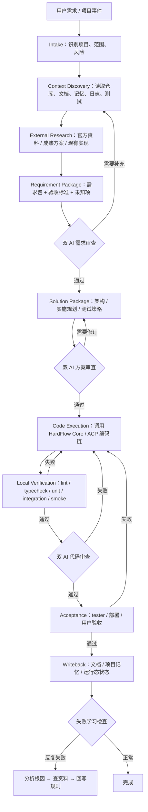
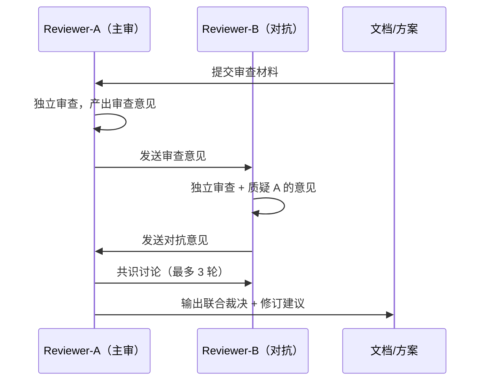
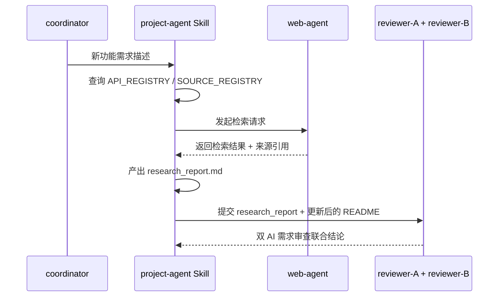

# 项目交付优先工作流 — 架构设计

> 版本：v0.4 | 2026-04-24（收束为端到端编码交付流水线）
> 需求文档：[README.md](README.md)

## 1. 设计目标

本工作流的核心目标不是让系统不断研究自己，也不是只把工作流安装到某个宿主，而是让系统稳定完成一整套编码交付：自动探索需求、生成方案、编码、测试、审核代码、修复、验收和回写。

设计原则如下：

1. **端到端状态机优先**：每个需求必须落到明确状态，不能只停在聊天、文档或半自动执行。
2. **检索是第一反应**：任何新需求、新功能，第一反应就是查项目事实源、官方资料和成熟方案，不浪费时间和 token 自己从零研究。
3. **先修文档和规则，再修实现**。
4. **双 AI 对抗式审查**：不是 1 个 AI 审核就完了，要 2 个 AI 互相探讨、互相质疑，得出最优方案。
5. **失败学习 → 文档回写**：模型做不好的任务，分析根因后修改文档纠偏，不让它继续瞎做。
6. **project-agent 成为项目事实源 owner**，不同项目有不同记忆模块。
7. **OpenClaw / Hermes 只是宿主**：运行宿主必须自适应，但不改变流水线本身。
8. **自进化完全不做**——不是降级，是从主链完全移除。目标是把整个流程实现全自动。

## 2. 总体流程



### 2.1 状态机定义

| 状态 | 目标 | 主要产物 | 放行条件 |
|------|------|----------|----------|
| `intake` | 识别项目、需求来源、风险等级和是否需要外部检索 | `run_meta.json` | 项目与需求入口明确 |
| `context_discovery` | 自动读取仓库、文档、项目记忆、历史决策、测试和运行日志 | `context_snapshot.md` | 已覆盖当前项目事实源 |
| `external_research` | 查官方资料、成熟方案、相关 repo、API/changelog | `research_report.md` | 来源足够支撑需求讨论 |
| `requirement_package` | 生成范围、非目标、验收标准、待确认项 | `requirements.md` | 需求包字段完整 |
| `requirement_review` | 双 AI 对抗式审查需求合理性 | `requirements_review.md` | 裁决为 `ready_for_solution` |
| `solution_package` | 生成架构、实施规划、测试策略、回滚策略 | `solution.md` / `implementation_plan.md` | 方案足够指导实现 |
| `solution_review` | 双 AI 对抗式审查方案 | `solution_review.md` | 裁决为 `ready_for_implement` |
| `code_execution` | 调用 HardFlow Core / ACP 执行编码 | `patch_summary.md` | 实现完成且无未解释偏差 |
| `local_verification` | 执行 lint、typecheck、unit、integration、smoke、部署验证 | `verification_report.md` | 关键验证通过或缺口已记录 |
| `code_review` | 双 AI 审核代码是否按方案执行 | `code_review.md` | 裁决为 `accepted` |
| `acceptance` | tester / 用户 / 运行态验收 | `delivery_evidence.md` | 验收证据足够 |
| `writeback` | 更新 README、架构、实施规划、done/todo、项目记忆 | `writeback_report.md` | 事实源已同步 |

### 2.2 自动探索边界

自动探索可以做：

1. 读取当前仓库代码、文档、测试、配置、脚本、历史提交和本地项目记忆。
2. 读取运行日志、状态接口、dry-run 结果和非破坏性诊断命令。
3. 查询官方文档、官方 changelog、官方 SDK/repo、成熟开源实现和已登记第三方来源。
4. 汇总需求、未知项、风险、验收标准和建议方案。

自动探索不能擅自做：

1. 不能替用户决定业务范围、商业策略、产品取舍或高风险架构转向。
2. 不能在未获授权时执行破坏性命令、生产写操作、资金操作、密钥变更或外部发布。
3. 不能因为“看起来合理”就跳过需求审查、方案审查、测试或代码审查。
4. 不能把 Hermes/OpenClaw 宿主差异写进业务流程；宿主差异只能留在 runtime adapter 层。

### 2.3 运行宿主适配层

`OpenClaw` 与 `Hermes` 的兼容性应作为同一流水线的 runtime adapter：

| 适配项 | OpenClaw | Hermes |
|--------|----------|--------|
| runtime home | `$HOME/.openclaw` 或显式 `HARDFLOW_RUNTIME_HOME` | `$HOME/.hermes` 或显式 `HARDFLOW_RUNTIME_HOME` |
| 工作目录 | OpenClaw runtime / repo overlay | WSL/Linux 优先，不默认使用 `/mnt/h/...` |
| job payload | 使用 OpenClaw runtime path | 使用 Hermes runtime path |
| 记忆蒸馏 DB | 跟随当前 runtime home | 跟随当前 runtime home |
| 安装入口 | 技能化安装/同步入口 | 同一技能化入口 + Hermes context |

裁决：最终安装入口必须基于技能化架构，不继续扩展已废弃的 `cron_setup.py / install_*_job.py` 调用链。

## 3. 角色分工

| 角色 | 新职责 | 不再承担 |
|------|--------|----------|
| `coordinator` | 接收任务、调度角色、维护总流程节奏 | 代替项目 owner 做长期知识维护 |
| `project-agent` | 维护项目介绍、架构边界、规划、API surface、外部来源、项目记忆 | 直接修改业务代码 |
| `web-agent` | 官方 docs、changelog、成熟 repo、行业方案检索 | 代替 reviewer 做裁决 |
| `reviewer-A`（主审） | 独立审查需求/方案/代码，产出初始意见 | 只在代码完成后出现 |
| `reviewer-B`（对抗） | 质疑 A 的意见，补充盲点，提出替代方案 | 只做走过场式审查 |
| `implementation-agent` | 按批准后的需求包和方案包实现代码，可拆分为 backend/frontend/scripts/docs | 自行决定需求边界与架构方向 |
| `test-agent` | 运行 lint、typecheck、unit、integration、smoke、部署验证并汇总证据 | 代替 reviewer 做需求和方案质量判断 |
| `runtime-adapter` | 将同一流水线映射到 OpenClaw / Hermes 的路径、job payload、状态目录 | 改变业务流程或创建宿主专属分叉 |

### 3.1 project-agent 形态定义

> 2026-04-21 架构评审补充

`project-agent` **不是一个独立的 Agent**（不需要 SOUL.md + manifest + 独立注册）。它是一组 Skill + 脚本的组合，由 `coordinator` 按需调度：

| 组件 | 形态 | 说明 |
|------|------|------|
| `project-profile-manager` | Skill | 项目画像的 CRUD 操作 |
| `api-registry-manager` | Skill | API 注册表与来源维护 |
| `project-memory-writer` | 脚本 | 消费蒸馏报告中的 `project_routed_artifacts`，写入项目记忆 |
| `source-registry-watcher` | cron 脚本 | 定期检查已注册的官方来源更新 |

选择 Skill 组合而非独立 Agent 的原因：

1. 避免 Agent 注册膨胀（当前已有 14 个 Agent）
2. 项目维护操作本质上是按需调度，不需要常驻进程
3. 复用 coordinator 已有的 Skill 调度能力，实施成本最低


## 4. 双 AI 对抗式审查模型

> 2026-04-22 根据用户核心需求重构：不是 1 个 AI 审核就完了，要 2 个 AI 互相探讨、互相质疑。

### 4.0 对抗式审查原则

**为什么需要 2 个 AI？**

就算把完整的方案给了 AI，做出来的产品也会有很多问题。单个 AI 审查容易走过场——它倾向于认为自己的方案是对的。2 个 AI 互相质疑，能发现单个 AI 的盲点。

**对抗式审查流程**：



**角色分工**：

| 角色 | 职责 | 选型策略 |
|------|------|----------|
| Reviewer-A（主审） | 第一轮独立审查，产出初始意见 | 选不同于实现者的 AI 模型 |
| Reviewer-B（对抗） | 质疑 A 的意见，补充盲点，提出替代方案 | **必须选不同于 A 的 AI 模型**（不允许同模型换 prompt） |

> **铁律**：A 和 B 必须使用不同的底层模型（如 A 用 Claude → B 用 Gemini，或 A 用 GPT → B 用 Claude）。同模型换 prompt 不算"不同 AI"——同一个模型的思维盲点是一样的，换 prompt 无法弥补。

**共识规则**：

1. A 和 B 意见一致 → 直接通过/驳回
2. A 和 B 意见冲突 → 最多再讨论 2 轮（总共 3 轮），仍无共识 → 标记分歧，上报用户裁决
3. 任一方发现"方案根本方向错误" → 立即中止，不浪费后续 token

### 4.1 需求审查（双 AI 对抗）

目标：确认要做的事情本身没有明显问题。

审查内容：

1. 是否已经先查官方文档、成熟方案、成熟 repo（检索报告是否存在且充分）。
2. 需求边界、成功标准、非目标是否明确。
3. 是否存在明显的 XY 问题。
4. 是否缺少第三方 API 限制、兼容边界、数据口径说明。

输出：

- `requirements_review.md`（包含 A 和 B 的独立意见 + 联合结论）
- 对 `README.md` 的修订建议
- `need_more_research / scope_conflict / ready_for_solution` 三类裁决之一

### 4.2 方案审查（双 AI 对抗）

目标：确认技术路径、模型使用和依赖引入合理。

审查内容：

1. 技术方案是否复用现有成熟能力。
2. 某个模型/某条流程是否已知效果差，是否需要更换执行方式。
3. 是否应该优先官方 docs、官方 SDK、官方插件，而不是自研替代。
4. 是否需要把经验回写到需求文档、实施规划、模型执行规约。

**重点质疑项**（B 必须挑战 A 的以下判断）：

- "用这个模型做这件事"是否真的合适？有没有反复失败的历史？
- "自研这个组件"是否合理？网上有没有成熟轮子？
- 方案复杂度是否过高？有没有更简单的路径？

输出：

- `solution_review.md`（包含 A 和 B 的独立意见 + 联合结论）
- 对架构设计与实施规划的修订建议
- `ready_for_implement / requires_revision / blocked_by_unknowns`

### 4.3 代码审查（双 AI 对抗）

目标：确认实现是否按照预定方案和规则执行。

审查内容：

1. 代码是否与 PRD / 架构设计一致——不是"能跑就行"，而是"按预定规则做"。
2. 是否补齐 API 文档、测试、验收产物。
3. 是否出现"代码能跑，但偏离预定规则"的情况。
4. 是否应将发现的问题上溯到需求/方案文档，而不是仅补丁式修代码。

### 4.4 双 AI 审查与 HardFlow G0-G6 门禁的映射关系

> 2026-04-21 架构评审补充

双 AI 审查位于 HardFlow 门禁**之前**，两者是上下游关系，不是替代关系：

```text
双AI 需求审查 -> 双AI 方案审查 -> G0(需求包检查) -> G1-G3(编码) -> 双AI 代码审查 -> G4-G6(验收)
```

具体映射：

| 审查阶段 | 对应 HardFlow 门禁 | 关系 |
|----------|-------------------|------|
| 需求审查 | G0 之前 | 双 AI 先审查需求合理性，通过后 G0 做格式化需求包校验 |
| 方案审查 | G0 之后、G1 之前 | 双 AI 审查技术方案，通过后进入 HardFlow 编码循环 |
| 代码审查 | G4 之后 | 双 AI 审核代码是否按预定规则执行，G4-G5 做自动化测试与安全扫描 |

**裁决**：

1. G0 的需求包检查**不替代**需求审查——G0 检查的是格式完整性，双 AI 检查的是业务合理性
2. 双 AI 方案审查的联合结论（`ready_for_implement / requires_revision / blocked_by_unknowns`）作为 G0 的前置条件
3. 如果双 AI 方案审查返回 `requires_revision`，**不允许进入 G0**

### 4.5 失败学习 → 文档回写机制

> 2026-04-22 用户核心需求新增

**问题**：方案肯定会有各种问题，做出来的产品也会有很多问题。如果某个模型对某类任务总是完成的效果不好，不能继续让它瞎做。

**机制**：

```text
任务执行 → 结果不达标
→ 分析根因（是模型能力问题？是需求描述不清？是缺少成熟方案参考？）
→ 根因是"不知道怎么做" → 去网上查正确做法
→ 根因是"需求描述不清" → 修改需求文档，明确告诉 AI 该怎么做
→ 根因是"模型能力不足" → 更换模型/拆分任务/增加约束规则
→ 回写到需求文档/方案文档/模型执行规约
→ 下次执行同类任务时按新规则走
```

**触发条件**：

1. 同一类任务连续 2 次未通过代码审查
2. 双 AI 审查中 B 指出"这个模型/流程历史上多次在此类任务上失败"
3. 用户主动反馈"这块总是做不好"

**人工沟通硬约束**：失败学习流程触发后，**一定要与人沟通**，不允许 AI 自行闷头解决。具体要求：

- 分析完根因后，必须向用户汇报根因分类和拟采取的纠偏措施，等用户确认后再回写文档
- 如果根因是"不知道怎么做"，先向用户说明准备去网上查什么、查哪些来源
- 如果根因是"需求描述不清"，向用户追问具体的业务边界和约束，而不是自己编造
- 如果根因是"模型能力不足"，向用户提议更换方案，说明替代方案的利弊
- **绝不允许 AI 在用户不知情的情况下擅自修改需求文档或更换执行策略**

**回写目标**：

| 根因类型 | 回写到 | 示例 |
|----------|--------|------|
| 不知道怎么做 | `README.md` / `research_report.md` | 补充网上查到的成熟方案 |
| 需求描述不清 | `README.md` / 实施规划 | 补充具体的执行步骤和约束 |
| 模型能力不足 | 模型执行规约 / Skill prompt | 更换模型或增加约束 |
| 依赖 API 变更 | `API_REGISTRY.json` / `CHANGELOG.ndjson` | 更新 API 调用方式 |

## 5. 项目级记忆模型

### 5.1 基本原则

项目记忆不再默认混进全局 `MEMORY.md`。全局记忆只保留跨项目通用规则、宿主事实和高价值公共约束。

每个项目维护独立记忆模块，建议目录：

```text
.workflow/project-memory/<project_key>/
├── PROJECT_PROFILE.md
├── DECISIONS.md
├── API_REGISTRY.json
├── SOURCE_REGISTRY.json
├── DELIVERY_RULES.md
└── CHANGELOG.ndjson
```

### 5.2 记忆注入策略

1. 会话启动时，按项目只注入：
   - `PROJECT_PROFILE.md`
   - `DELIVERY_RULES.md`
   - `DECISIONS.md` 的摘要
2. `API_REGISTRY.json` 与 `SOURCE_REGISTRY.json` 由 `project-agent` 和 API watch 任务读取，不直接整份注入。
3. 全局 `MEMORY.md` 仅保留：
   - 跨项目通用规则
   - 宿主环境事实
   - 官方 runtime 边界

### 5.3 与记忆蒸馏的边界裁决

> 2026-04-21 架构评审补充。对应裁决同步记录在 [记忆蒸馏实施规划 1.3](../../基础设施/记忆蒸馏/Hermes-风格记忆蒸馏升级/Hermes-风格记忆蒸馏升级实施规划.md)。

| 来源 | 落点 | 规则 |
|------|------|------|
| 蒸馏产物（带 `project_key`） | 项目记忆 `.workflow/project-memory/<key>/` | 由 `project-memory-writer` 消费蒸馏报告写入 |
| 蒸馏产物（无 `project_key`） | 全局 `USER.md` / `MEMORY.md` | 由蒸馏 `memory_write_gateway` 直接写入 |
| 项目级人工决策 | 项目记忆 `DECISIONS.md` | 由 `project-profile-manager` Skill 写入 |
| 项目 API 来源登记 | 项目记忆 `API_REGISTRY.json` | 由 `api-registry-manager` Skill 写入 |

**铁律**：同一条经验不允许同时出现在全局记忆和项目记忆中。蒸馏层是唯一产出源，project-agent 组件是唯一消费者。

## 6. 外部方案检索与 API watch

### 6.1 检索是第一反应（强制门禁）

> 2026-04-22 强化：不是"建议先查"，而是"第一反应就是查网"；讨论需求前必须先完成信息搜集

**铁律**：对于任何新需求，第一反应应该是直接去网上查找方案，借鉴网上已经成熟的方案，自己再去修改。不允许跳过检索直接动手。

**讨论前置门禁**：对于复杂需求，**在开始讨论需求细节之前，必须先完成网上信息搜集**。没有搜集报告，不允许进入需求讨论环节。这确保讨论基于充分的外部信息，而不是基于 AI 的想象。

以下场景强制先检索再写方案：

1. 新功能。
2. 第三方 API / SDK 接入。
3. 模型与工具选型。
4. 官方 runtime 已有同类能力的治理题。
5. 某类任务反复失败、需要寻找更好做法。

检索顺序：

1. 官方文档 / 官方 changelog
2. 官方 repo / 官方 SDK
3. 行业成熟实现 / 高质量参考 repo
4. 现有项目历史方案

### 6.2 API watch 范围

API watch 只跟踪项目显式声明过的外部依赖，**定期更新第三方库的 API，随时保持最新状态**：

| 字段 | 说明 |
|------|------|
| `provider_id` | 第三方服务标识 |
| `base_urls` | API 根地址 |
| `docs_urls` | 官方文档 |
| `changelog_urls` | 版本更新源 |
| `repo_urls` | 官方 repo / SDK repo |
| `owned_by_project_agent` | 是否由项目 owner 维护 |
| `change_policy` | 变更出现后的处理方式 |

### 6.3 外部方案检索执行流程

> 2026-04-21 架构评审补充



**执行主体裁决**：

| 步骤 | 执行者 | 产物存放 |
|------|--------|----------|
| 触发检索 | `coordinator` 调度 `project-agent` Skill | -- |
| 实际检索 | `web-agent` | `docs/<模块>/research_report.md` |
| 结果整合 | `project-agent` Skill | 回写到 `README.md` 的"外部来源"章节 |
| 结果审查 | `reviewer-A + reviewer-B` | 需求审查时一并审查来源充分性 |

### 6.4 API watch 技术方案

> 2026-04-21 架构评审补充

**执行方式**：低频 cron job（每周一次），不使用 webhook/RSS。

```text
source_registry_watcher.py \
  --project-key <key> \
  --registry-path .workflow/project-memory/<key>/SOURCE_REGISTRY.json \
  --output-path .workflow/project-memory/<key>/CHANGELOG.ndjson \
  --notify-on-change true
```

**检查逻辑**：

1. 读取 `SOURCE_REGISTRY.json` 中每个来源的 `docs_urls` / `changelog_urls` / `repo_urls`
2. 对 `changelog_urls` 做 HTTP HEAD 检查 Last-Modified / ETag
3. 对 `repo_urls` 调 GitHub API 检查最新 release tag
4. 发现变更时写入 `CHANGELOG.ndjson`，按 `change_policy` 决定是否生成修订任务

**与 cron 裁剪的关系**：API watch 属于"项目交付核心链"，不属于自进化类，保留在默认基线中。频率为每周一次，token 消耗极低。

## 7. 默认 cron 基线调整

### 7.1 保留在默认主链

1. `task_executor`
2. `todo_patrol`
3. `OpenClaw/Hermes` 自适应的 runtime 安装 / 对齐 / 健康检查（目标形态：基于技能化入口，不继续扩展已废弃的 `cron_setup.py / install_*_job.py` 调用链）
4. 需求、方案、代码执行相关最小编排链

### 7.2 完全移除（不是降级，是移除）

> 2026-04-22 用户明确要求：自进化完全不做

1. 自进化类 job — **完全移除**
2. 自动评分晋升类 job — **完全移除**
3. 泛化 GitHub / web 扫描 — **完全移除**
4. 泛化优化建议自动派单 — **完全移除**
5. 全局自动更新安装 — **完全移除**

### 7.3 蒸馏 cron 的分类归属

> 2026-04-21 架构评审补充

`distill_runner.py`（记忆蒸馏）属于**基础设施层**，既不是自进化也不是项目交付，**独立保留在默认基线中**。

| cron 任务 | 分类 | 默认基线 |
|-----------|------|----------|
| `distill_runner.py` | 基础设施 | 保留 |
| `source_registry_watcher.py` | 项目交付 | 保留（每周） |
| `optimization_agent` 系列 | 自进化 | **移除** |
| `skill_evolution_review.py` | 自进化 | **移除** |
| `task_executor` | 核心运营 | 保留 |
| `todo_patrol` | 核心运营 | 保留 |

## 8. 数据对象

| 对象 | owner | 用途 |
|------|-------|------|
| Coding Pipeline Run | `coordinator` | 单次编码交付运行的状态、路径、宿主、阶段裁决 |
| Context Snapshot | `project-agent` | 仓库、文档、记忆、测试、日志和运行态事实快照 |
| Research Report | `web-agent` / `project-agent` | 官方资料、成熟方案、外部来源和引用 |
| Requirement Package | `project-agent` | 需求、边界、成功标准、外部来源 |
| Solution Package | `project-agent` | 架构设计、实施规划、模型与依赖选择 |
| Review Decision | `reviewer-A + reviewer-B` | 联合审查意见、对抗记录、修订建议 |
| Implementation Patch | `implementation-agent` | 代码改动、文件影响面、偏差说明 |
| Verification Report | `test-agent` | lint、typecheck、unit、integration、smoke、部署验证结果 |
| Failure Learning Record | `reviewer-A + reviewer-B` | 失败分析根因、回写目标、纠偏措施 |
| Project Memory Module | `project-agent` | 项目长期事实、决策、规则 |
| API Watch Registry | `project-agent` | 第三方 API 来源与变更跟踪 |
| Delivery Evidence | `test-agent` / `reviewer` | 代码、测试、验收、截图、接口回执 |

## 9. 风险与防御

| 风险 | 表现 | 防御方案 |
|------|------|----------|
| reviewer 过晚 | 代码做完才发现方向错 | 前移到需求审查和方案审查 |
| 单 AI 审查走过场 | 自己审查自己，发现不了盲点 | 双 AI 对抗式审查，互相质疑 |
| 流水线断点太多 | 需求、编码、测试、审核散落在不同工具里 | 统一 `Coding Pipeline Run` 状态机 |
| 模型反复失败 | 同类任务总做不好，浪费 token | 失败学习机制，分析根因后回写文档纠偏 |
| 方案拍脑袋 | 实现质量差、返工多 | 强制先查官方和成熟方案（第一反应） |
| 项目知识散落 | 不同会话重复解释同一项目 | project-agent 维护项目记忆模块 |
| 宿主差异污染业务流程 | OpenClaw/Hermes 出现两套不同流程 | 宿主差异只留在 runtime adapter |
| 第三方 API 漂移 | 线上突然失效 | API watch + 定期更新 + 官方来源 registry |
| 自进化噪音 | 占用大量 token 和认知预算 | 自进化完全移除，不保留 |

## 10. 验收标准

1. 新功能的第一反应是查项目事实源和网上成熟方案，有检索报告才能进入需求定义。
2. 每个需求都有 `Coding Pipeline Run`，能看到当前状态、下一步、失败原因和产物路径。
3. 每次审查都有 2 个 AI 互相探讨的记录，而不是单 AI 走过场。
4. 当某个模型反复做不好某类任务时，需求文档被主动修改以纠偏。
5. reviewer 不再只在代码完成后出现，而是在需求、方案、代码三个阶段都有阻断能力。
6. 编码完成不等于交付完成，必须有测试、代码审核、验收和回写证据。
7. 每个活跃项目至少有一套独立的项目记忆目录。
8. 第三方 API 的官方 docs / changelog / repo 可在项目维度被查询和维护，定期更新。
9. 同一流水线可在 OpenClaw / Hermes 宿主运行，宿主差异不污染业务流程。
10. 默认主链完全没有任何自进化相关任务。
