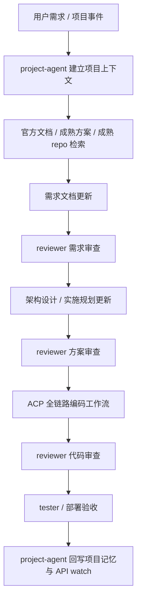

# 项目交付优先工作流 — 架构设计

> 版本：v0.1 | 2026-04-21
> 需求文档：[README.md](README.md)

## 1. 设计目标

本工作流的核心目标不是让系统不断研究自己，而是让系统更稳定地交付项目。

设计原则如下：

1. **先查外部成熟方案，再写内部方案**。
2. **先修文档和规则，再修实现**。
3. **reviewer 前移，不只审代码**。
4. **project-agent 成为项目事实源 owner**。
5. **项目记忆分仓，避免所有知识都塞进全局 MEMORY**。
6. **低价值自进化退出默认主链，保留为手动或低频辅助能力**。

## 2. 总体流程



## 3. 角色分工

| 角色 | 新职责 | 不再承担 |
|------|--------|----------|
| `coordinator` | 接收任务、调度角色、维护总流程节奏 | 代替项目 owner 做长期知识维护 |
| `project-agent` | 维护项目介绍、架构边界、规划、API surface、外部来源、项目记忆 | 直接修改业务代码 |
| `web-agent` | 官方 docs、changelog、成熟 repo、行业方案检索 | 代替 reviewer 做裁决 |
| `reviewer` | 需求审查、方案审查、代码审查、偏差指出、回写修订意见 | 只在代码完成后出现 |
| `backend-dev / frontend-dev` | 按批准后的方案实现代码 | 自行决定需求边界与架构方向 |
| `tester` | 运行态验收、接口验收、浏览器验收、回归验证 | 代替 reviewer 做需求和方案质量判断 |
| `optimization-agent` | 降级为手动改进工具，可在需要时分析优化机会 | 默认常驻自进化主链 |

## 4. reviewer 三段审查模型

### 4.1 需求审查

目标：确认要做的事情本身没有明显问题。

审查内容：

1. 是否已经先查官方文档、成熟方案、成熟 repo。
2. 需求边界、成功标准、非目标是否明确。
3. 是否存在明显的 XY 问题。
4. 是否缺少第三方 API 限制、兼容边界、数据口径说明。

输出：

- `requirements_review.md`
- 对 `README.md` 的修订建议
- `need_more_research / scope_conflict / ready_for_solution` 三类裁决之一

### 4.2 方案审查

目标：确认技术路径、模型使用和依赖引入合理。

审查内容：

1. 技术方案是否复用现有成熟能力。
2. 某个模型/某条流程是否已知效果差，是否需要更换执行方式。
3. 是否应该优先官方 docs、官方 SDK、官方插件，而不是自研替代。
4. 是否需要把经验回写到需求文档、实施规划、模型执行规约。

输出：

- `solution_review.md`
- 对架构设计与实施规划的修订建议
- `ready_for_implement / requires_revision / blocked_by_unknowns`

### 4.3 代码审查

目标：确认实现遵循需求、方案、契约和验收标准。

审查内容：

1. 是否与 PRD / 架构设计一致。
2. 是否补齐 API 文档、测试、验收产物。
3. 是否出现“代码能跑，但偏离预定规则”的情况。
4. 是否应将发现的问题上溯到需求/方案文档，而不是仅补丁式修代码。

## 5. 项目级记忆模型

### 5.1 基本原则

项目记忆不再默认混进全局 `MEMORY.md`。全局记忆只保留跨项目通用规则、宿主事实和高价值公共约束。

每个项目维护独立记忆模块，建议目录：

```text
.workflow/project-memory/<project_key>/
├── PROJECT_PROFILE.md
├── DECISIONS.md
├── API_REGISTRY.json
├── SOURCE_REGISTRY.json
├── DELIVERY_RULES.md
└── CHANGELOG.ndjson
```

### 5.2 记忆注入策略

1. 会话启动时，按项目只注入：
   - `PROJECT_PROFILE.md`
   - `DELIVERY_RULES.md`
   - `DECISIONS.md` 的摘要
2. `API_REGISTRY.json` 与 `SOURCE_REGISTRY.json` 由 `project-agent` 和 API watch 任务读取，不直接整份注入。
3. 全局 `MEMORY.md` 仅保留：
   - 跨项目通用规则
   - 宿主环境事实
   - 官方 runtime 边界

## 6. 外部方案检索与 API watch

### 6.1 外部方案检索门禁

以下场景强制先检索再写方案：

1. 新功能。
2. 第三方 API / SDK 接入。
3. 模型与工具选型。
4. 官方 runtime 已有同类能力的治理题。

检索顺序：

1. 官方文档 / 官方 changelog
2. 官方 repo / 官方 SDK
3. 行业成熟实现 / 高质量参考 repo
4. 现有项目历史方案

### 6.2 API watch 范围

API watch 只跟踪项目显式声明过的外部依赖：

| 字段 | 说明 |
|------|------|
| `provider_id` | 第三方服务标识 |
| `base_urls` | API 根地址 |
| `docs_urls` | 官方文档 |
| `changelog_urls` | 版本更新源 |
| `repo_urls` | 官方 repo / SDK repo |
| `owned_by_project_agent` | 是否由项目 owner 维护 |
| `change_policy` | 变更出现后的处理方式 |

## 7. 默认 cron 基线调整

### 7.1 保留在默认主链

1. `task_executor`
2. `todo_patrol`
3. runtime 安装 / 对齐 / 健康检查
4. 需求、方案、代码执行相关最小编排链

### 7.2 降级为手动或低频可选层

1. 自进化类 job
2. 自动评分晋升类 job
3. 泛化 GitHub / web 扫描
4. 泛化优化建议自动派单
5. 全局自动更新安装

## 8. 数据对象

| 对象 | owner | 用途 |
|------|-------|------|
| Requirement Package | `project-agent` | 需求、边界、成功标准、外部来源 |
| Solution Package | `project-agent` | 架构设计、实施规划、模型与依赖选择 |
| Review Decision | `reviewer` | 审查意见、阻断原因、修订建议 |
| Project Memory Module | `project-agent` | 项目长期事实、决策、规则 |
| API Watch Registry | `project-agent` | 第三方 API 来源与变更跟踪 |
| Delivery Evidence | `tester` / `reviewer` | 代码、测试、验收、截图、接口回执 |

## 9. 风险与防御

| 风险 | 表现 | 防御方案 |
|------|------|----------|
| reviewer 过晚 | 代码做完才发现方向错 | 前移到需求审查和方案审查 |
| 方案拍脑袋 | 实现质量差、返工多 | 强制先查官方和成熟方案 |
| 项目知识散落 | 不同会话重复解释同一项目 | project-agent 维护项目记忆模块 |
| 第三方 API 漂移 | 线上突然失效 | API watch + 官方来源 registry |
| 自进化噪音过大 | 占用大量 token 和认知预算 | 默认主链移除自进化常驻任务 |

## 10. 验收标准

1. 新功能在实现前必须能看到外部来源清单。
2. reviewer 至少产生一次需求或方案层裁决，而不是只在代码层介入。
3. 每个活跃项目至少有一套独立的项目记忆目录。
4. 第三方 API 的官方 docs / changelog / repo 可在项目维度被查询和维护。
5. 默认主链不再依赖 `optimization-agent` 持续常驻来“优化 OpenClaw 自己”。
