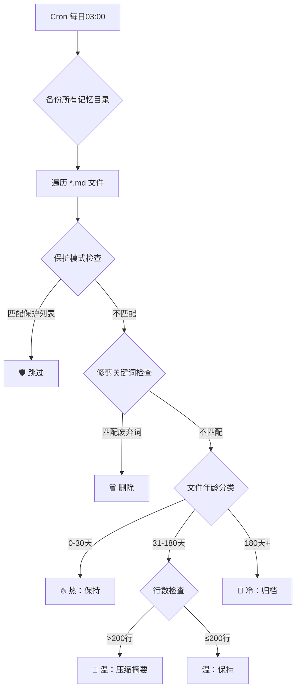

# MemTidy 记忆自动整理工作流 — 架构设计

> 版本：v1.0 | 2026-03-29

## 处理流程



## 规则配置结构

```json
{
  "hot_memory": { "days": 30 },
  "warm_memory": {
    "days_min": 31, "days_max": 180,
    "compact_threshold_lines": 200,
    "compact_target_lines": 80
  },
  "cold_memory": {
    "days": 181,
    "archive_dir": "~/.openclaw/memory-archive/"
  },
  "prune": {
    "keywords": ["测试对话", "调试日志", "临时笔记", ...],
    "empty_file_action": "delete"
  },
  "protected_patterns": ["MEMORY.md", "core-identity", "偏好", "soul", ...],
  "backup": { "enabled": true, "max_backups": 7 }
}
```

## 产物

| 产物 | 路径 |
|------|------|
| JSON 报告 | `~/.openclaw/ops/memtidy-reports/memtidy-<timestamp>.json` |
| Markdown 报告 | `~/.openclaw/ops/memtidy-reports/memtidy-<timestamp>.md` |
| 备份 | `~/.openclaw/ops/memtidy-backups/memtidy-backup-<timestamp>/` |
| 归档文件 | `~/.openclaw/memory-archive/` |
