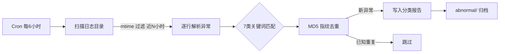

# 统一异常日志巡检工作流 — 架构设计

> 版本：v1.0 | 2026-03-29

## 处理流程

## 扫描目标

| 目录 | 说明 |
|------|------|
| `~/.openclaw/ops/workflow-logs/` | 工作流运行日志 |
| `~/.openclaw/sessions/` | Agent 会话日志 |

## 日志管理

| 天数 | 操作 | 工具 |
|------|------|------|
| 0-6天 | 原始保留 | — |
| 7-30天 | gzip 压缩 | `--cleanup` |
| 30天+ | 自动删除 | `--cleanup` |

## 产出

- `~/.openclaw/ops/exception-reports/exception-<timestamp>.json`
- `~/.openclaw/logs/abnormal/<category>/<file>.log`
