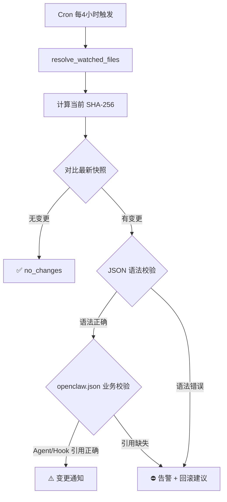

# 配置变更安全兜底工作流 — 架构设计

> 版本：v1.0 | 2026-03-29

## 核心流程

## 监控文件

| 文件 | 校验层级 |
|------|---------|
| `openclaw.json` | SHA-256 + JSON 语法 + Agent 引用 + Hook 引用 + 模型配置 |
| `cron/jobs.json` | SHA-256 + JSON 语法 |
| `hooks/*/handler.js` | SHA-256 |
| `agents/*/SOUL.md` | SHA-256（glob 匹配） |

## 快照生命周期

- 保留最近 10 个快照
- 快照目录：`<config_dir>/.config-watchdog-snapshots/snapshot-<timestamp>/`
- 每个快照包含：`manifest.json`（hash 清单）+ 所有监控文件副本

## 回滚安全机制

1. 回滚前先备份当前（可能损坏的）文件为 `.broken-<timestamp>` 后缀
2. 从最新快照恢复目标文件
3. 支持 `--dry-run` 预览
